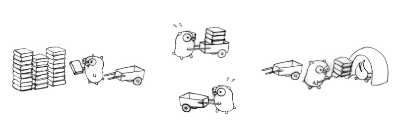

# GO BLOG

## 值接收者和指针接收者区别

### 方法

```golang
type Person struct {
    age int
}

func (p Person) howOld() int {
    return p.age
}

func (p *Person) growUp() {
    p.age += 1
}

func main() {
    // qcrao 是值类型
    qcrao := Person{age: 18}
    // 值类型 调用接收者也是值类型的方法
    fmt.Println(qcrao.howOld())
    // 值类型 调用接收者是指针类型的方法
    qcrao.growUp()
    fmt.Println(qcrao.howOld())

    // ----------------------

    // stefno 是指针类型
    stefno := &Person{age: 100}
    // 指针类型 调用接收者是值类型的方法
    fmt.Println(stefno.howOld())
    // 指针类型 调用接收者也是指针类型的方法
    stefno.growUp()
    fmt.Println(stefno.howOld())
}
```

调用了 `growUp` 函数后，不管调用者是值类型还是指针类型，它的 `Age` 值都改变了。

| | 值接收者 | 指针接收者 |
| --- | --- | --- |
| 值类型调用者| 方法会使用调用者的一个副本，类似于“传值” | 使用值的引用来调用方法，上例中，`qcrao.growUp()` 实际上是 `(&qcrao).growUp()` |
| 指针类型调用者| 指针被解引用为值，上例中，`stefno.howOld()` 实际上是 `(*stefno).howOld()` | 实际上也是“传值”，方法里的操作会影响到调用者，类似于指针传参，拷贝了一份指针 |

### 接收者

语法糖：实现了接收者是值类型的方法，相当于自动实现了接收者是指针类型的方法；而实现了接收者是指针类型的方法，不会自动生成对应接收者是值类型的方法。

理解：当实现了一个接收者是值类型的方法，就可以自动生成一个接收者是对应指针类型的方法，因为两者都不会影响接收者。但是，当实现了一个接收者是指针类型的方法，如果此时自动生成一个接收者是值类型的方法，原本期望对接收者的改变（通过指针实现），现在无法实现，因为值类型会产生一个拷贝，不会真正影响调用者。

### 两者分别在何时使用

如果方法的接收者是值类型，无论调用者是对象还是对象指针，修改的都是对象的副本，不影响调用者；如果方法的接收者是指针类型，则调用者修改的是指针指向的对象本身。

使用指针作为方法接收者的理由：

1. 方法能够修改接收者指向的值
2. 避免在每次调用方法时复制该值，在值的类型为大型结构体时这样做会更加高效

## GO 反射

### 什么是反射？

反射是指计算机程序在运行时（Run time）可以访问、检测和修改它本身状态或行为的一种能力。用比喻来说，反射就是程序在运行的时候能够“观察”并且修改自己的行为。

Go 语言提供了一种机制在运行时更新变量和检查它们的值、调用它们的方法，但是在编译时并不知道这些变量的具体类型，这称为反射机制。

### 为什么要用反射

使用反射的两个场景

1. 有时你需要编写一个函数，但是并不知道传给你的参数类型是什么，可能是没约定好；也可能是传入的类型很多，这些类型并不能统一表示。这时反射就会用的上了；
2. 有时候需要根据某些条件决定调用哪个函数，比如根据用户的输入来决定。这时就需要对**函数和函数的参数进行反射**，在运行期间动态地执行函数。

### 反射是如何实现的

`interface{}` 当向接口变量赋予一个实体类型的时候，接口会存储实体的类型信息，反射就是通过接口的类型信息实现的，反射建立在类型的基础上，Go 语言在 reflect 包里定义了各种类型，实现了反射的各种函数，通过它们可以在运行时检测类型的信息、改变类型的值。

#### types 和 interface

GO 语言中，每个变量都有一个静态类型，在编译阶段就确定了，注意，**这个类型是声明时的类型，不是底层数据类型**

接口变量可以存储任何实现了接口定义的所有方法的变量

interface{} 类型定义，其中 `itab` 由具体类型 `_type` 以及 `interfacetype` 组成，`_type` 表示具体类型，而 `interfacetype` 表示具体类型实现的接口类型


Go 语言中最常见的就是 Reader 和 Writer 接口：

```golang
type Reader interface {
    Read(p []byte) (n int, err error)
}
type Writer interface {
    Write(p []byte) (n int, err error)
}
```

```golang
var r io.Reader
tty, err := os.OpenFile("/Users/qcrao/Desktop/test", os.O_RDWR, 0)
if err != nil {    
    return nil, err
}
r = tty
```

先声明 `r` 的类型是 `io.Reader`，注意，这是 `r` 的静态类型，此时它的动态类型为 `nil`，并且它的动态值也是 `nil`。

之后，`r = tty` 这一语句，将 `r` 的动态类型变成 `*os.File`，动态值则变成非空，表示打开的文件对象。这时，`r` 可以用 `<value, type>` 对来表示为：`<tty, *os.File>`


注意看上图，此时虽然 `fun` 所指向的函数只有一个 `Read` 函数，其实 `*os.File` 还包含 `Write` 函数，也就是说 `*os.File` 其实还实现了 `io.Writer` 接口。因此下面的断言语句可以执行：

```golang
var w io.Writer
w = r.(io.Writer)
```

这样，`w` 也可以表示成 `<tty, *os.File>`，仅管它和 `r` 一样，但是 `w` 可**调用的函数取决于它的静态类型** `io.Writer`，也就是说它只能有这样的调用形式： `w.Write()` 。`w` 的内存形式如下图：


最后再来一个赋值：

```golang
var empty interface{}
empty = w
```

由于 empty 是一个空接口，因此所有的类型都实现了它，w 可以直接赋给它，不需要执行断言操作。


### 反射的基本函数

reflect 包里面包含了一个接口和一个结构体，即 `reflect.Type` 和 `reflect.Value`，它们提供很多函数来获取存储在接口里面的信息

`reflect.Type` 主要提供关于类型相关的信息，所以它和 `_type` 关联紧密，`reflect.Value` 则结合 `_type` 和 `data` 两者

reflect包提供了两个基础的关于反射的函数来获取上述的接口和结构体

```golang
func TypeOf(i interface{}) Type // 提取接口中值的类型信息
func ValueOf(i interface{}) Value // 提供实际变量的各种信息
```

总结一下：`TypeOf()` 函数返回一个接口，这个接口定义了一系列方法，利用这些方法可以获取关于类型的所有信息； `ValueOf()` 函数返回一个结构体变量，包含类型信息以及实际值。


### 反射的三大定律

1. Reflection goes from interface value to reflection object. 反射是一种检测存储在 `interface` 中的类型和值机制。这可以通过 `TypeOf` 函数和 `ValueOf` 函数得到
2. Reflection goes from reflection object to interface value. 它将 `ValueOf` 的返回值通过 `Interface()` 函数反向转变成 `interface` 变量
3. To modify a reflection object, the value must be settable. 如果想要操作原变量，反射变量 `Value` 必须要 hold 住原变量的地址才行

举个例子：

```golang
var x float64 = 3.4
v := reflect.ValueOf(x)
v.SetFloat(7.1) // Error: will panic
```

执行上面的代码会产生 panic，原因是反射变量 v 不能代表 x 本身，为什么？因为调用 `reflect.ValueOf(x)` 这一行代码的时候，传入的参数在函数内部只是一个拷贝，是值传递，所以 v 代表的只是 x 的一个拷贝，因此对 v 进行操作是被禁止的。

可设置是反射变量 `Value` 的一个性质，但不是所有的 `Value` 都是可被设置的

```golang
var x float64 = 3.4
p := reflect.ValueOf(&x)
fmt.Println("type of p:", p.Type())
fmt.Println("settability of p:", p.CanSet())

// type of p: *float64
// settability of p: false
```

p 还不是代表 x，`p.Elem()` 才真正代表 x，这样就可以真正操作 x 了

```golang
v := p.Elem()
v.SetFloat(7.1)
fmt.Println(v.Interface()) // 7.1
fmt.Println(x) // 7.1
```

## TCMalloc

### TCMalloc 是什么

TCMalloc是google推出的一种内存分配器，常见的内存分配器还有glibc的`ptmalloc`和google的`jemalloc`。相比于`ptmalloc` ，`TCMalloc` 性能更好，特别适用于高并发场景。

### TCmalloc 具体策略

`TCMalloc` 分配的内存主要来自两个地方：全局缓存堆和进程的私有缓存。对于一些小容量的内存申请试用进程的私有缓存，私有缓存不足的时候可以再从全局缓存申请一部分作为私有缓存。对于大容量的内存申请则需要从全局缓存中进行申请。而大小容量的边界就是32k。缓存的组织方式是一个单链表数组，数组的每个元素是一个单链表，链表中的每个元素具有相同的大小。

## Go GC

在 Go 1.10 中，Go使用的是CMS垃圾回收器，但是没有分代，且非整理的

|                         | JAVA (JAVA 8 HotSpot VM)                    | Go             |
| ----------------------- | ------------------------------------------- | -------------- |
| 垃圾回收器（Collector） | 多种垃圾回收器（Serial，Parallel，CMS，G1） | CMS            |
| 整理（Compaction）      | 整理                                        | 非整理         |
| 分代GC                  | 分代                                        | 不分代         |
| 调试参数                | 依赖于垃圾回收器，并且有多个参数可用        | 只有`GOGC`可用 |

### 整理（Compaction）

垃圾回收可以是非移动的，也可以是移动的

#### 非移动GC（Non-moving GC）-- 标记清除算法

非移动的垃圾回收不会移动堆中的对象，Go使用的CMS垃圾回收器是非移动的，通常在非移动垃圾回收中重复进行内存的分配和释放，在堆中会产生碎片，从而降低了分配的性能，但是这也与你如何进行内存分配有关


#### 移动GC（Moving GC）-- 标记整理算法

移动GC通过将存活对象移动到堆的尾部来整理堆，一个示例就是在HotSpot VM上使用的复制算法


通过整理堆空间带来的好处有：

- 避免碎片
- 通过指针碰撞，能够实现高性能的内存分配器，因为所有对象都位于堆的末尾，所以我们可以在最后增加新对象的分配

**为什么Go不选择整理算法呢？**

- 起初Go的研发人员企图做一个 read barrier free concurrent copying GC.
- 由于时间关系，选择了CMS
- 采用了基于 TCMalloc 的内存分配器，解决了内存碎片和优化分配的问题

### 分代 （Generational GC）

分代GC的目的是为通过将堆中的对象按照其年龄进行划分来优化GC

- Minor GC：回收新生代，因为新生代对象存活时间很短，因此 Minor GC 会频繁执行，执行的速度一般也会比较快。
- Full GC：回收老年代和新生代，老年代对象其存活时间长，因此 Full GC 很少执行，执行速度会比 Minor GC 慢很多。 

#### 写屏障

分代GC的缺陷是即使垃圾回收没有执行，也仍然存在写屏障开销


**如果我们只对年轻代进行可达性分析，检查root节点指向的新对象然后进行收集，如果老年代有指向该新对象的旧对象，那么会导致该新对象意外被回收了，但是如果我们检查包含旧对象的整个堆，避免新对象被回收，那么分代GC就没有意义了**

**所以解决办法是 当替换或者重写引用时，在新对象中记录旧对象的引用（写屏障）**

**为什么Go不选择分代GC？**

由上可知，写屏障开销是Go放弃使用分代GC的原因之一，另外，在Go中，编译器的逃逸分析很出众，如果需要的话，程序员可以控制不在堆上分配的对象，因此短期对象通常分配在堆栈而不是堆上，这意味着不需要GC。

Java中的 CMS （Concurrent Mark Sweep）收集器，Mark Sweep 指的是标记-清除算法，分为以下四个阶段：

- 初始标记：仅仅只是标记一下 GC Roots 能直接关联到的对象，速度很快，需要停顿。
- 并发标记：进行 GC Roots Tracing 的过程，它在整个回收过程中耗时最长，不需要停顿。
- 重新标记：为了修正并发标记期间因用户程序继续运作而导致标记产生变动的那一部分对象的标记记录，需要停顿。
- 并发清除：不需要停顿。


在整个过程中耗时最长的并发标记和并发清除过程中，收集器线程都可以与用户线程一起工作，不需要进行停顿。存在浮动垃圾，浮动垃圾是指并发清除阶段由于用户线程继续运行而产生的垃圾，这部分垃圾只能到下一次 GC 时才能进行回收。

## GMP模型

并发：逻辑上具有处理多个同时性任务的能力，并行：物理上同一时刻执行多个并发任务

通常说的并发编程时在单核CPU上，通过多线程共享CPU时间片串行执行（并发非并行），而并行则依赖于多核处理器等物理资源，让多个任务可以实现并行执行（并发且并行）

多线程或多进程是并行的基本条件，但单线程也可以用协程(coroutine)做到并发。简单将Goroutine归纳为协程并不合适，因为它运行时会创建多个线程来执行并发任务，且任务单元可被调度到其它线程执行。这更像是多线程和协程的结合体，能最大限度提升执行效率，发挥多核处理器能力。

```go
func main() {
    go func() {
        fmt.Println("Hello World")
    }()
}
```

支撑整个调度器的主要有4个重要结构，分别是M、G、P、Sched

- Sched结构就是调度器，它维护有存储M和G的队列以及调度器的一些状态信息等

- G就是goroutine实现的核心结构了，G维护了goroutine需要的栈、程序计数器以及它所在的M等信息。
- M代表内核级线程，一个M就是一个线程，goroutine就是跑在M之上的
- P是一个抽象的概念，并不是真正的物理CPU，P全称是Processor，处理器，它的主要用途就是用来执行goroutine的，所以它也维护了一个goroutine队列，里面存储了所有需要它来执行的goroutine

三者关系：地鼠(gopher)用小车运着一堆待加工的砖。M就可以看作图中的地鼠，P就是小车，G就是小车里装的砖


### 启动过程

```txt
CALL	runtime·args(SB)
CALL	runtime·osinit(SB)
CALL	runtime·hashinit(SB)
CALL	runtime·schedinit(SB)

// create a new goroutine to start program
PUSHQ	$runtime·main·f(SB)		// entry
PUSHQ	$0			// arg size
CALL	runtime·newproc(SB)
POPQ	AX
POPQ	AX

// start this M
CALL	runtime·mstart(SB)
```

- `runtime schedinit` 根据用户设置的 `GOMAXPROCS` 创建一批小车（p），这些小车初始化创建后都是闲置状态，也就是没有开始使用，所以它们都放置在调度结构（Sched）的 `pidle` 字段维护

- `runtime newproc` 创建出第一个 goroutine，这个 goroutine 将执行的函数是 `runtime main`，这是第一个goroutine 也就是作为的主goroutine，任何一个Go程序的入口都是从这个goroutine开始的
- 查看 `runtime main` 函数可以了解到主 goroutine 开始执行后，做的第一件事情是创建一个新的内核线程（地鼠M），不过这个线程是一个特殊线程，它在整个运行期专门负责做特定的事情 - 系统监控

### 创建 goroutine

go关键字就是用来创建一个goroutine的，后面的函数就是这个goroutine需要执行的代码逻辑。go关键字对应到调度器的接口就是`runtime·newproc`。`runtime·newproc` 干的事情很简单，就负责制造一块砖(G)，然后将这块砖(G)放入当前这个地鼠(M)的小车(P)中。

### 创建内核线程

Go程序中没有语言级的关键字让你去创建一个内核线程，你只能创建goroutine，内核线程只能由runtime根据实际情况去创建

runtime什么时候创建线程？以地鼠运砖图来讲，砖(G)太多了，地鼠(M)又太少了，实在忙不过来，刚好还有空闲的小车(P)没有使用，那就从别处再借些地鼠(M)过来直到把小车(p)用完为止。这里有一个地鼠(M)不够用，从别处借地鼠(M)的过程，这个过程就是创建一个内核线程(M)

```c
void newm(void (*fn)(void), P *p)
```

newm函数的核心行为就是调用clone系统调用创建一个内核线程，每个内核线程的开始执行位置都是`runtime·mstart` 函数，newm接口只是给新创建的M分配了一个空闲的P，也就是相当于告诉借来的地鼠(M)接下来用哪个小车工作

### 调度核心

```c
schedule(void)
{
	G *gp;

	gp = runqget(m->p);
	if(gp == nil)
		gp = findrunnable();

	if (m->p->runqhead != m->p->runqtail &&
		runtime·atomicload(&runtime·sched.nmspinning) == 0 &&
		runtime·atomicload(&runtime·sched.npidle) > 0)  // TODO: fast atomic
		wakep();

	execute(gp);
}
```

调度的四大逻辑：

1. `runqget`, 地鼠(M)试图从自己的小车(P)取出一块砖(G)，当然结果可能失败，也就是这个地鼠的小车已经空了，没有砖了。
2. `findrunnable`, 如果地鼠自己的小车中没有砖，那也不能闲着不干活是吧，所以地鼠就会试图跑去工场仓库（调度器Sched的全局等待队列）取一块砖来处理；工场仓库也可能没砖啊，出现这种情况的时候，这个地鼠也没有偷懒停下干活，而是悄悄跑出去，随机盯上一个小伙伴(地鼠)，然后从它的车里试图偷一半砖到自己车里。如果多次尝试偷砖都失败了，那说明实在没有砖可搬了，这个时候地鼠就会把小车还回停车场，然后`睡觉`休息了。如果地鼠睡觉了，下面的过程当然都停止了，地鼠睡觉也就是线程sleep了。
3. `wakep`, 到这个过程的时候，可怜的地鼠发现自己小车里有好多砖啊，自己根本处理不过来；再回头一看停车场居然有闲置的小车，查看是否由其他地鼠在睡觉，小伙伴醒了，拿上自己的小车，乖乖干活去了。有时候，可怜的地鼠发现没有在睡觉的小伙伴，于是会很失望，最后只好向系统提出申请：””停车场还有闲置的车，快从别的工场借个地鼠来帮忙吧”，最后系统就搞来一个新的地鼠干活了。
4. `execute`，地鼠拿着砖放入火种欢快的烧练起来。



地鼠偷砖的过程称为：work stealing 算法

### 调度点

当我们翻看channel的实现代码可以发现，对channel读写操作的时候会触发调用 `runtime·park` 函数。goroutine调用park后，这个goroutine就会被设置位waiting状态，放弃cpu。被park的goroutine处于waiting状态，并且这个goroutine不在小车(P)中，如果不对其调用 `runtime·ready`，它是永远不会再被执行的

除了park可以放弃cpu外，调用 `runtime·gosched` 函数也可以让当前goroutine放弃cpu，但和park完全不同，`gosched` 是将goroutine设置为runnable状态，然后放入到调度器全局等待队列

### 上下文切换问题

上下文切换的成本只是goroutine切换的成本

goroutine在cpu上换入换出，不断上下文切换的时候，必须要保证的事情就是`保存现场`和`恢复现场`，保存现场就是在goroutine放弃cpu的时候，将相关寄存器的值给保存到内存中；恢复现场就是在goroutine重新获得cpu的时候，需要从内存把之前的寄存器信息全部放回到相应寄存器中去。

## 简单的生产者消费者模型

```go
func produce() {
	for i := 0; i < 10; i++ {
		stream <- i
	}
	fin <- true
}

func consume() {
	for {
		data := <- stream
		fmt.Println(data)
	}
}

func main() {
	go produce()
	go consume()
	<- fin
}
```

