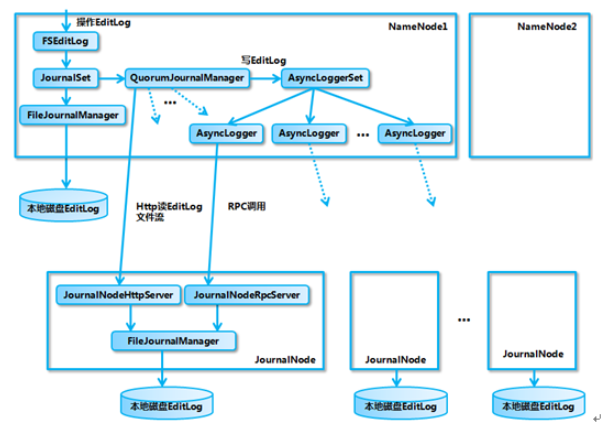
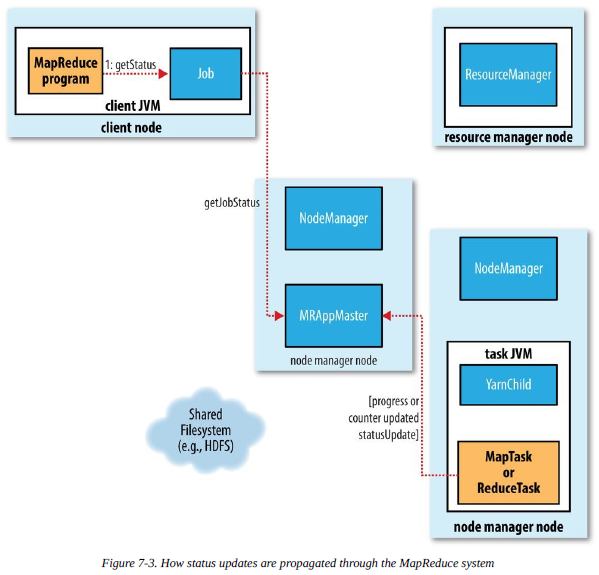
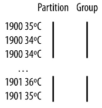
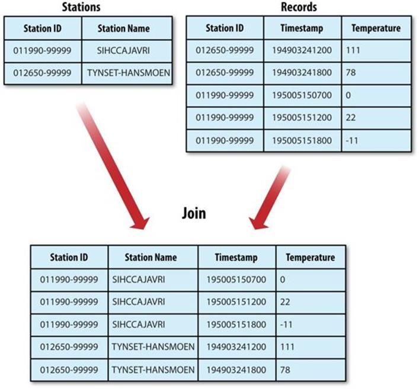

# Hadoop权威指南

> **第I部分 Hadoop基础知识**

## 第一章 初始Hadoop

### Hadoop 三种运行模式

- 独立（本地）模式：无需运行任何守护进程，所有程序都在同一个JVM上执行
- 伪分布模式：Hadoop守护进程运行在本地机器上，模拟一个小规模的集群
- 全分布模式：Hadoop守护进程运行在一个集群上

### 数据的存储与分析

对多个硬盘中的数据并行进行读／写，有很多问题需要解决

- 硬件故障问题 RAID，replica，HDFS
- 大多数分析任务需要以某种方式结合大部分数据来共同完成分析，MapReduce

Hadoop为我们提供了一个可靠的且可拓展的存储和分析平台

### 查询所有数据

MapReduce是一个批量查询处理器，能够在合理的时间范围内处理针对整个数据集的动态查询

YARN是一个集群资源管理系统，允许任何一个分布式程序（不仅仅是MapReduce）基于Hadoop集群的数据而运行

### 较于其他系统的优势

`寻址时间的提升远远不低于传输速率的提升`

MapReduce适合一次写入，多次读取数据的应用，关系型数据库则更适合持续更新的数据集

- 结构化数据：具有既定格式的实体化数据
- 半结构化数据：比较松散，虽然可能有格式但经常被忽略，所以它只能作为对数据结构的一般性指导
- 非结构化数据：没有什么特别的内部结构，如纯文本或图像数据

Hadoop对后两者非常有效

MapReduce以及Hadoop中其他的处理数据是可以随着数据规模线性伸缩的

高性能计算和网格计算主要使用类似于消息传递接口的API

**数据本地化特性是Hadoop数据处理的核心**

MapReduce三大设计目标

1. 为只需要短短几分钟或几小时就可以完成的作业提供服务
2. 运行于同一个内部有高速网络连接的数据中心内
3. 数据中心内的计算机都是可靠的，专门的硬件

## 第二章 关于MapReduce

`一种可用于数据处理的编程框架`

气象数据集

### **2.3 使用Hadoop来分析数据**

将查询表示成MapReduce作业，完成某种本地端的小规模测试之后，就可以把作业部署到集群上运行

#### map 和 reduce

mapreduce任务过程分为两个处理阶段，map阶段和reduce阶段。每阶段都以键值对作为输入和输出，程序员需要写两个函数：map函数和reduce函数

map函数的作用仅限于提取年份和气温信息，输出经由MapReduce框架处理后，最后发给reduce函数，这个处理过程基于键来对键值对进行排序和分组


MapReduce中，每个作业由两部分组成：应用程序和作业配置，作业配置内容包括环境配置和用户自定义配置两部分，环境配置由Hadoop自动添加

Mapper类

四个形参类型，分别制定map函数的输入键\值，输出键\值类型

```java
import java.io.IOException;
import org.apache.hadoop.io.IntWritable;
import org.apache.hadoop.io.LongWritable;
import org.apache.hadoop.io.Text;
import org.apache.hadoop.mapreduce.Mapper;
import org.apache.hadoop.mapred.MapReduceBase;

public class MaxTemperatureMapper extends Mapper<LongWritable, Text, Text, IntWritable> {

    private static final int MISSING = 9999;

    @Override
    public void map(LongWritable key, Text value, Context context) throws IOException, InterruptedException {
        String line = value.toString();
        String year = line.substring(15,19);
        int airTemperature;
        if (line.charAt(87) == '+') {
            airTemperature = Integer.parseInt(line.substring(88, 92));
        } else {
            airTemperature = Integer.parseInt(line.substring(87, 92));
        }

        String quality = line.substring(92, 93);
        if (airTemperature != MISSING && quality.matches("[01459]")) {
            context.write(new Text(year), new IntWritable(airTemperature));
        }
    }
}
```

Reducer类

reduce函数的输入类型必须匹配map函数的输出类型：Text类型和IntWritable类型

```java
import java.io.IOException;
import org.apache.hadoop.io.IntWritable;
import org.apache.hadoop.io.LongWritable;
import org.apache.hadoop.io.Text;
import org.apache.hadoop.mapreduce.Reducer;

public class MaxTemperatureReducer
        extends Reducer<Text, IntWritable, Text, IntWritable> {
    @Override
    public void reduce(Text key, Iterable<IntWritable> values, Context context) throws IOException, InterruptedException {
        int maxValue = Integer.MIN_VALUE;
        for (IntWritable value : values) {
            maxValue = Math.max(maxValue, value.get());
        }
        context.write(key, new IntWritable(maxValue));
    }
}
```

运行MapReduce作业

Job 对象指定作业执行规范，我们用它来控制整个作业的运行

```java
import java.io.IOException;
import org.apache.hadoop.fs.Path;
import org.apache.hadoop.io.IntWritable;
import org.apache.hadoop.io.Text;
import org.apache.hadoop.mapreduce.Job;
import org.apache.hadoop.mapreduce.lib.input.FileInputFormat;
import org.apache.hadoop.mapreduce.lib.output.FileOutputFormat;

public class MaxTemperature {
    public static void main(String[] args) throws Exception {
        if (args.length != 2) {
            System.err.println("Usage: MaxTemperature <input path> <output path>");
            System.exit(-1);
        }
        Job job = new Job();
        // 传递一个类，Hadoop利用这个类来查找包含它的jar文件，进而找到相关的jar文件
        job.setJarByClass(MaxTemperature.class);
        job.setJobName("Max temperature");

        // 设置文件输入输出路径
        FileInputFormat.addInputPath(job, new Path(args[0]));
        FileOutputFormat.setOutputPath(job, new Path(args[1]));

        // 指定要用的map类型和reduce类型
        job.setMapperClass(MaxTemperatureMapper.class);
        job.setReducerClass(MaxTemperatureReducer.class);

        // 控制reduce函数的输出类型，并且必须和reduce类产生的相匹配
        // map函数的输出类型默认情况下和reduce函数是相同的
        // 如果不同需调用 setMapOutputKeyClass和setMapOutputValueClass
        job.setOutputKeyClass(Text.class);
        job.setOutputValueClass(IntWritable.class);

        System.exit(job.waitForCompletion(true) ? 0 : 1);
    }
}
```

命令行执行：

- > export HADOOP_CLASSPATH=hadoop-example.jar

- > hadoop MaxTemperature input/ncdc/1901 output

### **2.4 横向扩展**

为实现横向扩展，我们需要把数据存储在分布式文件系统中（HDFS），通过使用Hadoop资源管理系统YARN，Hadoop可以将MapReduce计算转移到存储有部分数据的各台机器上

#### 数据流

分片：MapReduce的输入数据划分成等长的小数据块

最佳分片应该和块大小相同：因为它是确保可以存储在单个节点上的最大输入块的大小

**map任务将其输出写入本地磁盘而非HDFS**：因为map的输出是中间结果，一旦作业完成该结果可删除

图中，a为本地数据map任务，b为本地机架map任务，c为跨机架map任务


reduce任务不具备数据本地化的优势，单个reduce任务的输入通常来自所有mapper的输出，**reduce的输出通常存储在HDFS中以实现可靠存储**

图为一个reduce任务的MapReduce数据流，虚线框表示节点，reduce任务数量是独立指定的


如果有好多个reduce任务，每个map任务就会针对输出进行分区，每个reduce任务建立一个分区，每个分区有许多键，每个键对应的键值对都在同一个分区，分区可有用户定义的分区函数控制，通常使用hash函数来分区

多个reduce任务的数据流如下图，map任务和reduce任务之间的数据流称为shuffle（混洗），每个reduce任务的输入都来自许多map任务，**调整混洗参数对作业总执行时间影响非常大**


当数据处理可以完全并行（无需混洗）时，可能会出现无reduce任务的情况，这种情况下，唯一的非本地节点数据传输是map任务将结果写入HDFS


#### combiner函数

combiner函数不能取代reduce函数，我们仍需要reduce函数来处理不同map输出中具有相同键的记录，但combiner函数能帮助减少mapper和reducer之间的数据传输量

combiner是通过reducer类来定义的，在这个例子中，它的实现于MaxTemperatureReducer中的reduce函数相同，唯一改动的是job中设置combiner类

```java
import org.apache.hadoop.fs.Path;
import org.apache.hadoop.io.IntWritable;
import org.apache.hadoop.io.Text;
import org.apache.hadoop.mapreduce.Job;
import org.apache.hadoop.mapreduce.lib.input.FileInputFormat;
import org.apache.hadoop.mapreduce.lib.output.FileOutputFormat;

public class MaxTemperatureWithCombiner {
    public static void main(String[] args) throws Exception {
        if (args.length != 2) {
            System.err.println("args ERROR");
            System.exit(-1);
        }

        Job job = new Job();
        job.setJarByClass(MaxTemperatureWithCombiner.class);
        job.setJobName("Max temperature");

        FileInputFormat.addInputPath(job, new Path(args[0]));
        FileOutputFormat.setOutputPath(job, new Path(args[1]));

        job.setMapperClass(MaxTemperatureMapper.class);
        job.setCombinerClass(MaxTemperatureReducer.class);

        job.setReducerClass(MaxTemperatureReducer.class);

        job.setOutputKeyClass(Text.class);
        job.setOutputValueClass(IntWritable.class);

        System.exit(job.waitForCompletion(true) ? 0 : 1);
    }
}
```

### **2.5 Hadoop Streaming**

Hadoop为MapReduce提供了不同的API，可以方便我们使用不同的编程语言来使用MapReduce框架，而不是只局限于Java

map的输入数据通过标准输入流传递给map函数，并且是一行一行地传输，最后将结果行写到标准输出，map输出的键值对是以一个制表符分隔的行，reduce函数的输入格式与之相同，结果写入标准输出

Python版本

map

```python
import re
import sys

for line in sys.stdin:
    val = line.strip()
    (year, temp, q) = (val[15:19], val[87:92], val[92:93])
    if (temp != "+9999" and re.match("[01459]", q)):
        print "%s\t%s" % (year, temp)
```

reduce

```python
import sys

(last_key, max_val) = (None, -sys.maxint)
for line in sys.stdin:
  (key, val) = line.strip().split("\t")
  if last_key and last_key != key:
    print "%s\t%s" % (last_key, max_val)
    (last_key, max_val) = (key, int(val))
  else:
    (last_key, max_val) = (key, max(max_val, int(val)))

if last_key:
  print "%s\t%s" % (last_key, max_val)
```

执行命令

cat input/ncdc/sample.txt | ch02-mr-intro/src/main/python/max_temperature_map.py | ch02-mr-intro/src/main/python/max_temperature_reduce.py

## 第三章 Hadoop分布式文件系统

`管理网络中跨多台计算机存储的文件系统称为分布式文件系统`

### **3.1 HDFS设计**

- 超大文件
- 流式数据访问
  - 读取整个数据集的时间延迟比读取第一条记录的时间延迟更重要
- 商用硬件
- 低时间延迟的数据访问
  - **HDFS是为高数据通途量应用优化的，可能会以提高时间延迟为代价，低延迟的数据访问HBase更适合**
- 大量的小文件
- 多用户写入，任意修改文件
  - 只支持单个写入者，以添加方式在文件末尾写数据

#### 数据块

HDFS块默认大小128MB，与磁盘传输速率有关

块抽象好处：

- 一个文件的大小可以大于网络中任意一个磁盘的容量
- 以抽象块为存储单元而非整个文件，大大简化了存储子系统的设计 

#### namenode 和 datanode

- namenode：管理节点，管理文件系统的命名空间，维护着文件系统树及整棵树内所有的文件和目录，这些信息以两个文件形式永久保存在本地磁盘上 **命名空间镜像文件（namespace image）** **编辑日志文件（edit log）**
- datanode：工作节点，根据需要存储并检索数据块，定期向namenode发送它们所存储的块的列表

namenode两种容错机制：

1. 备份哪些组成文件系统元数据持久状态的文件，一般配置是将持久状态写入本地磁盘的同时，写入一个远程挂载的网络文件系统
2. 运行一个辅助namenode，但它不能被用作namenode，定期合并编辑日志与命名空间镜像

#### 块缓存

通常datanode从磁盘中读取块，但对于访问频繁的文件，其对应的块可能被显式地缓存在datanode的内存中

#### 联邦HDFS

允许系统通过添加namenode实现扩展，其中每个namenode管理文件系统命名空间中的一部分

集群中的datanode需要注册到每个namenode，并且存储着来自多个数据块池中的数据块

#### HDFS的高可用性（High Availability）

namenode失效，新的namenode直到满足以下情形才能响应服务：

- 将命名空间的映射导入内存中
- 重演编辑日志
- 接受到足够多的来自datanode的数据块报告并退出安全模式

**活动-备用namenode**：当活动namenode失效，备用namenode就会接管它的任务并开始服务于来自客户端的请求，实现这一目标需要在架构上修改：

- namenode之间通过高可用共享存储实现编辑日志的共享
- datanode需要同时向两个namenode发送数据块处理报告
- 客户端需要使用特定的机制来处理namenode的失效问题
- 辅助namenode的角色被备用namenode所包含，备用的namenode为活动的namenode命名空间设置周期性检查点


**Namenode高可用架构** [参考文章](https://www.ibm.com/developerworks/cn/opensource/os-cn-hadoop-name-node/index.html
)

- Active NameNode和Standby NameNode：两台NameNode形成互备，前者为主NameNode，后者为备NameNode，只有主NameNode才能对外提供读写服务
- 主备切换控制器ZKFailoverController：对NameNode的主备切换进行总体控制，监控NameNode的健康状况，在主NameNode故障时借助ZooKeeper实现自动的主备选举和切换
- Zookeeper集群：为主备切换控制器提供主备选举支持
- 共享存储系统：保存了NameNode在运行过程中产生的HDFS元数据。主备NameNode通过该系统实现元数据同步
- DataNode节点：同时向主备NameNode上报数据块的位置信息

##### *NameNode主备切换实现*

由ZKFailoverController，HealthMonitor和ActiveStandbyElector这三个组件协同完成

ZKFailoverController（zkfc）启动的时候会创建HealthMonitor和ActiveStandbyElector这两个主要的内部组件，创建的同时也会向两者注册相应的回调方法

HealthMonitor主要负责检测NameNode的健康状态，发现NameNode状态变化会回调ZKFailoverController的方法进行自动的主备选举

ActiveStandbyElector主要负责完成自动的主备选举，内部封装了Zookeeper的处理逻辑，一点Zookeeper主备选举完成，会回调ZKFailoverController的方法进行NameNode的主备状态转换

NameNode 实现主备切换的流程如图，有以下几步：


1. HealthMonitor初始化完成之后会启动内部的线程来定时调用对应 NameNode的HAServiceProtocol RPC接口的方法，对NameNode的健康状态进行检测。
2. HealthMonitor如果检测到NameNode的健康状态发生变化，会回调ZKFailoverController注册的相应方法进行处理。
3. 如果ZKFailoverController判断需要进行主备切换，会首先使用ActiveStandbyElector来进行自动的主备选举。
4. ActiveStandbyElector与Zookeeper进行交互完成自动的主备选举。
5. ActiveStandbyElector在主备选举完成后，会回调ZKFailoverController的相应方法来通知当前的NameNode成为主 NameNode或备NameNode。
6. ZKFailoverController调用对应NameNode的HAServiceProtocol RPC接口的方法将NameNode转换为Active状态或Standby状态。

##### *NameNode的共享存储实现*

###### NameNode的元数据存储概述

NameNode在执行HDFS客户端提交的创建文件或移动文件这样的写操作的时候，会首先把这些操作记录在EditLog中，然后更新内存中的文件系统镜像。

- 内存中的文件系统镜像用于NameNode向客户端提供读服务
- EditLog仅仅是数据恢复时起作用

EditLog中的每一个操作称为事务，EditLog被切割为很多段每一段称为Segment

NameNode会定期对内存中的文件系统镜像进行checkpoint操作，在磁盘上生成FSImage文件

NameNode启动时会进行数据恢复，首先把FSImage文件加载到内存中形成文件系统镜像，然后再把EditLog之中FSImage的结束事务id之后的EditLog回放到这个文件系统中

###### 基于QJM的共享系统的总体架构



**NameNode:**

- FSEditLog：这个类封装了对 EditLog 的所有操作，是 NameNode 对 EditLog 的所有操作的入口。
- JournalSet：这个类封装了对本地磁盘和 JournalNode 集群上的 EditLog 的操作，内部包含了两类 JournalManager
  - 一类为 FileJournalManager，用于实现对本地磁盘上 EditLog 的操作。
    - FileJornalmanager 封装了对本地磁盘上的 EditLog 文件的操作，不仅 NameNode 在向本地磁盘上写入 EditLog 的时候使用 FileJournalManager，JournalNode 在向本地磁盘写入 EditLog 的时候也复用了 FileJournalManager 的代码和逻辑。
  - 一类为 QuorumJournalManager，用于实现对 JournalNode 集群上共享目录的EditLog的操作。
    - 封装了对 JournalNode 集群上的 EditLog 的操作，它会根据 JournalNode 集群的 URI 创建负责与 JournalNode 集群通信的类 AsyncLoggerSet， QuorumJournalManager 通过 AsyncLoggerSet 来实现对 JournalNode 集群上的 EditLog 的写操作，对于读操作，QuorumJournalManager 则是通过 Http 接口从 JournalNode 上的 JournalNodeHttpServer 读取 EditLog 的数据。
  - FSEditLog 只会调用 JournalSet 的相关方法，而不会直接使用 FileJournalManager 和 QuorumJournalManager。

- AsyncLoggerSet：内部包含了与 JournalNode 集群进行通信的 AsyncLogger 列表，每一个 AsyncLogger 对应于一个 JournalNode 节点，另外 AsyncLoggerSet 也包含了用于等待大多数 JournalNode 返回结果的工具类方法给 QuorumJournalManager 使用。
  - AsyncLogger：具体的实现类是 IPCLoggerChannel，IPCLoggerChannel 在执行方法调用的时候，会把调用提交到一个单线程的线程池之中，由线程池线程来负责向对应的 JournalNode 的 JournalNodeRpcServer 发送 RPC 请求。

**JournalNode:**

- JournalNodeRpcServer：运行在 JournalNode 节点进程中的 RPC 服务，接收 NameNode 端的 AsyncLogger 的 RPC 请求。
- JournalNodeHttpServer：运行在 JournalNode 节点进程中的 Http 服务，用于接收处于 Standby 状态的 NameNode 和其它 JournalNode 的同步 EditLog 文件流的请求。

### **3.3 命令行接口**

启动HDFS：`start-dfs.sh`

`hadoop fs -ls [path]`

没有指定[path]的时候，在hdfs中hadoop扩展目录到 /home/[username]，其中[username]被执行命令的linux username所代替例如

`ubuntu@lenovo:~$ hadoop fs -ls`

hadoop查询的路径为：/home/ubuntu

`ubuntu@lenovo:~$ hadoop fs -ls hdfs://localhost:9000`

hadoop查询的路径为指定的[path]，其是hdfs的根目录类似于：`ubuntu@lenovo:~$ hadoop fs -ls /`

### **3.4 Hadoop文件系统**

Hadoop是由Java写的，通过Java API可以调用大部分Hadoop文件系统的交互操作

WebHDFS协议童工HTTP REST API使得其他语言开发的应用能够方便的于HDFS交互

通过HTTP访问HDFS有两种方式

- 直接访问：HDFS守护进程接收客户端的HTTP请求
  - namenode和datanode内嵌的web服务器作为WebHDFS的端节点运行
  - 元数据由namenode管理，文件读写先发往namenode，由namenode发送一个HTTP重定向到某个客户端，指定以流方式传输文件数据的目的或源datanode
- 代理访问：客户端通过DistributedFileSystem API访问HDFS
  - 所有到集群的网络通信都需要经过代理，代理服务器可以部署更加严格的防火墙策略和带宽限制策略


### **3.5 Java接口**

#### 通过URLStreamHandler访问HDFS文件

```java
import org.apache.hadoop.fs.FsUrlStreamHandlerFactory;
import org.apache.hadoop.io.IOUtils;

import java.io.InputStream;
import java.net.URL;

public class URLCat {
    static {
        URL.setURLStreamHandlerFactory(new FsUrlStreamHandlerFactory()); //每个java虚拟机只能调用一次这个方法
    }

    public static void main(String[] args) throws Exception {
        InputStream in = null;
        try {
            in = new URL(args[0]).openStream();
            IOUtils.copyBytes(in, System.out, 4096, false);
        } finally {
            IOUtils.closeStream(in);
        }
    }
}
```

#### 通过FileSystem访问HDFS文件

```java
import org.apache.hadoop.conf.Configuration;
import org.apache.hadoop.fs.Path;
import org.apache.hadoop.io.IOUtils;
import org.apache.hadoop.fs.FileSystem;
import sun.nio.ch.IOUtil;

import java.io.InputStream;
import java.net.URI;

public class FileSystemCat {
    public static void main(String[] args) throws Exception {
        String uri = args[0];
        Configuration conf = new Configuration();
        FileSystem fs = FileSystem.get(URI.create(uri), conf);
        InputStream in = null;
        try {
            in = fs.open(new Path(uri));
            IOUtils.copyBytes(in, System.out, 4096, false);
        } finally {
            IOUtils.closeStream(in);
        }

    }
}
```

#### 写入数据

将本地文件复制到Hadoop文件系统，调用create()方法写入文件时会自动创建父目录

```java
import java.io.BufferedInputStream;
import java.io.FileInputStream;
import java.io.InputStream;
import java.io.OutputStream;
import java.net.URI;

import org.apache.hadoop.conf.Configuration;
import org.apache.hadoop.fs.FileSystem;
import org.apache.hadoop.io.IOUtils;
import org.apache.hadoop.util.Progressable;
import org.apache.hadoop.fs.Path;

public class FileCopyWithProgress {
    public static void main(String[] args) throws Exception {
        String localSrc = args[0];
        String dst = args[1];
        InputStream in = new BufferedInputStream(new FileInputStream(localSrc));

        Configuration conf = new Configuration();
        FileSystem fs = FileSystem.get(URI.create(dst), conf);
        OutputStream out = fs.create(new Path(dst), new Progressable() {
            @Override
            public void progress() {
                System.out.println(".");
            }
        });

        IOUtils.copyBytes(in, out, 4096, true);
    }

}
```

#### 查询文件系统

1. 文件元数据 FileStatus
    - FileStatus封装了文件系统中文件和目录的元数据，包括文件长度、块大小、复本、修改时间、所有者以及权限信息

2. 列出文件 listStatus

3. 文件模式 globStatus
    - 返回路径格式与指定模式匹配的所有FileStatus对象组成的数组，并按路径排序
4. PathFilter对象
    - 用于排除匹配正则表达式的路径

### **3.6 数据流**

#### 剖析文件读取

1. 客户端调用FileSystem对象的open()方法打开希望读取的文件，对于HDFS来说，这个对象是 DistributedFileSystem 的一个实例
2. DistributedFileSystem 通过远程过程调用(RPC)来调用namenode，确定文件起始块位置
    - 对于每个块，namenode返回存有该块副本的datanode地址，这些datanode根据它们与客户端的距离来排序，如果该客户端本身就是一个datanode，那么该客户端将会从保存有相应数据的块副本的本地datanode中读取数据
3. DistributedFileSystem 类返回一个FSDataInputStream对象给客户端以便读取数据，FSDataInputStream 类转而封装 DFSInputStream 对象，该对象管理着 datanode 和 namenode 的I/O，接着客户端对这个输入流调用read()方法
4. 存储文件起始几个块的datanode地址的 DFSInputStream 随即连接距离最近的文件中第一个块所在的 datanode 通过反复调用 read() 方法，可以将数据从 datanode 传输到客户端
5. 到达块的末端时，DFSInputStream 关闭与该 datanode的连接，然后寻找下一块最佳 datanode
6. 客户端也会根据需要询问namenode来检索下一批数据块的 datanode 的位置，客户端读取完毕，就对FSDataInputStream调用close()方法


这个设计的重点是：客户端可以直接连接到datanode检索数据，由于数据分散在集群中的所有datanode中，所以这种设计能使HDFS 扩展到大量的并发客户端，同时namenode只要响应块位置的请求，无需响应数据请求，否则随着客户端的请求，namenode会成为瓶颈

#### 剖析文件写入

1. 客户端通过DistributedFileSystem 对象调用 create() 来新建文件
2. DistributedFileSystem 对象调用 create() 创建一个RPC调用，在文件系统的命名空间中新建一个文件，此时此刻该文件还没有响应的数据块
3. namenode 执行各种不同的检查以确保这个文件不存在以及客户端有新建该文件的权限，检查通过，namenode会为创建新文件记录一条记录，否则抛出IOException异常
    - DistributedFileSystem 向客户端返回一个 FSDataOutputStream 对象，由此可以开始写入数据，FSDataOutputStream 封装一个 DFSOutpurStream 对象，该对象负责处理 datanode 和 namenode 之间的通信
4. DFSOutputStream 将数据分成一个个数据包，写入数据队列(data
 queue)，DataStreamer处理数据队列，它的责任是挑选出适合存储复本的一组datanode，并据此来要求namenode分配新的数据块
5. DFSOutputStream 也维护着一个内部数据包队列来等待datanode的收到确认回执，称为确认队列(ack queue)，收到管道中所有datanode确认信息后，该数据包才会从确认队列删除
6. 客户端完成数据的写入后，对数据流调用 close() 方法
7. 该操作将剩余的所有数据包写入datanode管线，并在联系到namenode告知其文件写入完成之前，等待确认


namenode 已经知道文件是由那些块组组成(因为 DataStreamer 请求分配数据块) 所以它在返回成功前只需要等待数据块进行最小量的复制

#### 一致模型

hflush() 方法不保证 datanode 已经将数据写到磁盘上，仅保证数据据在 datanode 的内存上

hsync() 方法将数据写入到磁盘上

### **3.7 通过distcp并行复制**

代替 `hadoop fs -cp`

`% hadoop distcp file1 file2`，也可以复制目录：`hadoop distcp dir1 dir2`

`hadoop distcp -update dir1 dir2` 修改了 dir1 子树中的一个文件，将修改同步到dir2

:floppy_disk:

## 第四章 关于YARN

Yet Another Resource Negotiator 是 Hadoop 的集群资源管理系统，最初是为了改善MapReduce的实现，但它具有足够的通用性，同样可以支持其他的分布式计算模式


### **4.1 剖析YARN应用运行机制**

YARN提供核心服务的守护进程有：

- 管理集群上资源使用的资源管理器
- 运行在集群中所有节点上且能够启动和监控容器的节点管理器


1. 客户端联系资源管理器，要求它运行一个 application master 进程
2. 资源管理器找到一个能够在容器中启动 application master 的节点管理器
3. application mater 一旦启动起来能够做些什么依赖于应用本身，有可能是在所处的容器中简单运行一个计算，并将结果返回给客户端，或是向资源管理器请求更多的容器
4. 以用于运行一个分布式计算

YARN 本身不会为应用的各部分彼此间通信提供任何手段，大多数重要的YARN应用使用某种形式的远程通信机制 (Hadoop的RPC层) 来向客户端传递状态更新和返回结果，但是这些通信机制都是专属于各应用的

#### 资源请求

YARN 有一个灵活的资源请求模型，当请求多个容器时，可以指定每个容器需要的计算机资源数量，还可以指定对容器的本地限制要求

Spark采用在集群上启动固定数量的执行器，MapReduce则分两步走，在最开始时申请map任务容器，reduce任务容器的启动放在后期

#### 应用生命期

按照应用到用户运行的作业之间的映射关系对应用进行分类

最简单的模型：一个用户作业对应一个应用，这是MapReduce采取的方式

第二种模型：作业的每个工作流或每个用户对话对应一个应用，这种方法要比第一种情况效率高，因为容器可以在作业之间重用，并且可能缓存作业之间的中间结果，Spark采取的是这种模型

第三种模型：多个用户共享一个长期运行的应用，这个应用通常作为一种协调者的角色在运行

### **4.2 YARN与MapReduce 1 相比**

MapReduce 1 和 YARN在组成上的比较，YARN的很多设计是为了解决MapReduce 1的局限性

| MapReduce 1 | YARN                                         |
| ----------- | -------------------------------------------- |
| Jobtracker  | 资源管理器、application master、时间轴服务器 |
| Tasktracker | 节点管理器                                   |
| Slot        | 容器                                         |

使用YARN的好处包括

- 可扩展性
- 可用性
- 利用率
  - MapReduce 1中，每个tasktracker都配置有若干固定长度的slot，这些slot是静态分配的，在配置的时候被划分为 map slot 和 reduce slot
  - YARN 中，一个节点管理器管理一个资源池，而不是指定数目的slot，YARN 上运行的MapReduce任务不会出现由于集群中仅有map slot可用导致reduce任务必须等待的情况
- 多租户
  - 最大的优点是向MapReduce以外其他类型的分布式应用开放了Hadoop

### **4.3 YARN中的调度**

YARN有三种调度器可用：FIFO调度器、容量调度器、公平调度器

FIFO调度器

- 优点是简单易懂，不行也要任何配置，但是不适合共享集群，大的应用会占用集群中的所有资源，所以每个应用必须等待直到轮到自己运行

容量调度器

- 一个独立的专门队列保证小作业一提交就可以启动，大作业执行时间较长

公平调度器

- 调度器动态平衡资源，第一个大作业启动（唯一运行的作业）获取集群中所有的资源，第二个作业启动时，它被分配到集群的一半资源，这样每个作业都能共享资源


用户队列间的公平共享


## 第五章 Hadoop的I/O操作

### **5.1 数据完整性**

HDFS 会对写入的所有数据计算校验和，并在读取数据时验证校验和

- datanode 负责在收到数据后存储该数据及其校验和之前 对数据进行验证，管线中最后一个datanote负责验证校验和
- 客户端从datanode 读取数据时也会验证校验和，将它们与datanode中存储的校验和进行比较
- 每个datanode也会在一个后台线程中运行一个 DataBlockScanner，从而定期验证存储在这个 datanode 上的所有数据块

#### LocalFileSystem

Hadoop 的LocalFileSystem 执行客户端的校验和验证，我们也可以禁用校验和计算，特别是在底层文件系统本身就支持检验和的时候，在这种情况下，使用RawLocalFileSystem 替代 LocalFileSystem

#### ChecksumFileSystem

LocalFileSystem 通过 ChecksumFileSystem 来完成自己的任务，ChecksumFileSystem 类集继承自FileSystem 类，一般用法是：

```java
FileSystem rawFs = ...
FileSystem checksummedFs = new ChecksumFileSystem(rawFs);
```

### **5.2 压缩**

文件压缩的两个好处：

- 减少存储文件所需要的空间
- 加速数据在网络和磁盘上的传输

#### codec

codec是压缩-解压缩算法的一种实现，在Hadoop中，一个对CompressionCodec接口的事件代表一个codec

##### 1. 通过CommpressionCodec对数据流进行压缩和解压缩

- 对写入输出数据流的数据进行压缩，可用`createOutputStream(OutputStream out)`方法在底层的数据流中对需要以压缩格式写在此之前尚未压缩的数据新建一个CommpressionOutputStream对象
- 对输入数据流中读取的数据解压时，调用`createInputStream(Input in)`获取CompressionInputStream可以通过该方法从底层数据流读取解压后的数据

该程序压缩从标准输入读取的数据，然后将其写到标准输出

```java
import org.apache.hadoop.conf.Configuration;
import org.apache.hadoop.io.IOUtils;
import org.apache.hadoop.io.compress.CompressionCodec;
import org.apache.hadoop.io.compress.CompressionOutputStream;
import org.apache.hadoop.util.ReflectionUtils;

public class StreamCompressor {
    public static void main(String[] args) throws Exception {
        // 符合CompressionCodec 实现的完全合格名称作为第一个命令行参数
        String codecClassname = args[0];
        Class<?> codecClass = Class.forName(codecClassname);
        Configuration conf = new Configuration();
        // 使用 ReflectionUtils创建一个codec实例
        CompressionCodec codec = (CompressionCodec)ReflectionUtils.newInstance(codecClass, conf);
        // 并由此获得在 System.out 上支持压缩的一个包装方法
        CompressionOutputStream out = codec.createOutputStream(System.out);
        // 将输入数据复制到输出
        IOUtils.copyBytes(System.in, out, 4096, false);
        // 要求压缩方法将写操作完成到压缩数据流上，但不关闭这个数据流
        out.finish();
    }
}
```

执行命令：

- `export HADOOP_CLASSPATH=StreamCompressor.jar`
- `echo "hello" | hadoop StreamCompressor org.apache.hadoop.io.compress.GzipCodec | gunzip -`

##### 2. 通过CompressionCodecFactory推断 CompressionCodec

根据文件拓展名选取 codec 解压文件

```java
import org.apache.hadoop.conf.Configuration;
import org.apache.hadoop.fs.FileSystem;
import org.apache.hadoop.fs.Path;
import org.apache.hadoop.io.IOUtils;
import org.apache.hadoop.io.compress.CompressionCodec;
import org.apache.hadoop.io.compress.CompressionCodecFactory;

import java.io.InputStream;
import java.io.OutputStream;
import java.net.URI;


public class FileDecompressor {

    public void main(String[] args) throws Exception {
        String uri = args[0];
        Configuration conf = new Configuration();
        FileSystem fs = FileSystem.get(URI.create(uri), conf);

        Path inputPath = new Path(uri);
        CompressionCodecFactory factory = new CompressionCodecFactory(conf);
        CompressionCodec codec = factory.getCodec(inputPath);
        if (codec == null) {
            System.err.println("no codec found for " + uri);
            System.exit(1);
        }
        // 除去文件拓展名，形成输出文件名
        String outputUri = CompressionCodecFactory.removeSuffix(uri, codec.getDefaultExtension());

        InputStream in = null;
        OutputStream out = null;
        try {
            in = codec.createInputStream(fs.open(inputPath));
            out = fs.create(new Path(outputUri));
            IOUtils.copyBytes(in, out, conf);
        } finally {
            IOUtils.closeStream(in);
            IOUtils.closeStream(out);
        }
    }
}
```

##### 3. 原生类库

为了提高性能，最好使用native类库实现压缩和解压缩

##### 4. CodecPool

如果使用的是原生代码库并且需要在应用中执行大量的压缩和解压缩操作，可以考虑使用CodecPool

#### 压缩和输入分片

文件经过gzip压缩，压缩后的文件大小为1GB，与以前一样，HDFS将这个文件保存为8个数据块，但是将每个数据块单独作为一个输入分片是无法实现工作的，因为无法实现从gzip压缩数据流的任意位置读取数据，所以让map任务独立于其他任务进行数据读取是不可行的

gzip不支持文件切分

bzip2 文件提供不同数据块之间的同步标识，因而它支持切分

对大文件按来说，不要使用不支持切分整个文件的压缩格式，因为会失去数据的本地特性，进而造成MapReduce应用效率地下

##### 对map任务输出进行压缩

尽管MapReduce应用读写的是未经压缩的数据，但是map阶段的中间输入进行压缩可以获得不少好处，例如减少传输的数据量

### **5.3 序列化**

>序列化 是指将结构化对象转化为字节流以便在网络上传输或写到硬盘中进行永久存储的过程，反序列化是指将字节流转回结构化对象的逆过程

序列化的是对象的状态

序列化用于分布式数据处理的两大领域：

- 进程间通信
- 永久存储

Hadoop中，系统中多个节点上进程间通信是通过“远程过程调用”(RPC)实现的，RPC协议将消息序列化成二进制流后发送到远程节点，远程节点接着将二进制流反序列化为原始消息，RPC序列化格式如下：

- 紧凑
  - 紧凑格式能充分利用网络带宽
- 快速
  - 减少序列化和反序列化的开销
- 可扩展
  - 为了满足新需求，协议不断变化，可读取老格式的数据
- 支持互操作
  - 支持不同语言写的客户端和服务器的交互

#### Writable接口

Writable 接口定义了两种方法

- `write(DataOutput out)` 将其状态写入DataOutput二进制流
- `readFileds(DataInput in)` 从DataInput二进制流读取状态

#### Writable类

##### 1. Java基本类型的Writable封装器

- 定长格式编码很是和数值在整个值域空间中分布非常均匀的情况，例如哈希函数
- 大部分数值变量的分布都不均匀，使用变长格式会更节省空间

##### 2. Text类型

针对UTF-8序列的Writable类，可以理解为等价于Writable类的`java.lang.String`

对Text类的索引是根据编码后字节序列中的位置实现的，并非字符串中的Unicode字符，也不是 java char 的编码单元，Text的charAt返回一个该编码位置的int类型值，String返回该位置的char类型值，charAt()方法的用法
如下：

```java
Text t = new Text("Hadoop");
assertThat(t.getLength(), is (6));
assertThat(t.getBytes().length, is(6));

assertThat(t.charAt(2), is((int)'d'));
assertThat("Out of bounds", t.charAt(100), is(-1));
```

Text还有一个find()方法，该方法类似于String的 indexOf()

```java
Text t = new Text("hadoop");
assertThat("Find a substring", t.find("do"), is(2));
assertThat("Finds first 'o'", t.find("o"), is(3));
assertThat("Finds 'o' from position 4 or later", t.find("o", 4), is(4));
assertThat("No match", t.find("pig"), is(-1));
```

- String 的长度是器所含char编码单元的个数，indexOf()方法返回char编码单元中的索引位置
- Text对象的长度却是其UTF-8编码的字节数，find()方法返回字节偏移量
- 与String另一个区别是Text是可变的，通过调用set()方法，Text通过toString()方法实现String对象

##### 3. BytesWritable

BytesWritable 是对二进制数据数组的封装，序列化格式为：一个指定所含数据字节数的整数域，后跟数据内容本身

长度为2的字节数组包含数值3和5，序列化形式为一个4字节的整数（00000002）和该数组中的两个字节（03和05）

```java
BytesWriable b = new BytesWritable(new byte[]{3, 5});
byte[] bytes = serialize(b);
assertThat(StringUtils.byteToHeString(bytes), is("000000020305"));
```

BytesWritable 是可变的

##### 4. NullWritable

NullWritable是Writable的特殊类型，它的序列化长度为0，它并不从数据流中读取数据，也不写入数据，在MapReduce中，如果不需要使用键或值的序列化地址，就可以将键或值声明为NullWritable，这样可高效存储常量空值

##### 5. ObjectWritable 和 GenericWritable

ObjectWritable是对Java基本类型（String，enum，Writable，null或这些类型组成的数组）的一个通用封装，他在Hadoop RPC中用于对方法的参数和返回类型进行封装和解封装

##### 6. Writable 集合类

org.apache.hadoop.io 中有6个Writable集合类，分别是 ArrayWritable，ArrayPrimitiveWritable，TwoDArrayWritable，MapWritable，SortedMapWritable，EnumMapWritable

- ArrayWritable 和 TwoDWritable 是对 Writable 的数组和二维数组的实现
- ArrayPrimitiveWritable 是对java基本数组类型的一个封装
- MapWritable，SortedMapWritable 分别实现了 java.util.Map<Writable, Writable> 和 java.util.SortedMap<WritableComparable, Writable>

#### 实现定制的Writable集合

有了定制的Writable类型，就可以完全控制二进制表示的排序顺序

```java
import java.io.*;
import org.apache.hadoop.io.*;
public class TextPair implements WritableComparable<TextPair> {
    private Text first;
    private Text second;

    public TextPair() {
        set(new Text(), new Text());
    }

    public TextPair(String first, String second) {
        set(new Text(first), new Text(second));
    }

    public TextPair(Text first, Text second) {
        set(first, second);
    }

    public void set(Text first, Text second) {
        this.first = first;
        this.second = second;
    }

    public Text getFirst() {
        return this.first;
    }

    public Text getSecond() {
        return this.second;
    }

    // 依次将每个Text对象序列化到输出流中
    @Override
    public void write(DataOutput out) throws IOException {
        first.write(out);
        second.write(out);
    }

    // 将来自输入流的字节进行反序列化
    @Override
    public void readFields(DataInput in) throws IOException {
        first.readFields(in);
        second.readFields(in);
    }

    @Override
    public int hashCode() {
        return first.hashCode() * 163 + second.hashCode();
    }

    @Override
    public boolean equals(Object o) {
        if (o instanceof TextPair) {
            TextPair tp = (TextPair)o;
            return first.equals(tp.first) && second.equals(tp.second);
        }
        return false;
    }

    @Override
    public String toString() {
        return first + "\t" + second;
    }

    @Override
    public int compareTo(TextPair tp) {
        int cmp = first.compareTo(tp.first);
        if (cmp != 0) {
            return cmp;
        }
        return second.compareTo(tp.second);
    }
}
```

##### 1. 为提高速度实现一个RawComparator

当TextPair被用作MapReduce的键时，需要将数据流反序列化为对象，然后调用compareTo()方法进行比较

其实我们还可以看序列化表示比较两个TextPair对象

```java
 public static class Comparator extends WritableComparator {
        private static final Text.Comparator TEXT_COMPARATOR = new Text.Comparator();

        public Comparator() {
            super(TextPair.class);
        }

        @Override
        public int compare(byte[] b1, int s1, int l1,
                           byte[] b2, int s2, int l2) {
            try {
                // firstL1 和 firstL2 表示每个字节流中第一个Text字段的长度
                // WritableUtils.decodeVIntSize表示变长整数的长度，readVInt表示编码值
                int firstL1 = WritableUtils.decodeVIntSize(b1[s1]) + readVInt(b1, s1);
                int firstL2 = WritableUtils.decodeVIntSize(b2[s2]) + readVInt(b2, s2);

                int cmp = TEXT_COMPARATOR.compare(b1, s1, firstL1, b2, s2, firstL2);

                if (cmp != 0) {
                    return cmp;
                }
                return TEXT_COMPARATOR.compare(b1, s1 + firstL1, l1 - firstL1,
                                                b2, s2 + firstL2, l2 - firstL2);
            } catch (IOException e) {
                throw new IllegalArgumentException(e);
            }
        }
    }

    static {
        WritableComparator.define(TextPair.class, new Comparator());
    }
```

##### 2. 定制的comparator

定制的RawComparator用于比较TextPair对象字节表示的第一个字段

```java
    public static class FirstComparator extends WritableComparator {
        private static final Text.Comparator TEXT_COMPARATOR = new Text.Comparator();

        public FirstComparator() {
            super(TextPair.class);
        }

        @Override
        public int compare(byte[] b1, int s1, int l1,
                           byte[] b2, int s2, int l2) {
            try {
                int firstL1 = WritableUtils.decodeVIntSize(b1[s1]) + readVInt(b1, s1);
                int firstL2 = WritableUtils.decodeVIntSize(b2[s2]) + readVInt(b2, s2);

                return TEXT_COMPARATOR.compare(b1, s1, firstL1, b2, s2, firstL2);
            } catch (IOException e) {
                throw new IllegalArgumentException(e);
            }
        }

        @Override
        public int compare(WritableComparable a, WritableComparable b) {
            if (a instanceof TextPair && b instanceof TextPair) {
                return ((TextPair)a).first.compareTo(((TextPair)b).first);
            }
            return super.compare(a, b);
        }
    }
```

#### 序列化框架

Hadoop有一个针对可替换序列化框架的API，序列化框架用一个Serialization实现来表示，例如 WritableSerialization 类是对 Writable 类型的 Serialization 实现

Serialization 对象定义了从类型到 Serializer 实例（将对象转换成为字节流）和 Deserializer实例（将字节流转换为对象） 的映射方式

不建议使用 Java Object Serialization

##### 序列化IDL

不通过代码来定义类型，而是接口定义语言（IDL）以不依赖于具体语言的方式进行声明

比较流行的序列化框架

- Apache Thrift
- Google Protocal Buffers
- 常用作二进制数据的永久存储格式，MapReduce格式对该类的支持有限
- Avro是一个基于IDL的序列化框架，非常适合于Hadoop的大规模数据处理

### **5.4 基于文件的数据结构**

需要特殊的数据结构来存储自己的数据

#### 关于SequenceFile

纯文本不适合记录二进制类型的数据，SequenceFile类非常适合，为二进制键-值对提供了一个持久数据结构

SequenceFile也可以作为小文件的容器

##### 1. SequenceFile 的写操作

```java
import java.io.IOException;
import java.net.URI;

import org.apache.hadoop.conf.Configuration;
import org.apache.hadoop.fs.FileSystem;
import org.apache.hadoop.fs.Path;
import org.apache.hadoop.io.IOUtils;
import org.apache.hadoop.io.IntWritable;
import org.apache.hadoop.io.SequenceFile;
import org.apache.hadoop.io.Text;

public class SequenceFileWriteDemo {
    private static final String[] DATA = {
        "One, two, buckle my shoe",
        "Three, four, shut the door",
        "Five, six, pick up sticks",
        "Seven, eight, lay them straight",
        "Nine, ten, a big fat hen"
    };

    public static void main(String[] args) throws IOException {
        String uri = args[0];
        Configuration conf = new Configuration();
        FileSystem fs = FileSystem.get(URI.create(uri), conf);
        Path path = new Path(uri);
        // 存储在SequenceFile中的键和值并不一定需要是Writable类型，只要能被Serialization序列化和反序列化就可以
        IntWritable key = new IntWritable();
        Text value = new Text();
        SequenceFile.Writer writer = null;
        try {
            // 创建SequenceFile对象，返回SequenceFile.Writer实例
            writer = SequenceFile.createWriter(fs, conf, path, key.getClass(), value.getClass());

            for (int i = 0; i < 100; i++) {
                key.set(100 - i);
                value.set(DATA[i % DATA.length]);
                System.out.printf("[%s]\t%s\t%s\n", writer.getLength(), key, value);
                writer.append(key, value);
            }
        } finally {
            IOUtils.closeStream(writer);
        }
    }
}
```

- 运行 `start-dfs.sh` 启动HDFS
- `export HADOOP_CLASSPATH=SequenceFileWriteDemo.jar`
- `hadoop SequenceFileWriteDemo numbers.seq`

##### 2. SequenceFile 的读操作

该程序显示了如何读取包含Writable类型键值对的顺序文件

```java
import java.io.IOException;
import java.net.URI;

import org.apache.hadoop.conf.Configuration;
import org.apache.hadoop.fs.FileSystem;
import org.apache.hadoop.fs.Path;
import org.apache.hadoop.io.IOUtils;
import org.apache.hadoop.io.SequenceFile;
import org.apache.hadoop.io.Writable;
import org.apache.hadoop.io.WritableComparable;
import org.apache.hadoop.util.ReflectionUtils;

public class SequenceFileReadDemo {
    public static void main(String[] args) throws IOException {
        String uri = args[0];
        Configuration conf = new Configuration();
        FileSystem fs = FileSystem.get(URI.create(uri), conf);
        Path path = new Path(uri);

        SequenceFile.Reader reader = null;
        try {
            reader = new SequenceFile.Reader(fs, path, conf);
            // getKeyClass getValueClass 发现SequenceFile中所使用的类型
            // ReflectionUtils对象生成常见键值实例
            Writable key = (Writable)ReflectionUtils.newInstance(reader.getKeyClass(), conf);
            Writable value = (Writable)ReflectionUtils.newInstance(reader.getValueClass(), conf);
            long position = reader.getPosition();
            while (reader.next(key, value)) {
                //  同步点
                String syncSeen = reader.syncSeen() ? "*" : "";
                System.out.printf("[%s%s]\t%s\t%s\n", position, syncSeen, key, value);
                position = reader.getPosition();
            }
        } finally {
            IOUtils.closeStream(reader);
        }
    }
}
```

同步点是指 数据读取迷路后能够再一次与记录边界同步的数据流中的某个位置，例如在数据流中搜索而跑到任意位置后可采取此动作

在顺序文件中搜索给定位置有两种方法。

- 第一种是调用seek()方法，该方法将读指针指向文件中指定的位置

```java
reader.seek(359);
assertThat(reader.next(key, value), is(true));
assertThat(((IntWritable)key).get(), is(95));
```

- 第二种方法通过同步点查找记录边界，SequenceFile.Reader 对象的sync(long position)方法 可以将读取位置定位到position之后的下一个同步点

可以将加入同步点的顺序文件作为MapReduce的输入，因为该类顺序文件允许切分，由此该文件的不同部分可以由独立的map任务单独处理

MapReduce是对多个顺序文件进行排序（或合并）最有效的方法，MapReduce本身是并行的，并且可由用户指定使用多少个reducer

##### SequenceFile 的格式

SequenceFile 由文件头和随后一条或多条记录组成

- SequenceFile的前三个字节为SEQ(顺序文件代码)
- 紧随其后的一个字节表示SequenceFile的版本号
- 文件头还包括其他字段，键值类的名称，数据压缩细节，用户定义的元数据以及同步标识


记录的内部结构取决于是否启用压缩，如果启用压缩，其结构取决于是记录压缩还是数据块压缩

- 记录压缩格式与无压缩情况基本相同，只不过值是用文件头中定义的codec压缩的，注意，键没有被压缩
- 块压缩是指一次性压缩多条记录，因为它可以利用记录间的相似性进行压缩


#### 关于MapFile

MapFile 是已经排过序的 SequenceFile，它有索引，所以可以按键查询，索引自身就是一个 SequenceFile 包含了map中的一小部分键，主数据文件是另一个 SequenceFile，包含了所有的 map 条目，这些条目都按照键顺序进行了排序

MapFile变种

- SetFile
- ArrayFile
- BloomMapFile

#### 其他文件格式和面向列的格式

Avro数据文件是面向大规模数据而设计的，又是可移植的，它们可以跨越不同的编程语言使用

SequenceFile，MapFile，Avro数据文件都是面向行的格式，面向列的存储布局可以使一个查询跳过那些不必访问的列

面向列的文件格式有：

- Hive的ORCFile
- 基于Google Dremel的Parquet
- Avro的Trevni

> **第II部分 关于MapReduce**

## 第六章 MapReduce 应用开发

MapReduce编程流程：

- 首先写map函数和reduce函数，单元测试来确保函数的运行符合预期
- 本地IDE用小的数据集来运行，调整代码
- 程序按预期通过小型数据集的测试，就可以把它放到集群上运行了，通过扩展测试用例调试修改
- 优化调整需要执行一些标准检查，借此加快MapReduce程序的运行速度，然后做任务剖析

### **6.1 用于配置的API**

Hadoop中的组件是通过Hadoop自己的配置API来配置的

```java
Configuration conf = new Configuration();
conf.addResource("configuration-1.xml");
```

#### 资源合并

后来添加到资源文件的属性会覆盖之前定义的属性，不过被标记为`final`的属性不能被后面的定义所覆盖

#### 变量扩展

配置属性可以用其他属性或系统属性进行定义，系统属性的优先级高于资源文件中定义的属性

### **6.2 配置开发环境**

#### 辅助类 GenericOptionsParser， Tool 和 ToolRunner

为了简化命令行方式运行作业，Hadoop自带一些辅助类，通常不直接使用GenericOptionsParser，更方便的方式是实现Tool接口，通过ToolRunner来运行应用程序，ToolRunner内部调用 GenericOptionsParser

```java
import org.apache.hadoop.conf.Configuration;
import org.apache.hadoop.conf.Configured;
import org.apache.hadoop.util.Tool;
import org.apache.hadoop.util.ToolRunner;

import java.util.Map;

public class ConfigurationPrinter extends Configured implements Tool {

    // 确保核心配置外的 HDFS，YARN和MapReduce配置能够被获取，因为Configuration已经获取了核心配置
    static {
        Configuration.addDefaultResource("hdfs-default.xml");
        Configuration.addDefaultResource("hdfs-site.xml");
        Configuration.addDefaultResource("yarn-default.xml");
        Configuration.addDefaultResource("yarn-site.xml");
        Configuration.addDefaultResource("mapred-default.xml");
        Configuration.addDefaultResource("mapred-site.xml");
    }

    public int run(String[] args) throws Exception {
        Configuration conf = getConf();
        for (Map.Entry<String, String> entry : conf) {
            System.out.printf("%s = %s\n", entry.getKey(), entry.getValue());
        }
        return 0;
    }

    public static void main(String[] args) throws Exception {
        //ToolRunner.run 方法负责在调用自身的run方法之前，为Tool建立一个Configuration对象
        int exitCode = ToolRunner.run(new ConfigurationPrinter(), args);
        System.exit(exitCode);
    }
}
```

编译运行：

- `mvn compile`
- `export HADOOP_CLASSPATH=/home/kong/IdeaProjects/mymapreduce/target/classes` 注意用等号连接
- `hadoop ConfigurationPrinter` 可以看到所有的配置信息

JVM 系统属性来自于 java.lang.System，而Hadoop属性只能从 Configuration对象中获取

### **6.3 用MRunit来写单元测试**

pom.xml中，mrunit的 scope 字段值为 test，所以只有在工程的 test文件夹下的java文件才可以引入 import mrunit

#### 关于Mapper

简单测试MaxTemperatureMapper

```java
@Test
public void processesValidRecord() throws IOException, InterruptedException {
    Text value = new Text("0043011990999991950051518004+68750+023550FM-12+0382" +
            "99999V0203201N00261220001CN9999999N9-00111+99999999999");
    // 测试的是Mapper，在调用runTest之前，配置mapper，输入key-value，期望的输出key-value
    new MapDriver<LongWritable, Text, Text, IntWritable>()
            .withMapper(new MaxTemperatureMapper())
            .withInput(new LongWritable(), value)
            .withOutput(new Text("1950"), new IntWritable(-11))
            .runTest();
}
```

---
v1版本的Mapper

```java
public class v1MaxTemperatureMapper extends Mapper<LongWritable, Text, Text, IntWritable> {

    @Override
    public void map(LongWritable key, Text value, Context context) throws IOException, InterruptedException {
        String line = value.toString();
        String year = line.substring(15, 19);
        int airTemperature = Integer.parseInt(line.substring(87, 92));
        context.write(new Text(year), new IntWritable(airTemperature));
    }
}
```

其测试用例为：

```java
@Test
public void ignoresMissingTemperatureRecord() throws IOException, InterruptedException {
    Text value = new Text("0043011990999991950051518004+68750+023550FM-12+0382" +
            "99999V0203201N00261220001CN9999999N9+99991+99999999999");
    new MapDriver<LongWritable, Text, Text, IntWritable>()
            .withMapper(new v1MaxTemperatureMapper())
            .withInput(new LongWritable(0), value)
            .runTest();
}
```

根据withOutput被调用的次数，MapDriver能用来检查0，1 或多个输出记录，由于没有考虑到+9999这样一种特殊情况，测试失败

---

v2版本的Mapper，添加一个解析类

```java
public class NcdcRecordParser {
    private static final int MISSING_TEMPERATURE = 9999;

    private String year;
    private int airTemperature;
    private String quality;

    public void parse(String record) {
        year = record.substring(15, 19);
        String airTemperatureString;
        if (record.charAt(87) == '+') {
            airTemperatureString = record.substring(88, 92);
        } else {
            airTemperatureString = record.substring(87, 92);
        }

        airTemperature = Integer.parseInt(airTemperatureString);
        quality = record.substring(92, 93);
    }

    public void parse(Text record) {
        parse(record.toString());
    }

    public boolean isValidTemperature() {
        return airTemperature != MISSING_TEMPERATURE && quality.matches("[01459]");
    }

    public String getYear() {
        return year;
    }

    public int getAirTemperature() {
        return airTemperature;
    }
}
```

对应的Mapper为：

```java
public class v2MaxTemperatureMapper extends Mapper<LongWritable, Text, Text, IntWritable> {

    private NcdcRecordParser parser = new NcdcRecordParser();

    @Override
    public void map(LongWritable key, Text value, Context context) throws IOException, InterruptedException {
        parser.parse(value);
        if (parser.isValidTemperature()) {
            context.write(new Text(parser.getYear()), new IntWritable(parser.getAirTemperature()));
        }
    }
```

---

#### 关于Reducer

reducer必须指出指定键的最大值，用来计算最高气温的reducer

```java
public class MaxTemperatureReducer extends Reducer<Text, IntWritable, Text, IntWritable> {
    @Override
    public void reduce(Text key, Iterable<IntWritable> values, Context context) throws IOException, InterruptedException {
        int maxValue = Integer.MIN_VALUE;
        for (IntWritable value : values) {
            maxValue = Math.max(maxValue, value.get());
        }
        context.write(key, new IntWritable(maxValue));
    }
}
```

测试用例：

```java
public class MaxTemperatureReducerTest {
    @Test
    public void returnsMaximumIntegerInvalues() throws IOException, InterruptedException {
        new ReduceDriver<Text, IntWritable, Text, IntWritable>()
                .withReducer(new MaxTemperatureReducer())
                .withInput(new Text("1950"), Arrays.asList(new IntWritable(10), new IntWritable(5)))
                .withOutput(new Text("1950"), new IntWritable(10))
                .runTest();
    }
}
```

### **6.4 本地运行测试数据**

现在Mapper和Reducer可以在受控的输入上进行工作了，下一步是写一个作业驱动程序，然后在开发机器上使用测试数据运行它

#### 在本地作业运行器上运行作业

```java
import com.google.common.annotations.VisibleForTesting;
import org.apache.hadoop.conf.Configured;
import org.apache.hadoop.fs.Path;
import org.apache.hadoop.io.IntWritable;
import org.apache.hadoop.io.Text;
import org.apache.hadoop.mapreduce.lib.output.FileOutputFormat;
import org.apache.hadoop.mapreduce.lib.input.FileInputFormat;
import org.apache.hadoop.mapreduce.Job;
import org.apache.hadoop.util.Tool;
import org.apache.hadoop.util.ToolRunner;

public class MaxTemperatureDriver extends Configured implements Tool {

    // MaxTemperatureDriver实现了Tool接口，所以可以设置 GenericOptionsParser支持的选项
    public int run(String[] args) throws Exception {
        if (args.length != 2) {
            System.err.printf("Usage: %s [generic options] <input> <output>\n", getClass().getSimpleName());
            ToolRunner.printGenericCommandUsage(System.err);
            return -1;
        }

        Job job = new Job(getConf(), "Max temperature");
        job.setJarByClass(getClass());

        FileInputFormat.addInputPath(job, new Path(args[0]));
        FileOutputFormat.setOutputPath(job, new Path(args[1]));

        job.setMapperClass(MaxTemperatureMapper.class);
        job.setCombinerClass(MaxTemperatureReducer.class);
        job.setReducerClass(MaxTemperatureReducer.class);

        job.setOutputKeyClass(Text.class);
        job.setOutputValueClass(IntWritable.class);

        return job.waitForCompletion(true) ? 0 : 1;
    }

    public static void main(String[] args) throws Exception {
        int exitCode = ToolRunner.run(new MaxTemperatureDriver(), args);
        System.exit(exitCode);
    }
}
```

Usage:

```txt
Usage: MaxTemperatureDriver [generic options] <input> <output>
Generic options supported are:
-conf <configuration file>        specify an application configuration file
-D <property=value>               define a value for a given property
-fs <file:///|hdfs://namenode:port> specify default filesystem URL to use, overrides 'fs.defaultFS' property from configurations.
-jt <local|resourcemanager:port>  specify a ResourceManager
-files <file1,...>                specify a comma-separated list of files to be copied to the map reduce cluster
-libjars <jar1,...>               specify a comma-separated list of jar files to be included in the classpath
-archives <archive1,...>          specify a comma-separated list of archives to be unarchived on the compute machines

The general command line syntax is:
command [genericOptions] [commandOptions]
```

运行命令 `hadoop MaxTemperatureDriver -fs file:/// -jt local path/to/input/ncdc/micro output`

本地作业运行器实际上可以在包括 HDFS 在内的任何文件系统上正常工作

#### 测试驱动程序

除了灵活的配置选项可以使应用程序实现Tool，还可以插入任意Configuration来增加可测试性

- 第一种方法是使用本地作业运行器，在本地文件系统的测试文件上运行作业

```java
import org.apache.hadoop.conf.Configuration;
import org.apache.hadoop.fs.FileSystem;
import org.apache.hadoop.fs.Path;
import org.junit.Test;

import static org.hamcrest.core.Is.is;
import static org.junit.Assert.assertThat;


public class MaxTemperatureTest {
    @Test
    public void test() throws Exception {
        Configuration conf = new Configuration();
        // 指明了 fs.defaultFS 和 mapreduce.framework.name
        conf.set("fs.defaultFS", "file:///");
        conf.set("mapreduce.framework.name", "local");
        conf.setInt("mapreduce.task.io.sort.mb", 1);

        Path input = new Path("/home/kong/code/hadoop-book/input/ncdc/micro");
        Path output = new Path("output");

        FileSystem fs = FileSystem.getLocal(conf);
        fs.delete(output, true);

        MaxTemperatureDriver driver = new MaxTemperatureDriver();
        driver.setConf(conf);

        int exitCode = driver.run(new String[] {input.toString(), output.toString()});
        assertThat(exitCode, is(0));
    }
}
```

- 第二种方法是使用一个mini集群来运行，Hadoop有一组测试类，名为MiniDFSCluster，MiniMRCluster，MiniYARNCluster，它以程序方式创建正在运行的集群，不同于本地作业运行器，它们允许在整个HDFS，MapReduce和YARN机器上运行测试，mini集群上的节点管理器启动不同的JVM来运行任务，这会使调试更加困难

### **6.5 在集群上运行**

#### 打包作业

- 本地作业运行器使用单JVM运行一个作业，只要作业需要的所有类都在类路径上，那么作业就可以正常执行
- 分布式环境中，开始的时候作业的类必须打包成一个作业JAR文件并发送给集群，Hadoop 通过搜索驱动程序的类路径（路径包含JobConf或Job上的setJarByClass 方法中设置的类）自动找到该作业JAR文件，另一种方法，如果想要通过文件路径设置一个指定的JAR文件，可以使用setJar方法，JAR 文件路径可以是本地的，也可以是一个HDFS路径

Maven 构建Jar文件 `mvn package -DskipTests`

##### 1. 客户端的类路径

由 `hadoop jar <jar>` 设置的用户客户端类路径包括以下几个组成部分：

- 作业的JAR文件
- 作业JAR文件的lib目录中的所有JAR文件以及classes目录
- HADOOP_CLASSPATH定义的类路径

##### 2. 任务的类路径

在集群上（包括伪分布模式），map和reduce任务在各自的JVM上运行，它们的路径不受HADOOP_CLASSPATH控制，HADOOP_CLASSPATH是一项客户端设置，并针对驱动程序的JVM的类路径进行设置

用户任务的类路径由以下几个部分组成：

- 作业的JAR文件
- 作业JAR文件的lib目录中的所有JAR文件以及classes目录
- 使用 -libjars 选项 或 DistributedCache 的addFileToClassPath 方法，或Job添加到分布式缓存的所有文件

##### 3. 打包依赖

处理作业的库依赖

- 将库解包和重新打包进作业JAR
- 将作业JAR的lib目录中的库打包
- 保持库于作业JAR分开，并通过HADOOP_CLASSPATH将它们添加到客户端的类路径，通过 -libjar 将它们添加到任务的类路径

从创建的角度看，最后使用分布式缓存的选项是最简单的

##### 4. 任务类路径的优先权

设置这些选项就改变了针对Hadoop框架依赖的类, 谨慎使用：
`HADOOP_USER_CLASSPATH_FIRST = true` 客户端中强制使Hadoop将用户的类路径邮箱放到搜索顺序中

对于任务的类路径 `mapreduce.job.user.classpath.first = ture`

#### 启动作业

MapReduce 作业ID由 YARN 资源管理器创建的 YARN 应用ID生成

一个应用ID的格式包含两部分：资源管理器开始时间和唯一标识此应用的由资源管理器维护的增量计数器

| ID                                | 含义                                                                    |
| --------------------------------- | ----------------------------------------------------------------------- |
| application_1410450250506_0003    | 资源管理器上的第三个应用                                                |
| job_1410450250506_0003            | 对应的作业ID                                                            |
| task_14104050250506_0003_m_000003 | 任务属于作业，对应作业的第四个map任务，任务ID的顺序不必是任务执行的顺序 |

访问 resource-manager-host

- 配置yarn-site.xml
- `start-yarn.sh`
- `mr-jobhistory-daemon.sh start historyserver`

MaxTemperature 运行命令：

`hadoop jar myhadoop-1.0-SNAPSHOT.jar MaxTemperatureDriver /user/kong/input/ncdc/all max-temp`

#### MapReduce的web页面

作业历史指已完成的MapReduce作业的事件和配置信息

#### 获取结果

`hadoop fs -getmerge max-temp max-temp-local` 将指定目录下的所有文件合并为本地文件系统的一个文件

`sort max-temp-local | tail` 因为reduce输出分区是无序的，我们对输出进行排序

#### 作业调试

如果调试期间产生的日志数据规模比较大，可以有多种选择，一种是将这些信息写到map的输出流供reduce任务分析，而不是写到标准错误流，另一种是可以写一个程序来分析作业产生的日志

MaxTemperatureMapper 第三个版本

```java
public class v3MaxTemperatureMapper extends Mapper<LongWritable, Text, Text, IntWritable> {
    enum Temperature {
        OVER_100
    }

    private NcdcRecordParser parser = new NcdcRecordParser();
    @Override
    public void map(LongWritable key, Text value, Context context) throws IOException, InterruptedException {
        parser.parse(value);
        if (parser.isValidTemperature()) {
            int airTemperature = parser.getAirTemperature();
            // 100度表示为1000
            if (airTemperature > 1000) {
                // 标识有问题的行
                System.err.println("Temperature over 100 for input:" + value);
                // 更新map状态
                context.setStatus("detected possibly corrupt record: see logs");
                // 计数器，统计超过100度的记录数
                context.getCounter(Temperature.OVER_100).increment(1);
            }
            context.write(new Text(parser.getYear()), new IntWritable(airTemperature));
        }
    }
}
```

#### Hadoop日志

针对不同用户，Hadoop在不同的地方生成日志，YARN由一个日志聚合服务，可以取到已完成的应用的任务日志，并把其搬移到HDFS中，在那里任务日志被存储在一个容器文件中用于存档

#### 远程调试

在一个任务失败并且没有足够多的记录信息来诊断错误，可以选择用调试器运行该任务，在集群上运行作业很难使用调试器，因为不知道哪个节点处理哪部分输入，所以不能在错误发生之前安装调试器，还有一些方法可用：

- 在本地重新产生错误
- 使用JVM调试选项
- 使用任务分析

### **6.6 作业调优**

在开始任务级别的分析和优化之前，必须仔细研究

- mapper的数量
- reducer的数量
- combiner
- 中间值的压缩
- 自定义序列
- 调整shuffle

分析任务

HPROF分析工具，一个JDK自带的分析工具，能够提供程序的CPU和堆使用等有价值的信息

可以设定 mapreduce.task.profile.maps 和 mapreduce.task.progile.reduces 两个属性来指定要分析的任务ID的范围

### **6.7 MapReduce的工作流**

数据处理问题转化成MapReduce模型

对于更复杂的问题可以考虑 Pig，hive，Cascading，Crunch，Spark，一个直接的好处是有了它之后，就用不着处理到MapReduce作业的转换，而是集中精力分析正在执行的任务

#### 将问题分解成MapReduce作业

问题：找到每个气象台每年每天的最高气温记录的均值

使用 MapReduce 来计算，分为两个阶段

1. 计算每个 station-date 的每日最高气温
2. 计算每个 station-day-month 键的每日最高气温的均值
    - 丢掉年份部分，投影到记录 station-day-month
    - 然后reducer为每个station-day-month键计算最高气温值的均值

一个作业可以包含多个(简单的)MapReduce步骤，这样整个作业由多个可分解的，可维护的mapper和reducer组成

- mapper 一般执行输入格式的解析、投影（选择相关的字段）和过滤（去掉无用记录），我们可以在一个mapper中完成，也可以用ChainMapper类库将它们连成一个mapper
- 结合使用ChainReducer，可以在一个MapReduce 作业中运行一系列的mapper，在运行一个reducer和另一个mapper链

#### 关于JobControl

JobControl的实例表示一个作业的运行图。可以加入作业配置，告诉JobControl实例作业之间的依赖关系。在一个线程中运行JobControl时，它将按照依赖顺序来执行这些作业

#### 关于Apache Oozie

Apache Oozie 是一个运行工作流的系统，由两部分组成

- 一个工作流引擎，负责存储和运行由不同类型的hadoop作业组成的工作流
- 一个cordinator引擎，负责基于预定义的调度策略及数据可用性运行工作流作业

## 第七章 MapReduce的工作机制

### **7.1 剖析MapReduce 作业运行机制**

Hadoop 运行作业过程描述如下图，在最高层由以下5个独立的实体

- 客户端，提交MapReduce作业
- YARN资源管理器，负责协调集群上计算机资源的分配
- YARN节点管理器，负责启动和监视集群中计算机上的计算容量(container)
- MapReduce 的 application master，负责协调运行MapReduce作业的任务，他和MapReduce任务在容器中运行，这些容器由资源管理器分配并由节点管理器进行管理
- 分布式文件系统，用来于其他实体间共享作业文件

#### 作业的提交

Job 的submit方法创建一个内部的 JobSummiter实例，并且调用其submitJobInternal方法`（步骤1）`，提交作业后，waitForCompletion每秒轮询作业的进度


JobSummiter 所实现的作业提交过程如下：

- 向资源管理器请求一个新应用ID，用于MapReduce作业ID`（步骤2）`
- 检查作业的输出说明。例如没有指定输出目录或输出目录已经存在，作业就不提交，错误返回给MapReduce程序
- 计算作业的输入分片。如果分片无法计算，比如因为输入路径不对，作业就不提交，错误返回给MapReduce程序
- 将运行作业所需要的资源复制到一个以作业ID命名的目录下的共享文件系统中`（步骤3）`
- 通过调用资源管理器的submitApplication方法提交作业`（步骤4）`

#### 作业的初始化

- 资源管理器收到调用它的submitApplication消息后，便将请求传递给YARN调度器(scheduler)，调度器分配一个容器，然后资源管理器在节点管理器的管理下，在容器中启动application master的进程`（步骤5a，5b）`
- MapReduce 作业的 application master是一个应用程序，其主类是MRAppMaster，由于将接受来自任务的进度和完成报告`（步骤6）`，因此application master 对作业的初始化是通过创建多个簿记对象（bookkeeping objects）保持对作业进度的跟踪来完成的
- 接下来接受来自共享文件系统的、在客户端计算的输入分片`（步骤7）`
- 然后对每一个分片创建一个map任务对象以及由 mapreduce.job.reduces 属性确定的多个reduce任务对象，任务ID在此时分配

应用主节点必须确定如何执行任务。如果作业比较小的话，应用主节点会选择在同一个 JVM 中串行运行任务，这被称作 uberized，这个任务被称作 uber 任务；否则则会在多个节点上并行执行任务。 uber 任务可降低任务的延迟。

默认情况下，小作业就是少于10个mapper且只有1个reducer且输入大小小于一个HDFS块的作业

#### 任务的分配

- 如果作业不适合作为uber任务运行，那么application master就会为该作业中的所有map任务和reduce任务向资源管理器请求容器`（步骤8）`
- 首先为Map任务发出请求，该请求优先级要高与reduce任务的请求，这是因为所有的Map任务必须在reduce的排序阶段能够启动前完成，直到有5%的map任务完成时，为reduce任务的请求才会发出

reduce任务能够在集群中任意位置运行，但是map任务的请求有着数据本地化局限，这也是调度器所关注的

#### 任务的执行

- 一旦资源管理器的调度器为任务分配了一个特定节点上的容器，application master就通过与节点管理器通信来启动容器`（步骤9a，9b）`，该任务由主类为YarnChild的一个java应用程序执行
- 在它运行任务之前，首先将任务需要的资源本地化，包括作业的配置，JAR文件和所有来自分布式缓存的文件`（步骤10）`
- 最后运行map任务或reduce任务`（步骤11）`

Streaming 运行特殊的map任务和reduce任务，目的是运行用户提供的可指定程序，并与之通信


#### 进度和状态的更新

MapReduce作业是长时间运行的批量作业，运行时间范围从数秒到数小时

构成进度的所有操作如下：

- 读入一条输入记录
- 写入一条输出记录
- 设置状态描述
- 增加计数器的值
- 调用 Reporter 或 TaskAttemptContext 的 progress 方法

任务也有一组计数器，负责对任务运行过程中各个事件进行计数（详情参见2.3.2节Java MapReduce），这些计数器要么内置于框架中，例如已写人的map输出记录数，要么由用户自己定义。

当map任务或reduce任务运行时，子进程和自己的父application master通过umbilical接口通信。每隔3秒钟，任务通过这个umbilical接口向自己的application master报告进度和状态（包括计数器），application master会形成一个作业的汇聚视图(aggregateview)。

资源管理器的界面显示了所有运行中的应用程序，并且分别有链接指向这些应用各自的application master的界面，这些界面展示了MapReduce作业的更多细节，包括其进度。

在作业期间，客户端每秒钟轮询一次application master以接收最新状态（轮询间隔通过mapreduce.client.progressmonitor.pollinterval设置）。客户端也可以使用Job的getStatus()方法得到一个JobStatus的实例，后者包含作业的所有状态信息。



#### 作业的完成

当application master收到作业最后一个任务已完成的通知后，便把作业状态设置为成功，然后在Job轮询状态时，便知道任务已成功完成，于是Job打印一条消息告诉用户，然后waitForCompletion方法返回，Job的统计消息和计数值也在这个时候输出到控制台

最后作业完成时，application master和任务容器清理其工作状态

### **7.2 失败**

我们需要考虑以下实体的失败：

- 任务
  - application master被告知一个任务失败后将重新调用该任务的执行，application master会试图避免在以前失败过的节点管理器上重新调用该任务
- application master
  - 恢复过程如下：
  - application master向资源管理器发送周期性心跳，当application master失败时，资源管理器将检测到该失败并在一个新容器中开始一个新的master
  - 对于MapReduce application master它将使用作业历史来恢复失败的应用程序所运行任务的状态，使其不必重新运行
  - MapReduce客户端向application master轮询进度报告，但是如果它的application master运行失败，客户端就需要重新定位新的实例
- 节点管理器
  - 在失败的节点管理器上运行的所有任务或application master 都用前两节描述的机制进行恢复，对于那些曾经在失败的节点管理器上运行且成功完成的map任务，如果属于未完成的作业，那么application master会安排它们重新运行
- 资源管理器
  - 为获得高可用性，在双机热备配置下，运行一堆资源管理器是必要的，如果主资源管理器失败了，那么备份资源管理器能够接替
  - 关于所有运行中的应用程序的信息存储在一个高可用的状态存储区中，这样备机可以恢复出失败的主资源管理器的关键状态。
  - 资源管理器从备机到主机的切换是由故障转移控制器处理的

### **7.3 shuffle 和 排序**

MapReduce确保每个reducer的输入都是按键排序的，`系统执行排序、将map输出作为输入传给reducer的过程称为shuffle`

shuffle 是 MapReduce的心脏，是奇迹发生的地方

#### map端

map函数开始产生输出时，并不是简单将它写到磁盘，它利用缓存的方式写到内存并处于效率的考虑进行预排序

每个map任务都有一个环形内存缓冲区用于存储任务输出，一旦缓存内容达到阈值，一个后台线程便把内容溢出到磁盘


在写磁盘之前，线程首先根据数据的最终要传的reducer把数据划分成相应的分区(partition)，在每个分区中，后台线程按键进行内存中排序，如果由一个combiner函数，它就在排序后的输出上运行，运行combiner函数使得map输出结果更紧凑，因此减少写到磁盘的数据和传输给reducer的数据

在将压缩map输出写到磁盘的过程中对它进行压缩往往是个好主意，因为这样会写磁盘的速度更快，节约磁盘空间，并且减少传给reducer的数据量

reducer通过HTTP得到输出文件的分区

#### reduce端

map输出文件位于运行map任务的tasktracker的本地磁盘，现在tasktracker需要为分区文件运行reduce任务，并且reduce任务需要集群上若干个map任务的mao输出作为其特殊的分区文件

- 每个map任务的完成时间可能不同，因此在每个任务完成时，reduce任务就开始复制其输出，这就是`reduce任务的复制阶段`

map任务成功完成后，它们会使用心跳机制通知它们的application master，application master 知道map输出和主机位置之间的映射关系，reducer中的一个线程定期询问master以获取map输出主机的位置

- 完成所有map输出后`reduce任务进入排序阶段（合并阶段）`，这个阶段将合并map输出，维持其顺序排序

- 在最后阶段即`reduce阶段`，直接把数据输入reduce函数，从而省略了一次磁盘往返行程，最后的合并可以来自内存和磁盘片段


每趟合并过程的目标是合并最小数量的文件以便满足最后一趟的合并系数，因此40个文件我们不会在4趟中每趟合并10个文件从而得到4个文件，相反，第一次合并4个，随后三趟合并10个，最后一趟4个已合并文件和余下6个文件合计10个文件

这样是为了尽量减少写到磁盘的数据量，因为最后一趟总是直接合并到reduce

在reduce阶段，对已排序输出中的每个键调用reduce函数，此阶段的输出直接写到输出文件系统，一般为HDFS

#### 配置调优

总的原则是给shuffle过程尽量多提供内存空间，然而有一个平衡问题，也就是要确保map函数和reduce函数能够得到足够的内存来运行

在map端，可以通过避免多次溢出来获得最佳性能

在reduce端，中间数据全部驻留在内存时，就能获得最佳性能

### **7.4 任务的执行**

Hadoop为map任务和reduce任务提供运行环境相关信息

Hadoop设置作业配置参数作为Streaming程序的环境变量

MapReduce 模型将作业分解成任务，然后并行地运行任务以使作业的整体执行时间少于各个任务顺序执行的时间，当一个作业由几百或者几千个任务组成时，可能出现少数拖后腿的任务，这是很常见的

任务执行缓慢可能有多种原因，包括硬件老化或者配置错误

推测执行的目的是为了减少作业执行时间，但这是以集群效率为代价的，在一个繁忙的集群中，推测执行会减少整体的吞吐量，因为冗余任务的执行时会减少作业的执行时间

Hadoop MapReduce 使用一个提交协议来确保作业和任务都完全成功或失败，这个行为通过对作业使用OutputCommitter来实现

## 第八章 MapReduce 的类型和格式

MapReduce数据处理模型非常简单，map和reduce函数的输入和输出是键值对

### **8.1 MapReduce的类型**

Hadoop的MapReduce中，map函数和reduce函数遵循如下的常规格式：

- `map： (K1, V1) -> list(K2, V2)`
- `reduce: (K2, list(V2)) -> list(K3, V3)`

reduce函数的输入类型必须和map函数的输出类型相同

如果使用combiner函数，它与reduce函数的形式相同，不同之处是它的输出类型是中间的键-值对类型(K2, V2)，这些中间值可以输入reduce函数

- `map: (K1, V1) -> list(K2, V2)`
- `combiner: (K2, list(V2)) -> list(K2, V2)`
- `reduce: (K2, list(V2)) -> list(K3, V3)`

partition函数对中间结果的键值对(K2, V2)进行处理，并且返回一个分区索引，实际上，分区由键单独决定

- `partition: (K2, V2) -> integer`

#### 默认的 MapReduce 作业

```java
public class MinimalMapReduceWithDefaults extends Configured implements Tool {
    
    public int run(String[] args) throws Exception {
        // 通过把打印使用说明的逻辑抽取出来，并把输入输出路径放到一个帮助方法中，实现对run()方法前几行简化
        Job job = JobBuilder.ParseInputAndOutput(this, getConf(), args);
        if (job == null) {
            return -1;
        }

        // 默认的输入格式是 TextInputFormat
        // 产生的键类型为 LongWritable（文件中每行中开始的偏移量值） 值类型是 Text（文本行）
        // 最后输出的整数含义: 行偏移量
        job.setInputFormatClass(TextInputFormat.class);

        // map 的输入输出键是LongWritable类型，输入输出值是Text类型
        job.setMapperClass(Mapper.class);
        job.setMapOutputKeyClass(LongWritable.class);
        job.setMapOutputValueClass(Text.class);

        // 它对每条记录的键进行Hash操作，以决定该记录属于哪个分区，
        // 每个分区由一个reduce任务处理，所以分区数等于作业的reduce任务个数
        job.setPartitionerClass(HashPartitioner.class);

        // map任务的数量等于输入文件被划分成的分块数
        // 目标reducer 保持在每个运行5分钟左右，且产生至少一个HDFS的输出比较合适
        job.setNumReduceTasks(1);
        job.setReducerClass(Reducer.class);

        // 大多数MapReduce程序不会一直用相同的键或值类型
        job.setOutputKeyClass(LongWritable.class);
        job.setOutputValueClass(Text.class);

        // 默认的输出格式为 TextOutputFormat
        job.setOutputFormatClass(TextOutputFormat.class);

        return job.waitForCompletion(true) ? 0 : 1;
    }

    public static void main(String[] args) throws Exception {
        int exitCode = ToolRunner.run(new MinimalMapReduceWithDefaults(), args);
        System.exit(exitCode);
    }
}
```

#### 默认的 Streaming 作业

开发一个非java的mapper，Steaming会做一些特殊的处理，它并不会把键传给mapper，而是只穿值

##### Streaming中的键和值

Streaming应用可以决定分隔符的使用，该分隔符用于通过标准输入把键值对转换为一串比特值发送个map函数和reduce函数

在Streaming MapReduce 作业中使用分隔符的位置（这些属性与输入和输出的格式无关）：


### **8.2 输入格式**

#### 输入分片和记录

输入分片和记录是逻辑概念，输入分片在java中表示为InputSplit接口，InputSplit包含一个以字节为单位的长度和一组存储位置（一组主机名），分片不包含数据本身，而是指向数据的引用，存储位置供MapReduce系统使用以便将map任务尽量放在分片数据附近

InputSplit是由InputFormat创建的

```java
public abstract class InputFormat<K, V> {

    public abstract List<InputSplit> getSplits(JobContext context)
   throws IOException, InterruptedException;
  
    public abstract RecordReader<K,V> createRecordReader(InputSplit split, TaskAttemptContext context) throws IOException, InterruptedException;
}
```

- 运行作业的客户端通过 getSplits计算分片，然后将它发送给application master，application master使用其存储位置信息来调度map任务，从而在集群上处理这些分片数据
- map任务把分片传递给InputFormat的 createRecordReader方法来获得这个分片的RecordReader，RecordReader就像记录上的迭代器，map任务用一个ReduceReader来生成记录的键值对，然后再传给map函数（见Mapper的run方法）
- nextKeyValue（委托给RecordReader的同名方法） 为mapper产生键值对象，通过Context键值从RecordReader中被检索出并传递给map方法

```java
  public void run(Context context) throws IOException， InterruptedException {
    setup(context);
    try {
      while (context.nextKeyValue()) {
        map(context.getCurrentKey(), context.getCurrentValue(), context);
      }
    } finally {
      cleanup(context);
    }
  }
```

##### **1. FileInputFormat类**

FileInputFormat 是所有使用文件作为数据源的InputFormat实现的基类，它提供两个功能

- 一个用于指出作业的输入文件位置
- 一个是为输入文件生成分片的代码实现


##### **2. FileInputFormat类的输入路径**

作业的输入被设定为一组路径，一个被指定为输入路径的目录，其内容不会被递归处理

##### **3. FileInputFormat类的输入分片**

FileInputFormat 只分割大（通常指文件超过HDFS块的大小）文件

最小分片的大小必须可以确保每个分片有一个同步点，最大的分片大小默认是由Java的long类型表示的最大值

##### **4. 小文件与 CombineFileInputFormat**

相对于大批量的小文件，Hadoop更适合处理少量的大文件，一个原因是FileInputFormat 生成的分块是一个文件或该文件的一部分

CombineFileInputFormat 可以缓解小文件导致的map任务过多，FileInputFormat 为每个文件生成一个分片，CombineFileInputFormat可以把多个文件打包到一个分片中以便每个mapper可以处理更多的数据

MapReduce处理数据的最佳速度应该与数据在集群中的传输速度相同，在HDFS集群中存储大量的小文件会浪费namenode的内存

##### **5. 避免切分**

两种方法保证输入文件不被切分

- 增加最小分片大小，将其设置成大于要处理的最大文件大小
- 使用FileInputFormat具体的子类，并重写isSplitable方法，把返回值设置为false

以下是一个不可分割的TextInputFormat

```java
public class NonSplittableTextInputFormat extends TextInputFormat {
    @Override
    protected boolean isSplitable(JobContext context, Path file) {
        return false;
    }
}
```

##### **6. mapper中的文件信息**

处理文件输入分片的mapper 可以从作业配置对象的某些特定属性中读取输入分片的有关信息，还可以通过调用在Mapper的Context对象上的getInputSplit方法来实现

当输入的格式源自于FileInputFormat，该方法返回InputSplit可以被强制转换为一个FileSplit

##### **7. 把整个文件作为一条记录处理**

```java
public class WholeFileRecordReader extends RecordReader<NullWritable, BytesWritable> {

    private FileSplit fileSplit;
    private Configuration conf;
    private BytesWritable value = new BytesWritable();

    // 用于记录记录是否被处理过
    private boolean processed = false;

    @Override
    public void initialize(InputSplit split, TaskAttemptContext context)
            throws IOException, InterruptedException {
        this.fileSplit = (FileSplit) split;
        this.conf = context.getConfiguration();
    }

    @Override
    public boolean nextKeyValue() throws IOException, InterruptedException {
        if (!processed) {
            // 产生长度为文件长度的字节数组
            byte[] contents = new byte[(int) fileSplit.getLength()];
            Path file = fileSplit.getPath();
            FileSystem fs = file.getFileSystem(conf);
            FSDataInputStream in = null;

            try {
                in = fs.open(file);

                // 用 IOUtils 类把文件的内容放入字节数组
                IOUtils.readFully(in, contents, 0, contents.length);
                value.set(contents, 0, contents.length);

            } finally {
                IOUtils.closeStream(in);
            }
            processed = true;
            return true;
        }
        return false;
    }

    @Override
    public NullWritable getCurrentKey() throws IOException, InterruptedException {
        return NullWritable.get();
    }

    @Override
    public BytesWritable getCurrentValue() throws IOException, InterruptedException {
        return value;
    }

    @Override
    public float getProgress() throws IOException {
        return processed ? 1.0f : 0.0f;
    }

    // 该方法由MapReduce 框架在reader完成后调用
    @Override
    public void close() throws IOException {
        // do somthing
    }
}
```

WholeFIleRecordReader 负责将FileSplit转化成一条记录，该记录的键为null，值为这个文件的内容

将若干个小文件打包成顺序文件的MapReduce程序

```java
public class SmallFileToSequenceFileConverter extends Configured implements Tool {

    static class SequenceFileMapper
            extends Mapper<NullWritable, BytesWritable, Text, BytesWritable> {

        private Text filenameKey;

        @Override
        protected void setup(Context context) throws IOException, InterruptedException {

            InputSplit split = context.getInputSplit();

            // 由于输入格式是WholeFileInputFormat，所以mapper 只需要找到文件输入分片的文件名
            Path path = ((FileSplit) split).getPath();
            filenameKey = new Text(path.toString());
        }

        @Override
        protected void map(NullWritable key, BytesWritable value, Context context)
                throws IOException, InterruptedException {
            context.write(filenameKey, value);
        }
    }

    public int run(String[] args) throws Exception {
        Job job = JobBuilder.ParseInputAndOutput(this, getConf(), args);
        if (job == null) {
            return -1;
        }

        job.setInputFormatClass(WholeFileInputFormat.class);
        job.setOutputFormatClass(SequenceFileOutputFormat.class);

        job.setOutputKeyClass(Text.class);
        job.setOutputValueClass(BytesWritable.class);

        job.setMapperClass(SequenceFileMapper.class);

        return job.waitForCompletion(true) ? 0 : 1;
    }

    public static void main(String[] args) throws Exception {
        int exitCode = ToolRunner.run(new SmallFileToSequenceFileConverter(), args);
        System.exit(exitCode);
    }
}
```

执行命令：

- `mvn package -DskipTests`
- `hadoop jar myhadoop-1.0.jar SmallFileToSequenceFileConverter -D mapreduce.job.reduces=2 /user/kong/input/smallfiles output`

查看结果 `hadoop fs -text /user/root/output/part-r-00000`：

hdfs://localhost:9000/user/kong/input/smallfiles/a 61 61 61 61 61 61 61 61 61 61
hdfs://localhost:9000/user/kong/input/smallfiles/c 63 63 63 63 63 63 63 63 63 63
hdfs://localhost:9000/user/kong/input/smallfiles/e 

一个mapper处理一个文件的方法是低效的，所以较好的方法是继承CombineFileInputFormat 而不是FileInputFormat

#### 文本输入

Hadoop非常擅长处理非结构化文本数据

##### **1. TextInputFormat**

TextInputFormat 是默认的InputFormat，每条记录是一行输入，键是LongWritable类型，存储该行在整个文件中的字节偏移量，值是这行的内容（不包含换行符和回车符），打包为Text对象

```txt
On the top of the Crumpetty Tree
The Quangle Wangle sat,
But his face you could not see,
On account of his Beaver Hat.
```

该文本被切分为包含4条记录的一个分片，每条记录表示为以下键值对

```txt
(0, On the top of the Crumpetty Tree)
(33, he Quangle Wangle sat,)
(57, But his face you could not see,)
(89, On account of his Beaver Hat.)
```

由于文件按字节而不是按行切分为分片，所以很难取的行号，每一行在文件中的偏移量是可以在分片内单独确定的

输入分片于HDFS块之间的关系


一个文件分成几行，行得边界与HDFS块的边界没有对齐，分片的边界与逻辑记录的边界对齐（这里是行边界），所以第一分片包含第五行，即使第5行跨第一块和第二块

##### **2. 控制一行的最大长度**

以此对付被破坏的文件，文件的损坏可表现为一个超长行，通过mapreduce.input.linerecordreader.line.maxlength设置

##### **3. 关于 KeyValueTextInputFormat**

与TextInputFormat 不一样的地方，key不再是字符的偏移量，把一行记录分隔符之前的区域当作key，其他区域当作value

##### **4. 关于 NLineInputFormat**

如果希望mapper收到固定行数的输入，需要将NLineInputFormat作为InputFormat使用，与TextInputFormat一样，键是文件中行的字节偏移量，值是行本身

例子：用Hadoop引导从多个数据源加载数据，创建一个”种子“输入文件，记录所有的数据源，一行一个数据源，然后每个mapper分配到一个数据源，并从这些数据源中加载数据到 HDFS 中

##### **5. 关于 XML**

Hadoop提供了 StreamXmlRecordReader 类，通过把输入格式设置为 StreamInputFormat，把stream.recordreader.class 属性设置为 org.apache.hadoop.streaming.mapreduce.StreamXmlRecordReader 来用 StreamXmlRecordReader 类

#### 二进制输入

##### **1. 关于SequenceFileInputFormat类**

如果要用顺序文件数据作为MapReduce的输入，可以使用 SequenceFileInputFormat，键和值是由顺序文件决定的，所以只要保证map输入的类型匹配

##### **2. 关于SequenceFileAsTextInputFormat类**

将顺序文件的键和值转换为Text对象，这个转换通过在键和值上调用toString实现，这个格式使顺序文件作为Streaming的合适的输入类型

##### **3. 关于SequenceFileAsBinaryInputFormat类**

它获取顺序文件的键和值作为二进制对象，它们被封装为BytesWritable对象

##### **4. 关于FixedLengthInputFormat类**

用于从文件中读取固定宽度的二进制记录，当然这些记录没有用分隔符分开

#### 多个输入

MultipleInputs 来处理不同格式的文件或不同的表示，它允许为每条输入路径指定InputFormat和Mapper

```java
MultipleInputs.addInputPath(job, ncdcInputPath, TextInputFormat.class, MaxTemperatureMapper.class);
MultipleInputs.addInputPath(job, metofficeInputPath, TextInputFormat.class, MetofficeMaxTemperatureMapper.class);
```

MultipleInputs类有一个重载版本的addInputPath方法，它没有mapper参数，如果有多种输入格式而只有一个mapper，这种方法很有用

```java
public static void addInputPath(Job job, Path path, class<? extends InputFormat> inputFormatClass)
```

#### 数据库输入（和输出）

DBInputFormat 用于使用JDBC从关系型数据库中读取数据，在数据库中运行太多的mapper读数据可能会使数据库受不了，所以DBInputFormat 最好用于加载小量的数据集，如果需要与来自HDFS的大数据集连接，要是用MultipleInputs，与之对应的输出格式为DBOutputFormat，它适用于将作业输出数据转储到数据库

关系型数据库和HDFS之间移动数据的另一个方法是使用 Sqoop

HBase的TableInputFormat 用于让MapReduce程序操作存放在HBase表中的数据，TableOutputFormat则是把MapReduce输出写到HBase

### **8.3 输出格式**

OutputFormat类的层次结构如图：


#### 文本输出

默认的输出格式是 TextOutputFormat，它把每条记录写为文本行，它的键和值可以是任意类型，因为TextOutputFormat 调用toString方法把它们转换为字符串

与TextOutputFormat对应的输入格式是 KeyValueTextInputFormat

可以用NullWritable来省略输出的键和值，这也会导致无分隔符输出，以使输出适合用TextInputFormat读取

#### 二进制输出

##### **1. 关于SequenceFileOutputFormat**

将其输出写为一个顺序文件

##### **2. 关于SequenceFileAsBinaryOutputFormat**

SequenceFileAsBinaryOutputFormat 与 SequenceFileAsBinaryInputFormat 相对应，它以原始的二进制格式把键值对写到一个顺序文件容器中

##### **3. 关于MapFileOutputFormat**

MapFileOutputFormat 把map文件作为输出，MapFile中的键必须顺序添加，所以必须确保reducer输出的键已经排好序

#### 多个输出

FileOutputFormat及其子类产生的文件放在输出目录下，每个reducer一个文件并且文件由分区命名：`part-r-00000`，`part-r-00001`，有时可能需要对输出的文件名进行控制或者让每个reducer输出多个文件，为此有了MultipleOutputFormat

##### **1. 数据分割**

问题：按照气象站来区分气象数据，作业的输出是每个气象站一个文件，此文件包含该气象站的所有数据记录

一种方法是每个气象站对应一个reducer，为此需要做：

- 写一个partitioner，把同一个气象站的数据放到同一个分区上
- 把作业的reducer数设为气象站的个数

缺点是：

- 需要在作业运行之前知道分区数和气象站数
- 让应用程序来限定分区数并不好，因为可能导致分区数少或分区不均

以下这两种特殊情况下，让应用程序来设定分区数是有好处的：

- 0个reducer 没有分区，因为应用只有map任务
- 1个reducer 可以很方便的运行若干个小作业

最好让集群为作业决定分区数，默认的HashPartitioner处理的分区数不限，并且确保每个分区都有一个很好的键组合使分区更均匀

如果使用HashPartitioner，每个分区就会包含多个气象站，因此要实现每个气象站输出一个文件，就需要每个reducer 写多个文件

##### **2. 关于MultipleOutput**

```java
public class PartitionByStationUsingMultipleOutputs extends Configured implements Tool {

    static class StationMapper extends Mapper<LongWritable, Text, Text, Text> {
        private NcdcRecordParser parser = new NcdcRecordParser();

        @Override
        protected void map(LongWritable key, Text value, Context context)
            throws IOException, InterruptedException {
            parser.parse(value);
            context.write(new Text(parser.getStationId()), value);
        }
    }

    static class MultipleOutputReducer extends Reducer<Text, Text, NullWritable, Text> {
        private MultipleOutputs<NullWritable, Text> multipleOutputs;

        @Override
        protected void setup(Context context) throws IOException, InterruptedException {
            // 构造MultipleOutputs的实例，并将它赋给一个实例变量
            multipleOutputs = new MultipleOutputs<NullWritable, Text>(context);
        }

        @Override
        public void reduce(Text key, Iterable<Text> values, Context context)
            throws IOException, InterruptedException {
            for (Text value : values) {
                // write 方法作用于键，值和名字，这里使用气象站标识符作为名字
                multipleOutputs.write(NullWritable.get(), value, key.toString());
            }
        }

        @Override
        protected void cleanup(Context context) throws IOException, InterruptedException {
            multipleOutputs.close();
        }
    }

    public int run(String[] args) throws Exception {
        Job job = JobBuilder.ParseInputAndOutput(this, getConf(), args);
        if (job == null) {
            return -1;
        }

        job.setMapperClass(StationMapper.class);
        job.setMapOutputKeyClass(Text.class);
        job.setReducerClass(MultipleOutputReducer.class);
        job.setOutputKeyClass(NullWritable.class);

        return job.waitForCompletion(true) ? 0 : 1;
    }

    public static void main(String[] args) throws Exception {
        int exitCode = ToolRunner.run(new PartitionByStationUsingMultipleOutputs(), args);
        System.exit(exitCode);
    }
}
```

#### 延迟输出

FileOutputFormat 的子类会产生输出文件，即使文件是空的，有些应用倾向于不创建空文件，此时LazyOutputFormat就有用了，它可以保证指定分区第一条记录输出是才真正创建文件

## 第九章 MapReduce 的特性

### **9.1 计数器**

计数器是收集作业统计信息的有效手段，用于质量控制和应用级统计

#### 内置计数器

##### 任务计数器

- MapReduce任务计数器
  - 任务计数器是由其关联任务维护，并定期发送给application master，任务计数器的值每次都是完整传输的
- 文件系统计数器
- FileInputFormat计数器
- FileOutputFormat计数器
- 作业计数器

##### 作业计数器

作业计数器由 application master维护，因此无需在网络间传输数据，这些计数器都是作业级别的统计量，其值不会随着任务运行而改变

#### 用户定义的Java计数器

用户定义的计数器由一个Java 枚举类型来定义，以便对有关的计数器分组

```java
public class MaxTemperatureWithCounters extends Configured implements Tool {

    enum Temperature {
        MISSING,
        MALFORMED
    }

    static class MaxTemperatureMapperWithCounters
            extends Mapper<LongWritable, Text, Text, IntWritable> {

        private NcdcRecordParser parser = new NcdcRecordParser();

        @Override
        protected void map(LongWritable key, Text value, Context context)
                throws IOException, InterruptedException {

            parser.parse(value);
            if (parser.isValidTemperature()) {
                int airTemperature = parser.getAirTemperature();
                context.write(new Text(parser.getYear()),
                        new IntWritable(airTemperature));
            } else if (parser.isMalformedTemperature()) {
                System.err.println("Ignoring possibly corrupt input: " + value);
                context.getCounter(Temperature.MALFORMED).increment(1);
            } else if (parser.isMissingTemperature()) {
                context.getCounter(Temperature.MISSING).increment(1);
            }

            // dynamic counter
            context.getCounter("TemperatureQuality", parser.getQuality()).increment(1);
        }
    }

    public int run(String[] args) throws Exception {
        Job job = JobBuilder.parseInputAndOutput(this, getConf(), args);
        if (job == null) {
            return -1;
        }

        job.setOutputKeyClass(Text.class);
        job.setOutputValueClass(IntWritable.class);

        job.setMapperClass(MaxTemperatureMapperWithCounters.class);
        job.setCombinerClass(MaxTemperatureReducer.class);
        job.setReducerClass(MaxTemperatureReducer.class);

        return job.waitForCompletion(true) ? 0 : 1;
    }

    public static void main(String[] args) throws Exception {
        int exitCode = ToolRunner.run(new MaxTemperatureWithCounters(), args);
        System.exit(exitCode);
    }
}
```

##### **1. 动态计数器**

上述代码还使用了动态计数器，这是一种不由java枚举类型定义的计数器，如：

```java
// 两个String类型的输入参数，分别代表组名称和计数器名称
public Counter getCounter(String groupName, String counterName)
```

##### **2. 获取计数器**

```java
public class MissingTemperatureFilelds extends Configured implements Tool {

    public int run(String[] args) throws Exception {
        if (args.length != 1) {
            JobBuilder.printUsage(this, "<job ID>");
            return -1;
        }
        String jobID = args[0];
        Cluster cluster = new Cluster(getConf());

        // 以作业ID为输入参数调用getJob方法，从Cluster中获取一个Job对象
        Job job = cluster.getJob(JobID.forName(jobID));
        if (job == null) {
            System.err.printf("No job with ID %s found\n", jobID);
            return -1;
        }

        if (!job.isComplete()) {
            System.err.printf("Job %s is not complete\n", jobID);
            return -1;
        }

        // 确认该作业已完成，调用getCounters方法返回一个Counters对象，封装了该作业的所有计数器
        Counters counters = job.getCounters();
        long missing = counters.findCounter(
                MaxTemperatureWithCounters.Temperature.MISSING).getValue();
        long total = counters.findCounter(TaskCounter.MAP_INPUT_RECORDS).getValue();

        System.out.printf("Records with missing temperature fields: %.2f%%\n",
        100.0 * missing / total);

        return 0;
    }

    public static void main(String[] args) throws Exception {
        int exitCode = ToolRunner.run(new MissingTemperatureFilelds(), args);
        System.exit(exitCode);
    }
}
```

#### 用户定义的Streaming计数器

使用Streaming 的 MapReduce 程序可以向标准错误流发送一行特殊格式的信息来增加计数器的值，这种计数可以作为一种计数器控制手段，信息的格式如下：`reporter:counter:group,counter,amount`

### **9.2 排序**

#### 准备

```java
public class SortDataPreprocessor extends Configured implements Tool {

    static class ClearnerMapper extends Mapper<LongWritable, Text, IntWritable, Text> {
        private NcdcRecordParser parser = new NcdcRecordParser();

        @Override
        protected void map(LongWritable key, Text value, Context context)
            throws IOException, InterruptedException {
            
            // 过滤输入数据，并移除包含由无效气温的记录，将天气信息转换为SequenceFile格式
            parser.parse(value);
            if (parser.isValidTemperature()) {
                context.write(new IntWritable(parser.getAirTemperature()), value);
            }
        }
    }

    public int run(String[] args) throws Exception {
        Job job = JobBuilder.parseInputAndOutput(this, getConf(), args);
        if (job == null) {
            return -1;
        }

        job.setMapperClass(ClearnerMapper.class);
        job.setOutputKeyClass(IntWritable.class);
        job.setOutputValueClass(Text.class);
        job.setNumReduceTasks(0);
        job.setOutputFormatClass(SequenceFileOutputFormat.class);
        SequenceFileOutputFormat.setCompressOutput(job, true);
        SequenceFileOutputFormat.setOutputCompressorClass(job, GzipCodec.class);
        SequenceFileOutputFormat.setOutputCompressionType(job, SequenceFile.CompressionType.BLOCK);

        return job.waitForCompletion(true) ? 0 : 1;
    }

    public static void main(String[] args) throws Exception {
        int exitCode = ToolRunner.run(new SortDataPreprocessor(), args);
        System.exit(exitCode);
    }
}
```

#### 部分排序

```java
public class SortByTemperatureUsingHashPartitioner extends Configured implements Tool {

    public int run(String[] args) throws Exception {
        Job job = JobBuilder.parseInputAndOutput(this, getConf(), args);
        if (job == null) {
            return -1;
        }

        job.setInputFormatClass(SequenceFileInputFormat.class);
        // 程序调用默认的HashParitioner 按 IntWritable 键排序顺序文件
        job.setOutputKeyClass(IntWritable.class);
        job.setOutputFormatClass(SequenceFileOutputFormat.class);
        SequenceFileOutputFormat.setCompressOutput(job, true);
        SequenceFileOutputFormat.setOutputCompressorClass(job, GzipCodec.class);
        SequenceFileOutputFormat.setOutputCompressionType(job, SequenceFile.CompressionType.BLOCK);

        return job.waitForCompletion(true) ? 0 : 1;
    }

    public static void main(String[] args) throws Exception {
        int exitCode = ToolRunner.run(new SortByTemperatureUsingHashPartitioner(), args);
        System.exit(exitCode);
    }
}
```

键的排列顺序是由RawComparator 控制的，规则如下：

- 1.若属性mapreduce.job.output.key.comparator.class 已经显示设置或者通过Job类 的setSortComparatorClass 方法进行设置，则使用该类的实例
- 2.否则键必须是WritableComparable的子类，并使用针对该键类的已登记的comparator
- 3.如果还没有已登记的comparator，则使用RawComparator，RawComparator 将字节流反序列化为一个对象，在由WritableComparable的compareTo方法操作

#### 全排序

如何用hadoop产生一个全局排序的文件？最简单的方法是使用一个分区，事实上仍有替代方案：

- 首先创建一系列排好序的文件
- 其次串联这些文件
- 最后生成一个全局排序好的文件

获取气温分布信息意味着可以建立一系列分布非常均匀的分区，但由于该操作需要遍历整个数据集因此并不实用，通过对键空间进行采样可以较为均匀的划分数据集。采样的核心思想是只查看一小部分键，获得键的近似分布，并由此建立分区，Hadoop内置了若干采样器，不需要用户自己写

InputSampler类实现了Sampler接口

```java
public interface Sampler<K, V> {
    K[] getSample(InputFormat<K, V> inf, Job job)
        throws IOException, InterruptedException;
}
```

该接口由InputSampler类的静态方法writePartitionFile调用，目的是创建一个顺序文件来存储定义分区的键

```java
public class SortByTemperatureUsingTotalOrderPartitioner extends Configured implements Tool {

    public int run(String[] args) throws Exception {
        Job job = JobBuilder.parseInputAndOutput(this, getConf(), args);
        if (job == null) {
            return -1;
        }

        job.setInputFormatClass(SequenceFileInputFormat.class);
        job.setOutputKeyClass(IntWritable.class);
        job.setOutputFormatClass(SequenceFileOutputFormat.class);
        SequenceFileOutputFormat.setCompressOutput(job, true);
        SequenceFileOutputFormat.setOutputCompressorClass(job, GzipCodec.class);
        SequenceFileOutputFormat.setOutputCompressionType(job, SequenceFile.CompressionType.BLOCK);

        job.setPartitionerClass(TotalOrderPartitioner.class);

        // 使用RandomSampler以指定的采样率均匀的从一个数据集中选取样本，只要任何一个限制条件满足即停止采样
        // 采样器在客户端运行
        InputSampler.Sampler<IntWritable, Text> sampler = new
                InputSampler.RandomSampler<IntWritable, Text>(0.1, 10000, 10);

        InputSampler.writePartitionFile(job, sampler);

        // 为了和集群上运行的其他任务共享分区文件，InputSampler 需将其所写的分区文件加到分布式缓存中
        Configuration conf = job.getConfiguration();
        String partitionFile = TotalOrderPartitioner.getPartitionFile(conf);
        URI partitionUri = new URI(partitionFile);
        job.addCacheFile(partitionUri);

        return job.waitForCompletion(true) ? 0 : 1;
    }

    public static void main(String[] args) throws Exception {
        int exitCode = ToolRunner.run(new SortByTemperatureUsingHashPartitioner(), args);
        System.exit(exitCode);
    }
}
```

#### 辅助排序（二次排序）

MapReduce 框架在记录到达reducer之前按键对记录排序，但键所对应的值并没有排序，但是有时候也许要通过特定的方法对键进行排序和分组等以实现对值的排序

例子：设计一个MapReduce程序以计算每年的最高气温

首先构造一个同时包含年份和气温信息的组合键，然后对键先按年份升序排序，再按气温降序排序，如果仅使用键的，会导致同一年份的记录可能有不同的键，这样的话记录不会被送到同一个reducer中

通过设置一个按照键的年份进行分区的partitioner，仅确保同一年的记录会被发送到同一个reducer中，但它不会改变reducer在分区内按键分组的事实


该问题的最终解决方案是进行分组设置，如果reducer中的值按照键的年份分组，则一个reducer组包含同一年的所有记录，监狱这些记录已经按气温降序排序，所以各组的首条记录就是这一年的最高气温



对记录按键排序的方法总结为：

- 定义包括自然键和自然值的组合键
- 根据组合键对记录进行排序，即同时用自然键和自然值排序
- 针对组合键进行分区和分组时均只考虑自然键

```java
public class MaxTemperatureUsingSecondarySort extends Configured implements Tool {

    static class MaxTemperatureMapper
            extends Mapper<LongWritable, Text, IntPair, NullWritable> {
        private NcdcRecordParser parser = new NcdcRecordParser();

        @Override
        protected void map(LongWritable key, Text value, Context context)
                throws IOException, InterruptedException {
            parser.parse(value);
            // 用IntPair类定义了一个代表年份和气温的组合键
            // 解析Text，生成IntPair作为中间输出的key
            if (parser.isValidTemperature()) {
                context.write(new IntPair(parser.getYearInt(), parser.getAirTemperature()), NullWritable.get());
            }
        }
    }

    static class MaxTemperatureReducer
            extends Reducer<IntPair, NullWritable, IntPair, NullWritable> {

        // reudcer只负责把数据直接输出，没有对中间数据的处理，
        // 但是如果没有reducer，中间结果会直接写到最终结果，没有group的过程了
        // group过程先于reduce方法调用，此时传入reduce的已经是各组首条记录
        @Override
        protected void reduce(IntPair key, Iterable<NullWritable> value, Context context)
                throws IOException, InterruptedException {
            context.write(key, NullWritable.get());
        }
    }

    // 自定的partitioner 以按照组合键的首字段（年份）进行分区
    public static class FirstPartitioner extends Partitioner<IntPair, NullWritable> {

        @Override
        public int getPartition(IntPair key, NullWritable value, int numPartitions) {
            return Math.abs(key.getFirst() * 127) % numPartitions;
        }
    }

    // 中间输出结果按照该比较器进行排序，key比较器决定了key的排序方式
    public static class KeyComparator extends WritableComparator {
        protected KeyComparator() {
            super(IntPair.class, true);
        }

        @Override
        public int compare(WritableComparable w1, WritableComparable w2) {
            IntPair ip1 = (IntPair) w1;
            IntPair ip2 = (IntPair) w2;
            // 第一个参数相等的前提下才比较第二个参数
            int cmp = IntPair.compare(ip1.getFirst(), ip2.getFirst());
            if (cmp != 0) {
                return cmp;
            }
            return -IntPair.compare(ip1.getSecond(), ip2.getSecond());
        }
    }


    // 中间结果输出在reducer的context上，通过该比较器进行判断
    // 中间输出经过上一部已经是按序排列的，所以本例中输入第一列相同的IntPair会被排列在一起
    // group比较器决定了同一组中哪个数据最终可以被输出
    // reducer的run会一直在context.nextkey的nextKeyValue方法中调用该比较器，知道比较器返回非0
    public static class GroupComparator extends WritableComparator {
        protected GroupComparator() {
            super(IntPair.class, true);
        }
        @Override
        public int compare(WritableComparable w1, WritableComparable w2) {
            IntPair ip1 = (IntPair) w1;
            IntPair ip2 = (IntPair) w2;
            return IntPair.compare(ip1.getFirst(), ip2.getFirst());
        }
    }

    public int run(String[] args) throws Exception {
        Job job = JobBuilder.parseInputAndOutput(this, getConf(), args);
        if (job == null) {
            return -1;
        }

        job.setMapperClass(MaxTemperatureMapper.class);

        job.setPartitionerClass(FirstPartitioner.class);

        // 为了按照年份升序，气温降序排列键，我们使用setSortComparatorClass设置一个自定义键comparator以抽取字段并执行比较操作
        job.setSortComparatorClass(KeyComparator.class);

        // 为了按照年份对键进行分组，我们使用SetGroupComparatorClass来自定一个comparator，只取键的首字段进行比较
        job.setGroupingComparatorClass(GroupComparator.class);

        job.setReducerClass(MaxTemperatureReducer.class);
        job.setOutputKeyClass(IntPair.class);
        job.setOutputValueClass(NullWritable.class);

        return job.waitForCompletion(true) ? 0 : 1;
    }

    public static void main(String[] args) throws Exception {
        int exitCode = ToolRunner.run(new MaxTemperatureUsingSecondarySort(), args);
        System.exit(exitCode);
    }
}
```

### **9.3 连接**

Mapreduce能够执行大型数据集间的连接操作（join），出了写MapReduce程序还可以考虑采用更高级的框架，如Pig，Hive，Cascading，Cruc或Spark等，它们都将连接操作视为整个实现的核心



连接操作如果由mapper执行，则被称为`map端连接`，如果由reducer执行，则被称为`reduce端连接`

#### map端连接

在两个大规模输入数据集之间的map端连接会在数据到达map函数之前就执行连接操作，为达到该目的，各map的输入数据必须先分区并且以特定方式排序，各个输入数据集会被划分成相同数量的分区，并且均按相同的键排序，同一键的所有记录会被放在同一个分区中

#### reduce端连接

由于reduce端连接并不要求输入数据集符合特定结构，因而reduce端连接比map端连接更加常用，但是由于数据集经过shuffle过程，所以reduce端连接效率低一点，基本思路是：

- mapper为各个记录标记源
- 使用连接键作为map的输出键
- 使键相同的记录放在同一个reducer中

以下方式可以实现reduce端连接

##### **1. 多输入**

MultipleInput类方便解析和标注各个源

##### **2. 辅助排序**

为了更好的执行连接操作，一个源的数据排列在另一个源的数据前是非常重要的，对于天气数据连接来说，气象站记录的值必须是最先看到的，这样reducer能够将气象站名称填到天气记录之中再马上输出

为标记每个记录，我们使用TextPair，包括键（气象站ID）和标记，这里标记是一个虚拟字段，其唯一目的是用于记录的排序，使气象站的记录比天气记录先到达

```java
public class JoinStationMapper extends Mapper<LongWritable, Text, TextPair, Text> {
    private NcdcStationMetadataParser parser = new NcdcStationMetadataParser();

    // 对气象站记录标记为0
    @Override
    protected void map(LongWritable key, Text value, Context context)
        throws IOException, InterruptedException {
        if (parser.parse(value)) {
            context.write(new TextPair(parser.getStationId(), "0"), new Text(parser.getStationName()));
        }
    }
}
```

```java
public class JoinRecordMapper extends Mapper<LongWritable, Text, TextPair, Text> {
    private NcdcRecordParser parser = new NcdcRecordParser();

    // 对天气记录标记为1
    @Override
    protected void map(LongWritable key, Text value, Context context)
            throws IOException, InterruptedException {
        parser.parse(value);
        context.write(new TextPair(parser.getStationId(), "1"), value);
    }
}
```

reducer知道自己会先收到气象站记录，因此从中抽取出值，并将其作为后续每条输出记录的一部分写到输出文件中

```java
public class JoinReducer extends Reducer<TextPair, Text, Text, Text> {

    @Override
    protected void reduce(TextPair key, Iterable<Text> values, Context context)
        throws IOException, InterruptedException {
        Iterator<Text> iter = values.iterator();
        Text stationName = new Text(iter.next());
        while (iter.hasNext()) {
            Text record = iter.next();
            Text outValue = new Text(stationName.toString() + "\t" + record.toString());
            context.write(key.getFirst(), outValue);
        }
    }
}
```

MapReduce 的shuffle过程在设计时就会自动调用键的compareTo方法来按键排序，我们将键拓展为组合键，所以会调用TextPair类的compareTo方法排序

```java
public class JoinRecordWithStationName extends Configured implements Tool {

    // 根据组合键的第一个字段StationID进行分区和分组
    public static class KeyPartitioner extends Partitioner<TextPair, Text> {

        @Override
        public int getPartition(TextPair key, Text value, int numPartitioners) {
            return (key.getFirst().hashCode() & Integer.MAX_VALUE) % numPartitioners;
        }
    }

    public int run(String[] args) throws Exception {
        if (args.length != 3) {
            JobBuilder.printUsage(this, "<ncdc input> <station input> <output>");
            return -1;
        }

        Job job = new Job(getConf(), "Join weather records with station names");
        job.setJarByClass(getClass());

        Path ncdcInputPath = new Path(args[0]);
        Path stationInputPath = new Path(args[1]);
        Path outputPath = new Path(args[2]);

        MultipleInputs.addInputPath(job, ncdcInputPath, TextInputFormat.class, JoinRecordMapper.class);
        MultipleInputs.addInputPath(job, stationInputPath, TextInputFormat.class, JoinStationMapper.class);
        FileOutputFormat.setOutputPath(job, outputPath);

        // 自定义分区
        job.setPartitionerClass(KeyPartitioner.class);
        // 自定义分组
        job.setGroupingComparatorClass(TextPair.FirstComparator.class);

        job.setMapOutputKeyClass(TextPair.class);

        job.setReducerClass(JoinReducer.class);

        job.setOutputKeyClass(Text.class);

        return job.waitForCompletion(true) ? 0 : 1;
    }

    public static void main(String[] args) throws Exception {
        int exitCode = ToolRunner.run(new JoinRecordWithStationName(), args);
        System.exit(exitCode);
    }
}
```

整个过程如图所示, [参考文档](https://blog.csdn.net/it_lee_j_h/article/details/78777980)

*存疑：shuffle过程那里应该是不用再自定义SortComparator吧？*

分组最后部分是取相同组合键记录中最后一条记录作为reduce的输入key


### **9.4 边数据分布**

边数据是作业所需的额外的只读数据，以辅助处理主数据集

#### 利用JobConf来配置作业

Configuration类的各种setter方法能够方便地配置作业的任意键值对，如果仅需向任务传递少量元数据则非常有用

#### 分布式缓存

与在作业配置中序列化数据的技术相比，Hadoop的分布式缓存机制更受青睐，它能够在任务运行过程中及时地将文件和存档复制到任务节点以供使用，为了节约网络带宽，再没一个作业中，各个文件通常只需要复制到一个节点一次

##### 1. 用法

对于使用GeneriOptionsParser的工具来说,用户可以使用-files选项指定待分发的文件，文件内包含以逗号隔开的URI列表，文件可以存放在本地文件系统，HDFS或者其他Hadoop可读文件系统之中，如果尚未指定文件系统，则这些文件被默认是本地的

用户可以使用`-archives`选项向自己的任务中复制存档文件，这些文件会被解档到任务点，`-libjars`选项会把JAR文件添加到mapper和reducer任务的类路径中

查找各气象站的最高气温并显示气象站名称，气象站文件是一个分布式缓存文件

```java
public class MaxTemperatureByStationNameUsingDistributedCacheFile extends Configured implements Tool {

    // mapper仅仅输出 气象站id-气温 对
    static class StationTemperatureMapper extends Mapper<LongWritable, Text, Text, IntWritable> {
        private NcdcRecordParser parser = new NcdcRecordParser();

        @Override
        protected void map(LongWritable key, Text value, Context context)
                throws IOException, InterruptedException {
            parser.parse(value);

            if (parser.isValidTemperature()) {
                context.write(new Text(parser.getStationId()), new IntWritable(parser.getAirTemperature()));
            }
        }
    }

    // 不仅要查找最高气温，还需要根据换缓存文件查找气象站名称
    static class MaxTemperatureReduceWithStationLookup extends Reducer<Text, IntWritable, Text, IntWritable> {
        private NcdcStationMetadata metadata;

        // 获取缓存文件 输入参数是文件的原始名称，文件的路径和任务的工作目录相同
        @Override
        protected void setup(Context context) throws IOException, InterruptedException {
            metadata = new NcdcStationMetadata();
            metadata.initialize(new File("stations-fixed-width.txt"));
        }

        @Override
        protected void reduce(Text key, Iterable<IntWritable> values, Context context)
                throws IOException, InterruptedException {
            String stationName = metadata.getStationName(key.toString());

            int maxValue = Integer.MIN_VALUE;
            for (IntWritable value : values) {
                maxValue = Math.max(maxValue, value.get());
            }
            context.write(new Text(stationName), new IntWritable(maxValue));
        }
    }

    public int run(String[] args) throws Exception {
        Job job = JobBuilder.parseInputAndOutput(this, getConf(), args);
        if (job == null) {
            return -1;
        }

        job.setOutputKeyClass(Text.class);
        job.setOutputValueClass(IntWritable.class);

        job.setMapperClass(StationTemperatureMapper.class);

        // 为map端的map输出分组获得最高气温
        job.setCombinerClass(MaxTemperatureReducer.class);
        job.setReducerClass(MaxTemperatureReduceWithStationLookup.class);

        return job.waitForCompletion(true) ? 0 : 1;
    }

    public static void main(String[] args) throws Exception {
        int exitCode = ToolRunner.run(new MaxTemperatureByStationNameUsingDistributedCacheFile(), args);
        System.exit(exitCode);
    }
}
```

##### 2. 工作机制

- 当用户启动一个作业，Hadoop会把`-files`，`-archives`，`-libjars`等选项所指定的文件复制到分布式文件系统中（一般是HDFS）
- 在任务运行之前，节点管理器将文件从分布式文件系统复制到本地磁盘（缓存）使任务能够访问文件，这时，这些文件就被视为本地化
- 从任务角度来看，这些文件就已经在那了，以符号链接的方式指向任务的工作目录，此外由`-libjars`指定的文件会在任务启动前添加到任务的类路径中（classpath）

节点管理器为缓存中的文件各维护一个计数器来统计这些文件的被使用情况

##### 3. 分布式缓存API

如果没有使用GenericOptionsParser，那么可以使用Job中的API将对象放进分布式缓存中

在任务中获取分布式缓存文件在工作机制上和以前是一样

### **9.5 MapReduce库类**

Hadoop还为mapper和reducer提供了一个包含了常用函数的库

> **第III部分 Hadoop的操作**

## 第十章 构建Hadoop集群

Hadoop集群管理工具

- Cloudera Manager
- Apache Ambari

### **10.1 集群规范**

Hadoop运行在商业硬件上

- 商业硬件并不等同于低端硬件
- 不推荐使用大型的数据库级别的机器，因为这些机器性价比太低了

尽管各个集群采用的硬件规格肯定有所不同，但是Hadoop一般使用多核CPU和多硬盘，以充分利用硬件的强大功能

尽管建议采用RAID作为namenode的存储器以保护元数据，但是若将RAID作为datanode的存储设备则不会给HDFS带来益处，HDFS所提供的节点间复制技术已可以满足数据备份需求，无需RAID的冗余机制

#### 集群规模

假如数据每天增长1TB，如果采用三路HDFS复制技术，则每天需要增加3TB存储能力，在加上一些中间文件和日志文件所需空间，基本上相当于每周添设一台机器

集群的规模不同，运行master守护进程的配置也不同：包括namenode，辅助namenode，资源管理器和历史服务器

一旦文件系统包含大量文件，单点机器的物理内存便无法同时运行主namenode和辅助namenode

#### 网络拓扑

Hadoop集群架构通常包含两级网络拓扑


对于多机架的集群来说，描述清楚节点-机架的映射关系是很重要的，这使得Hadoop将MapReduce任务分配到各个节点时，会倾向与执行机架内的数据传输，而非跨机架数据传输,HDFS能够更加智能地放置复本，以取得性能和弹性平衡

Hadoop配置需要通过一个Javajiekou DNSToSwitchMapping来指定节点地址和网络位置之间的映射关系，接口为

```java
public interface DNSToSwitchMapping {
    public List<String> resolve(List<String> names);
}
```

### **10.2 集群的构建和安装**

### **10.3 Hadoop配置**

### **10.4 安全性**

#### Kerberos 和 Hadoop

Kerberis（一个成熟的开源网络认证协议）实现用户认证，Hadoop不直接管理用户隐私，而Kerberos也不关心用户的授权细节，换句话说，Kerberos的职责在于鉴定登录帐号是否就是所声明的用户，Hadoop则决定该用户到底拥有多少权限

从宏观角度来看，使用Kerberos时，一个客户端要经过三个步骤才可以获得服务，在各个步骤，客户端需要和一个服务器交换报文

- **认证** 客户端向认证服务器发送一条报文，并获取一个含时间戳的票据
- **授权** 客户端使用TGT向票据授予服务器请求一个服务票据
- **服务请求** 客户端向服务器初始服务票据，以证实自己的合法性，该服务器提供客户端所需服务

同时，认证服务器和票据授予服务器构成密钥分配中心


授权和服务请求步骤并非用户级别的行为：客户端系统会代替用户来执行这些操作，但是认证步骤通常需要由用户调用`kinit`命令来执行，该过程会提示用户输入密码，用户所申请到的TGT具备一定的有效期，默认是10小时

#### 委托令牌

在诸如HDFS或MapReduce的分布式系统中，客户端和服务器之间频繁交互，且每次交互均需认证，对高负载集群上采用桑拿步骤Kerberos票据交换协议来认证每次交互，则会对KDC造成压力

因此，Hadoop使用委托令牌来支持后续认证访问，避免多次访问KDC

委托令牌由服务器创建（namenode），可以视为客户端和服务器之间共享的一个密文

- 客户端首次通过RPC访问namenode时，客户端并没有委托令牌，因此需要利用Kerberos进行认证，之后，客户端从namenode取得一个委托令牌，在后续RPC调用中，客户端只需出示委托令牌，namenode就能验证委托令牌的真伪，并因此向服务器认证客户端的身份

#### 其他安全性改进

- 任务可以提交作业的用户以操作系统帐号启动运行，而不一定要由运行阶段管理器的用户启动
- 当任务由提交作业的用户启动运行时，分布式缓存是安全的
- 用户只能查看和修改自己的作业，无法操控他人的作业
- shuffle是安全的，可以组织恶意用户请求获取其他用户的map输出
- 正确配置之后，可以阻止恶意的辅助namenode、datanode或节点管理器加入集群，从而破坏集群中的数据
- datanode最好运行在特权端口（小于1024），时客户端确定他是安全启动的
- 任务只与其父application master通信，从而阻止攻击者经由其他用户的作业获取MapReduce数据
- Hadoop的多个不同部件都提供了配置属性以支持网络数据加密，包括RPC，HDFS块传输和UI

### **10.5 利用基准评测程序测试Hadoop集群**

为了获得最佳评测结果，最好不要在运行基准评测程序时还同时运行其他任务

处于集群性能调优的目的，最好包含若干代表性强，使用频繁的作业，这样的话调优操作可以更具针对性，而不只是对通用场景进行调优

如果想把自己的作业作为基准评测时，用户还需要为作业选择数据集合

## 第11章 管理Hadoop

### **11.1 HDFS**

#### 永久性数据结构

##### 1. namenode目录结构


- layoutVersion 是一个负整数，描述HDFS持久性数据结构的版本，与Hadoop发布包的版本号无关
- namespaceID 是文件系统命名空间的唯一标识符，在namenode首次格式化时创建
- clusterID 是将HDFS集群作为一个整体赋予的唯一标识符，这里一个集群由多个命名空间组成，且每个命名空间由一个namenode管理
- blockpoolID 是数据块池的唯一标识符，数据块池中包含了由一个namenode管理的命名空间中的所有文件
- cTime 属性标记了namenode存储系统的创建时间
- storageType 属性说明该存储目录包含的是namenode的数据结构
- in_use.lock 文件是一个锁文件，namenode使用该文件为存储目录枷锁，可以避免其他namenode 实例同时使用同一个存储目录的情况
- 此外还包括 edits，fsimage，seen_txid等二进制文件

##### 2. 文件系统映像和编辑日志

文件系统客户端执行写操作时（例如创建或者移动文件），这些事务首先被记录到编辑日志中，namenode在内存中维护文件系统的元数据，当编辑日志被修改时，相关元数据信息也同步更新，内存中的元数据可支持客户端的读请求

编辑日志在概念上是单个实体，但是它体现为磁盘上的多个文件，任何一个时刻只有一个文件处于打开状态

每个fsimage文件都是文件系统元数据的一个完整的永久检查点，如果namenode发生故障，最近的fsimage文件将被载入到内存以重构元数据的最近状态，再从相关点开始向前执行编辑日志中记录的每个事务

每个fsimage文件包含文件系统中所有目录和文件inode的序列化信息，数据块存储在datanode中，但是fsimage文件并不描述datanode

编辑日志会无限增长，恢复编辑日志中的各项事务，namenode 的重启操作会比较慢，解决方案是运行辅助namenode，为主namenode内存中的文件系统元数据创建检查点

- 1.辅助Namenode请求主Namenode停止使用edits文件，暂时将新的写操作记录到一个新文件中，如edits.new。
- 2.辅助Namenode节点从主Namenode节点获取fsimage和edits文件（采用HTTP GET）
- 3.辅助Namenode将fsimage文件载入到内存，逐一执行edits文件中的操作，创建新的fsimage文件
- 4.辅助Namenode将新的fsimage文件发送回主Namenode（使用HTTP PUT）
- 5.主Namenode节点将从辅助Namenode节点接收的fsimage文件替换旧的fsimage文件，用步骤1产生的edits.new文件替换旧的edits文件（即改名）。同时更新fstime文件来记录检查点执行的时间


##### 3. 辅助namenode的目录结构

辅助namenode的检查点目录的布局和主namenode的检查点目录布局相同

##### 4. datanode的目录结构


- HDFS 数据块存储在以blk_为前缀名的文件中，文件名包含了该文件存户的块的原始字节数，每个块有一个相关联的.mata后缀的元数据文件
- 每个块属于一个数据块池，每个数据块池有自己的存储目录，目录根据数据块池ID组成(和namenode的VERSION文件中的数据块池ID相同)

当目录中存储的块数据量增加到一定规模时，DataNode会创建一个新的目录，用于保存新的块及元数据。当目录中的块数据量达到64（可由dfs.DataNode.numblocks属性确定）时，便会新建一个子目录，这样就会形成一个更宽的文件树结构，避免了由于存储大量数据块而导致目录很深，使检索性能免受影响

#### 安全模式

namenode启动时，首先将映像文件（fsimage）载入内存，并执行编辑日志（edits）中的各项编辑操作，一旦在内存中成功建立文件系统元数据的映像，则创建一个新的fsimage（不需要借助辅助namenode）和一个空的编辑日志，在这个过程中，namenode运行在安全模式，意味着namenode的文件系统对于客户端来说是只读的

系统中的数据块位置并不是由namenode维护的，而是以块列表的形式存储在datanode中，在系统正常操作期间，namenode会在内存中保留所有块信息的映射信息，在安全模式下，各个datanode会向namemode发送最新的块列表信息，namenode了解到足够多的块位置信息之后，即可高效运行文件系统

namenode会在30秒中之后就退出安全模式

#### 日志审计

HDFS的日志能够记录所有文件系统访问请求，有些组织需要这项特性来进行审计，每个HDFS事件均在审计日志中生成一行日志记录

#### 工具

- dfsadmin工具既可以查找HDFS状态信息，又可在HDFS上执行管理操作
- 文件系统检查工具fsck可以检查HDFS中文件的健康状态
- datanode块扫描器 定期检查本节点上的所有块，从而在客户端读到坏块之前及时地检查和修复坏块
- 均衡器是Hadoop的一个守护进程，他将块从忙碌的datanode移到相对空闲的datanode，从而重新分配块，它不断移动块，直到集群达到均衡，即每个datanode的使用率和集群的使用率接近

### **11.2 监控**

监控的目标在于检测集群在何时未提供所期望的服务

- 日志
- 度量和JMX(Java Management Extensions)：Hadoop守护进程收集事件和度量相关的信息，这些信息统称为度量，例如各个datanode会收集以下度量：写入的字节数，块的复本数和客户端发起的读操作请求数

度量为管理员服务，计数器主要为MapReduce用户服务

所有的Hadoop度量都发布给JMX，可以使用标准的JMX工具查看

### **11.3 维护**

#### 日常管理过程

1. 元数据备份
2. 数据备份（distcp）
3. 文件系统检查（fsck）
4. 文件系统均衡器

#### 委任和解除节点

委任节点

- 1.配置创建include文件，在文件中添加地址
- 2.运行以下命令，将经过审核的datanode更新至namenode信息
  - `hadoop dfsadmin -refreshNodes`
- 3.运行以下命令，将经过审核的nodemanager更新至resourcemanager信息
  - `yarn rmadmin -refreshNodes`
- 4.更新slaves文件，与include相同
- 5.启动新的datanode和nodemanager
- 6.通过网页界面检查是否成功更新

移除节点：

- 1.将要移除的节点添加到exclude文件中，不更新include文件
- 2.运行以下命令，将经过审核的datanode更新至namenode信息  
  - `hadoop dfsadmin -refreshNodes`
- 3.运行以下命令，将经过审核的nodemanager更新至resourcemanager信息
  - `yarn rmadmin -refreshNodes`
- 4.开始解除过程，解除的DataNode会把快信息复制到其他DataNode上
- 5.解除完毕后，从include文件中将这些节点移除。并运行
  - `hadoop dfsadmin -refreshNodes`
  - `yarn rmadmin -refreshNodes`
- 6.从slaves文件移除节点

#### 升级

将Hadoop版本升级成另外一个版本时需要仔细考虑需要升级步骤，同时还需要考虑：API兼容性，数据兼容性和连接兼容性

- API兼容性考虑用户代码和发行的Hadoop API之间的对比
- 数据兼容性考虑持久数据和元数据的格式
- 连接兼容性考虑通过利用RPC和HTTP这样的连接协议来实现客户端和服务器端之间的互操作性

集群管理工具：Cloudera Manager，Apache Ambari

> **第IV部分 Hadoop相关的开源项目**


- **MapReduce计算框架** MapReduce是一种分布式计算模型，用以进行大数据量的计算。它屏蔽了分布式计算框架细节，将计算抽象成map和reduce两部分
- **Spark(内存DAG计算模型)** Spark提供了一个更快、更通用的数据处理平台。和Hadoop相比，Spark可以让你的程序在内存中运行时速度提升100倍，或者在磁盘上运行时速度提升10倍
- **HIVE(数据仓库)** Hive定义了一种类似SQL的查询语言(HQL),将SQL转化为MapReduce任务在Hadoop上执行。通常用于离线分析。HQL用于运行存储在Hadoop上的查询语句，Hive让不熟悉MapReduce开发人员也能编写数据查询语句，然后这些语句被翻译为Hadoop上面的MapReduce任务
- **Kafka(分布式消息队列)** Kafka是Linkedin于2010年12月份开源的消息系统，它主要用于处理活跃的流式数据。活跃的流式数据在web网站应用中非常常见，这些数据包括网站的pv、用户访问了什么内容，搜索了什么内容等。这些数据通常以日志的形式记录下来，然后每隔一段时间进行一次统计处理。
- **Mahout(数据挖掘算法库)** Mahout的主要目标是创建一些可扩展的机器学习领域经典算法的实现，旨在帮助开发人员更加方便快捷地创建智能应用程序。Mahout现在已经包含了聚类、分类、推荐引擎（协同过滤）和频繁集挖掘等广泛使用的数据挖掘方法。除了算法，Mahout还包含数据的输入/输出工具、与其他存储系统（如数据库、MongoDB 或Cassandra）集成等数据挖掘支持架构。
- **MLib(机器学习库)** Spark MLlib是一个机器学习库，它提供了各种各样的算法，这些算法用来在集群上针对分类、回归、聚类、协同过滤等。
- **Pig(ad-hoc脚本)** Pig定义了一种数据流语言—Pig Latin，它是MapReduce编程的复杂性的抽象,Pig平台包括运行环境和用于分析Hadoop数据集的脚本语言(Pig Latin)。其编译器将Pig Latin翻译成MapReduce程序序列将脚本转换为MapReduce任务在Hadoop上执行。通常用于进行离线分析。
- **Solr(搜索服务器)** Solr是一个高性能，采用Java开发，基于Lucene的全文搜索服务器。文档通过Http利用XML加到一个搜索集合中。查询该集合也是通过 http收到一个XML/JSON响应来实现
- **HBase(分布式列存数据库)** HBase是一个建立在HDFS之上，面向列的针对结构化数据的可伸缩、高可靠、高性能、分布式和面向列的动态模式数据库。
- **Oozie(工作流调度器)** Oozie是一个可扩展的工作体系，集成于Hadoop的堆栈，用于协调多个MapReduce作业的执行。它能够管理一个复杂的系统，基于外部事件来执行，外部事件包括数据的定时和数据的出现。
- **Zookeeper(分布式协作服务)** 解决分布式环境下的数据管理问题：统一命名，状态同步，集群管理，配置同步等
- **Ambari(安装部署配置管理工具)** 创建、管理、监视 Hadoop 的集群，是为了让 Hadoop 以及相关的大数据软件更容易使用的一个web工具
- **Yarn(分布式资源管理器)** YARN是下一代MapReduce，即MRv2，是在第一代MapReduce基础上演变而来的，主要是为了解决原始Hadoop扩展性较差，不支持多计算框架而提出的。Yarn是下一代 Hadoop 计算平台，yarn是一个通用的运行时框架，用户可以编写自己的计算框架，在该运行环境中运行。
- **HDFS(Hadoop分布式文件系统)** 是Hadoop体系中数据存储管理的基础。它是一个高度容错的系统，能检测和应对硬件故障，用于在低成本的通用硬件上运行。HDFS简化了文件的一致性模型，通过流式数据访问，提供高吞吐量应用程序数据访问功能，适合带有大型数据集的应用程序。它提供了一次写入多次读取的机制，数据以块的形式，同时分布在集群不同物理机器上。
- **Flume(日志收集工具)** Cloudera开源的日志收集系统，具有分布式、高可靠、高容错、易于定制和扩展的特点。它将数据从产生、传输、处理并最终写入目标的路径的过程抽象为数据流，在具体的数据流中，数据源支持在Flume中定制数据发送方，从而支持收集各种不同协议数据。同时，Flume数据流提供对日志数据进行简单处理的能力，如过滤、格式转换等。
- **Sqoop(数据ETL/同步工具)** Sqoop是SQL-to-Hadoop的缩写，主要用于传统数据库和Hadoop之前传输数据。数据的导入和导出本质上是Mapreduce程序，充分利用了MR的并行化和容错性。Sqoop利用数据库技术描述数据架构，用于在关系数据库、数据仓库和Hadoop之间转移数据。


## 第12章 关于Avro

## 第13章 关于Parquet

## 第14章 关于Flume

## 第15章 关于Sqoop

## 第16章 关于Pig

## 第17章 关于Hive

## 第18章 关于Crunch

## 第19章 关于Spark

Spark是用于大数据处理的集群计算框架，并没有以MapReduce作为执行引擎，而是使用它自己的分布式运行环境在集群上执行工作,Spark最突出的表现在于它能够将作业与作业之间产生的大规模数据集存储在内存中，Spark处理模型中获益最大的两种应用类型分别是迭代算法（对一个数据集重复应用某个函数，直至满足退出条件）和交互式分析（用户向数据集发出一系列专用的探索性查询）

Spark的DAG引擎可以处理任意操作流水线，并未用户将其转换为单个作业

### **19.1 安装Spark**

官网下载安装包，添加环境变量

### **19.2 示例**

```scala
scala> val lines = sc.textFile("/home/kong/code/hadoop-book/input/ncdc/micro-tab/sample.txt")
lines: org.apache.spark.rdd.RDD[String] = /home/kong/code/hadoop-book/input/ncdc/micro-tab/sample.txt MapPartitionsRDD[1] at textFile at <console>:24
```

lines变量引用的是一个弹性分布式数据集（Resilient Distributed Dataset，简称RDD）是Spark最核心的概念，它是在集群中跨多个机器分区存储的一个只读的对象集合，在典型的Spark程序中，首先要加载一个或多个RDD，它们作为输入通过一系列转换得到一组目标RDD，然后对这些目标RDD执行一个动作，列入计算出结果或者写入持久存储器，弹性指的是Spark可以通过重新安排计算来自动重建丢失的分区

```scala
scala> val records = lines.map(_.split("\t"))
records: org.apache.spark.rdd.RDD[Array[String]] = MapPartitionsRDD[2] at map at <console>:25
```

通过RDD的map()方法可以对RDD中的每个元素应用某个函数，此处，我们将每一行文本拆分成一个String类型的Scala数组

然后，应用过滤器滤除不良记录

```scala
scala> val filtered = records.filter(rec => (rec(1) != "9999" && rec(2).matches("[01459]")))
```

RDD的filter方法的输入是一个过滤谓词，也就是一个返回布尔值的函数，在本例中此函数用于检查记录是否缺失了温度或者读数质量不达标

为了找出每年的最高温度，我们需要按照年份字段分组，这样才能对每年的所有温度值进行处理，Spark的reduceByKey方法提供了分组功能，但是它需要用　Scala Tuple2 来表示键值对RDD，因此，我们首先需要利用另一个map把RDD转换为适当的表现形式

```scala
scala> val tuples = filtered.map(rec => (rec(0).toInt, rec(1).toInt))
tuples: org.apache.spark.rdd.RDD[(Int, Int)] = MapPartitionsRDD[4] at map at <console>:25
```

然后我们可以执行聚合操作，reduceByKey方法的参数是一个函数，它以一对值作为输入，并将它们组合成一个值

```scala
scala> val maxTemps = tuples.reduceByKey((a, b) => Math.max(a, b))
maxTemps: org.apache.spark.rdd.RDD[(Int, Int)] = ShuffledRDD[5] at reduceByKey at <console>:25
```

通过foreach方法，并传递println参数，把其中的每个元素打印到控制台

```scala
scala> maxTemps.foreach(println(_))
[Stage 0:> (0 + 2) / 2]
(1949,111)
(1950,22)
```

foreach 方法与标准的Scala集合的等效方法一样，它对RDD的每个元素应用一个函数，正是这个操作触发了Spark运行一个作业来计算RDD中的值，从而是这些值能够传递给println方法

#### Spark应用、作业、阶段和任务

Spark和MapReduce一样有作业的概念，只不过Spark的作业比MapReduce的作业更通用，因为Spark作业是由任意的多阶段有向无环图构成的，其中每个阶段大致相当于MapReduce中的map阶段和reduce阶段

这些阶段又被Spark运行环境分解成多个任务，任务并行运行在分布于集群中的RDD分区上，就像MapReduce任务一样

Spark作业始终运行在应用上下文中，它提供了RDD分组以及共享变量，一个应用可以串行或者并行地运行多个作业，并为这些作业提供访问由同一应用的先前作业所缓存的RDD机制

#### Scala独立应用

```scala
import org.apache.spark.SparkContext._
import org.apache.spark.{SparkConf, SparkContext}
object MaxTemperature {
    def main(args: Array[String]) {
        val conf = new SparkConf().setAppName("Max Temperature")
    //setMaster("local") 本机的spark就用local，远端的就写ip
    //如果是打成jar包运行则需要去掉 setMaster("local")因为在参数中会指定。
    conf.setMaster("local")
    val sc = new SparkContext(conf)

    sc.textFile(args(0))
        .map(_.split("\t"))
        .filter(rec => (rec(1) != "9999" && rec(2).matches("[01459]")))
        .map(rec => (rec(0).toInt, rec(1).toInt))
        .reduceByKey((a, b) => Math.max(a, b))
        .saveAsTextFile(args(1))
    }
}
```

在运行一个独立程序时，由于提供SparkContext的shell环境已经不存在了，所以我们需要自己创建SparkContext

#### Java示例

在Java API中，RDD以JavaRDD实例来表示

```java
import org.apache.spark.SparkConf;
import org.apache.spark.api.java.JavaPairRDD;
import org.apache.spark.api.java.JavaRDD;
import org.apache.spark.api.java.JavaSparkContext;
import org.apache.spark.api.java.function.Function;
import org.apache.spark.api.java.function.Function2;
import org.apache.spark.api.java.function.PairFunction;
import scala.Tuple2;

public class MaxTemperatureSpark {
  
  public static void main(String[] args) throws Exception {
    if (args.length != 2) {
      System.err.println("Usage: MaxTemperatureSpark <input path> <output path>");
      System.exit(-1);
    }

    SparkConf conf = new SparkConf();
    JavaSparkContext sc = new JavaSparkContext("local", "MaxTemperatureSpark", conf);
    JavaRDD<String> lines = sc.textFile(args[0]);
    JavaRDD<String[]> records = lines.map(new Function<String, String[]>() {
      @Override public String[] call(String s) {
        return s.split("\t");
      }
    });
    JavaRDD<String[]> filtered = records.filter(new Function<String[], Boolean>() {
      @Override public Boolean call(String[] rec) {
        return rec[1] != "9999" && rec[2].matches("[01459]");
      }
    });
    JavaPairRDD<Integer, Integer> tuples = filtered.mapToPair(
      new PairFunction<String[], Integer, Integer>() {
        @Override public Tuple2<Integer, Integer> call(String[] rec) {
          return new Tuple2<Integer, Integer>(
              Integer.parseInt(rec[0]), Integer.parseInt(rec[1]));
        }
      }
    );
    JavaPairRDD<Integer, Integer> maxTemps = tuples.reduceByKey(
      new Function2<Integer, Integer, Integer>() {
        @Override public Integer call(Integer i1, Integer i2) {
          return Math.max(i1, i2);
        }
      }
    );
    maxTemps.saveAsTextFile(args[1]);
  }
}
```

#### python实例

```python
from pyspark import SparkContext
import re, sys
sc = SparkContext("local", "Max Temperature")
sc.textFile(sys.argv[1]) \
    .map(lambda s: s.split("\t")) \
    .filter(lambda rec: (rec[1] != "9999" and re.match("[01459]", rec[2]))) \
    .map(lambda rec: (int(rec[0]), int(rec[1]))) \
    .reduceByKey(max) \
    .saveAsTextFile(sys.argv[2])
```

### **19.3 弹性分布式数据集**

#### 创建

RDD的创建方式有三种：

- 来自一个内存中的对象集合（也称并行化一个集合）
- 使用外部存储器（HDFS）中的数据集
- 对现有的RDD进行转换

第一种适用于对少量的输入数据进行并行的CPU密集型计算

```scala
val params = sc.parallelize(1 to 10)
// val params = sc.parallelize(1 to 10, 10) 覆盖特定的计算并行度
val result = params.map(performExpensiveComputation)
```

performExpensiveComputation函数对输入的值并行运行，其并行度由spark.default.parallelism属性确定，默认值根据Spark作业的地点确定，如果是本地，默认值就是该机器的内核数，集群上就是集群所有executor节点的内核总数

创建RDD的第二种方法就是创建一个对外部数据集的引用

```scala
val text: RDD[String] = sc.textFile(inputPath)
```

其中的路径可以是任何Hadoop文件系统路径，在使用HDFS的情况下，每个HDFS块对应于一个Spark分区

另一种变体是通过返回一个字符串对RDD来把文本文件作为一个完整的文件对待，其中第一个字符串是文件路径，第二个字符串是文件内容，由于每个文件都需要加载到内存中，因此这种方式只适和小文件

```scala
val file: RDD[(String, String)] = sc.wholeTextFiles(inputPath)
```

读取顺序文件

```scala
sc.sequenceFile[IntWritable, Text](inputPath)
```

从任意Hadoop InputFormat格式创建RDD的方法有两种

- 对于需要路径输入的那些基于文件的格式可以使用hadoopFile()
- 对于不需要路径输入(如HBase)则可以使用hadoopRDD()

第三种方式就是通过对现有的RDD的转换来创建RDD，下面我们讨论转换

#### 转换和动作

Spark为RDD提供了两大类操作，转换(transformation)和动作(action)，转化是从现有的RDD生成新的RDD，动作则触发对RDD的计算并对计算结果执行某种操作

动作的效果立竿见影，转换是惰性的，对RDD执行一个动作之前都不会为该RDD的任何转换操作采取行动

小写字母化文本文件中的文本行：

```scala
val text = sc.textFile(inputPath)
val lower: RDD[String] = text.map(_.toLowerCase())
lower.foreach(println(_))
```

map方法是一个转换操作，在调用foreach方法之前，该函数实际上没有被调用，实际上Spark在结果即将被写入控制台之前，才会运行一个作业来读取输入文件并对其中的每一行文本调用toLowerCase

如果返回类型是RDD，那么就是一个转换，否则就是一个动作

##### 聚合转换

按键来为键值对对RDD进行聚合操作的三个主要转换函数分别是：reduceByKey，foldByKey，aggregateByKey，它们的工作方式稍有不同，但都用于聚合给定键的值，并为每个键产生一个值，对应的等效动作分别是 reduce，fold，aggregate，它们以类似的操作方式为整个RDD产生一个值

最简单的是reduceByKey，它为键值对中的值重复应用一个二进制函数，直到产生一个结果值

```scala
val pairs: RDD[(String, Int)] = sc.parallelize(Array(("a", 3), ("a", 1), ("b", 7), ("a", 5)))
val sums: RDD[(String, Int)] = pairs.reduceByKey(_+_)
assert(sums.collect().toSet === Set(("a", 9), ("b", 7)))
// 三元等于运算符 提供更多有意义的失败消息
```

键a的值使用加法函数来聚合，键b只有一个值，所以不需要聚合，操作的先后次序和两两之间的结合关系并不重要

利用foldByKey来执行相同的操作

```scala
val sums: RDD[(String, Int)] = pairs.foldByKey(0)(_+_)
assert(sums.collect().toSet === Set(("a", 9), ("b", 7)))
```

这次我们必须提供一个零值，在做整数加法时它就是0，但是对于其他类型及操作来说，它有可能是不同的

使用foldByKey和reduceByKey一样，没有谁比谁更强大，尤其是两者都不能改变聚合结果值的类型，想要达到这个目的需要使用 aggregateByKey，例如可以将一些整数值聚合形成一个集合：

```scala
val sets: RDD[(String, HashSet[Int])] = pair.aggregateByKey(new HashSet[Int])(_+=_, _++=_)
assert(sets.collect().toSet === Set(("a", Set(1, 3, 5)), ("b", Set(7))))
```

对于集合加法运算来说，零值就是空集，因此我们使用 new HashSet[Int] 来创建一个新的可变集合，必须为aggregateByKey提供两个输入的函数，第一个函数负责把Int合并到HashSet[Int]中，此外我们使用 `_+=_` 函数把整数添加到集合中（如果使用 `_+_` 则返回一个新集合并保留第一个集合不变）

第二个函数负责合并两个HashSet[Int]中的值

转换后的RDD可以持久化存储到内存中

#### 持久化

MapReduce 在执行另一个计算时必须从磁盘中重新加载输入数据集，即使它可以使用中间数据集作为输入，也始终无法摆脱必须从磁盘加载的事实，者必然会影响其执行速度，Spark可以在跨集群的内存中缓存数据集，这也就意味者对数据集所做的任何计算都会非常快

持久化级别

调用cache会在exector的内存中持久化保存RDD的每个分区，如果executor没有足够的内存来存储RDD分区，计算并不会失败，只不过重新计算分区，但是对于包含大量转换操作的复杂程序来说，重新计算的代价可能太高

默认的持久化级别是MEMORY_ONLY，它使用对象在内存中的常规表示方法，另一种更紧凑的表示方法是通过把分区中的元素序列化为字节数组来实现的，这一级别称为MEMORY_ONLY_SER，比MEMORY_ONLY多了一份CPU开销

#### 序列化

在使用Spark时，要从两个方面来考虑序列化：数据序列化和函数序列化

##### 数据

传统的java序列化机制从性能和大小来看，效率不高，使用Kryo序列化机制对于大多数Spark程序都是一个更好的选择

Kryo中注册类很简单，先创建一个KryoRegistrator子类，然后重写registerClass方法

```scala
class CustomKryoRegistrator extends KryoRegistrator {
    override def registerClasses(kryo: Kryo) {
        kryo.register(classOf[WeatherRecord])
    }
}
```

最后在driver程序中将`spark.kryo.registrator`属性设置为逆的KryoRegistrator实现的完全限定类名`conf.set("spark.kryo.registrator", CustomKryoRegistrator)`

##### 函数

Scala中的函数都可以通过标准的Java序列化机制来序列化，这也是Spark用于向远程executor节点发送函数的手段

### **19.4 共享变量**

Spark程序经常需要访问一些不属于RDD数据，例如

```scala
val lookup = Map(1 -> "a", 2 -> "e", 3 -> "i", 4 -> "o", 5 -> "u")
val result = sc.parallelize(Array(2, 1, 3)).map(lookup(_))
assert(result.collect().toSet() === Set("a", "e", "i"))
```

map操作中用到一张查找表，虽然这段程序可以正常工作（变量lookup作为闭包函数的一部分被序列化后传递给map），但是使用广播变量可以更高效地完成相同的工作

#### 广播变量

广播变量在经过序列化后被发送给各个executor，然后缓存在那里，以便后期任务可以在需要时访问它，它与常规变量不同，常规变量是作为闭包函数的一部分被序列化的，因此它们在每个任务中都要通过网络被传输一次，广播变量的作用类似于MapReduce中的分布式缓存

```scala
val lookup: Broadcast[Map[Int, String]] = sc.broadcast(Map(1 -> "a", 2 -> "e", 3 -> "i", 4 -> "o", 5 -> "u"))
val result = sc.parallelize(Array(2, 1, 3)).map(lookup.value(_))
assert(result.collect().toSet === Set("a", "e", "i"))
```

想在RDD的map操作中访问这些变量，需要对它们调用value

顾名思义，广播变量是单向传播的，即从driver到任务，因此一个广播变量是没有办法更新的，也不可能将更新传回driver，向要做到这一点需要累加器

#### 累加器

累加器是任务中只能对它做加法的共享变量，类似于MapReduce中的计数器，当作业完成后，driver程序可以检索累加器的最终值

这个例子对一个整数RDD中的元素个数进行计数，同时使用reduce动作对RDD中的值求和

```scala
// 创建一个累加器变量count
val count: Accumulator[Int] = sc.accumulator(0)
// map是一个恒等函数 其附带效果是使count递增，当spark作业的结果被计算出来后，可以通过对累加器调用value来访问它的值
val result: sc.parallelize(Array(1, 2, 3)).map(i => {count += 1; i}).reduce((x, y) => x + y)
assert(count.value === 3)
assert(result === 6)
```

### **19.5 剖析Spark作业运行机制**

在Spark最高层有两个独立实体：driver和executor，driver负责托管应用并为作业调度任务，executor专属于应用，它在应用运行期间运行，并执行该应用的任务

#### 作业提交

当对RDD执行一个动作时（如count），会自动提交一个Spark作业，

- 1.从内部看，它导致对SparkContext调用runJob
- 2.然后将调用传递给作为driver的一部分运行的调度程序，调度程序由两部分组成，DAG调度程序和任务调度程序，DAG调度程序把作业分解成若干个阶段，并构成一个DAG，任务调度程序则负责把每个阶段中的任务提交到集群
- 3.一点DAG调度程序已经构建一个为纳征的多阶段DAG，它就将每个阶段的任务集合提交给任务调度程序
- 4.这些被分配的任务通过调度程序后端启动
- 5.调度程序后端向executor后端发送远程启动任务的消息
- 6.以告知executor开始运行任务
- 7.executor以如下方式运行任务
  - 首先，它确保任务的Jar包和文件依赖包都是最新的，executor在本地高速缓存中保留了先前任务的已使用的所有依赖，因此只有在它们更新的情况下才会重新下载
  - 第二步，由于任务代码是启动任务消息的一部分而发送的序列化字节，因此需要反序列化任务代码
  - 第三步，执行任务代码


#### DAG的构建

阶段中运行的任务的类型有两种：shuffle map任务和result任务

- shuffle map任务：类似于MapReduce中shuffle的map端部分，每个shuffle map任务在一个RDD分区上运行计算，并根据分区函数把输出写入一组新的分区中，以允许后面的阶段中取用，该任务运行在除最终阶段之外的其他所有阶段
- result任务：运行在最终阶段，并将结果返回给用户程序，每个result任务在它自己的RDD分区上运行计算，然后把结果发送会driver，再由driver将每个分区的计算结果汇集成最终结果

为文本文件统计词频统计分布图

```scala
val hist: Map[Int, Long] = sc.textFile(inputPath)
  // 计算每个单词出现的频率
  .map(word => (word.toLowerCase(), 1))
  .reduceByKey((a, b) => a + b)
  // 交换键值对中的键和值得到(count, word)对
  .map(_.swap)
  // 返回每个计数对应的单词量
  .countByKey()
```

由于reduceByKey必须要有shuffle阶段，因此Spark的DAG调度程序将此作业分成两个阶段


DAG调度程序负责将一个阶段分解为若干任务以提交给任务调度程序，DAG调度程序会为每个任务赋予一个位置偏好，以允许任务调度程序充分利用数据本地化，例如，对于存储在HDFS上的输入RDD分区来说，它的任务位置偏好就是托管了这些分区的数据块的datanode(node local)，对于在内存中缓存的RDD分区，其任务的位置偏好就是那些保存RDD分区的executor(process local)

#### 任务调度

当任务集合被发送到任务调度程序后，任务调度程序用 为该应用运行的executor的列表，在斟酌位置偏好的同时构建任务到executor的映射，接着任务调度程序将任务分配给具有可用内核的executor，并且在executor完成运行任务时继续分配更多的任务，直到任务集合全部完成

任务调度程序在为某个executor分配任务时，首先分配的是进程本地(process-local)任务，再分配节点本地(node-local)任务，然后分配机架本地(rack-local)任务，最后分配任意(非本地)任务或者推测(speculative task)任务

当任务成功或者失败，executor都会向driver发送状态更新消息，如果失败了，任务调度程序将在另一个executor上重新提交任务

#### 任务执行

任务可以向driver返回执行结果，这些执行结果被序列化并发送到executor后端，然后以状态更新消息的形式返回driver，shuffle map任务返回的是一些可以让下一个阶段检索其输出分区的信息，而result任务则返回其运行的分区结果值，driver将这些结果值收集起来，并把最终结果返回给用户的程序

### **19.6 执行器和集群管理器**

负责管理executor生命周期的是集群管理器，Spark提供了好多中具有不同特性的集群管理器

- 本地模式 executor和driver运行在同一个JVM中
- 独立模式 独立模式的集群管理器是一个简单的分布式实现，运行一个master和一个或多个worker，master要求worker代表应用生成多个executor
- Mesos模式 Apache Mesos是一个通用的集群管理器，它允许根据组织策略在不同的应用之间细化资源共享，细粒度每个Spark任务被当作是一个Mesos任务，粗粒度下，executor在进程中运行任务，因此在Spark应用运行期间的集群资源由executor进程来掌管
- YARN模式 每个Spark引用对应与一个YARN应用实例，每个executor在自己的YARN容器中运行，YARN是唯一一个能够与Hadoop的Kerberos安全机制集成的集群管理器

#### 运行在YARN上的Spark

Spark提供了两种部署模式：YARN客户端模式和YARN集群模式，前者的driver在客户端运行，后者的driver在YARN的application master集群上运行

#### 1.YARN客户端模式

- 1.当driver构建新的SparkContext实例时就启动了与YARN之间的交互
- 2.该Context向YARN资源管理器提交一个YARN应用
- 3.YARN资源管理器启动集群节点管理器上的YARN容器，并在其中运行一个名为SparkExecutorLauncher的application master
- 4.为了启动YARN容器中的executor，ExecutorLauncher要向资源管理器请求资源
- 5.然后启动ExecutorBackend进程作为分配给它的容器


#### 2.YARN集群模式

集群模式下，driver程序在YARN的application master进程中运行

- spark-submit客户端将会启动YARN应用，但不会运行任何代码
- 剩余过程与客户端模式相同，除了application master在为executor分配资源(4)之前先启动driver程序外(3b)


## 第20章 关于HBase

[HBase深入浅出](https://www.ibm.com/developerworks/cn/analytics/library/ba-cn-bigdata-hbase/index.html)

`Hadoop HDFS为HBase提供了高可靠性的底层存储支持，Hadoop MapReduce为HBase提供了高性能的计算能力，Zookeeper为HBase提供了稳定服务和failover机制。Pig和Hive还为HBase提供了高层语言支持，使得在HBase上进行数据统计处理变的非常简单。 Sqoop则为HBase提供了方便的RDBMS（关系型数据库）数据导入功能，使得传统数据库数据向HBase中迁移变的非常方便。`

- HBase版本1.4.7
- Hadoop版本2.9.1
- HBase最新版本2.1.0 会出现HMaster线程无法启动的问题

### 概念

HBase是Hadoop上面向列的分布式数据库，如果需要实时地随机访问超大规模数据集就可以使用HBase

HBase并不是关系型数据库，它不支持SQL

HBase的一个典型应用是webtable，一个以网页URL为主键的表，其中包含爬取的页面和页面属性

单元格是有版本的，默认情况下版本号是自动分配的，为HBase插入单元格的时间戳，单元格的内容是未解释的字节数组

表中行的键也是字节数组，所以理论上任何东西都可以通过表示成字符串或者将二进制形式转换为长整型，或直接对数据结构进行序列化，来作为键值。表中的行根据行的键值进行排序，排序根据字节序进行，所有对表的访问都要通过表的主键


同一列族的所有成员具有相同的前缀，列族必须作为表模式定义的一部分预先给出，HBase更准确的说法是面向列族的存储器，所以最好使所有列族成员都有相同的访问模式和大小特征

HBase自动把表水平划分成区域，每个区域由表中行的子集构成

区域 是在HBase集群上分布数据的最小单位，其中每个节点都负责管理表所有区域的一个子集

加锁 无论对行进行访问的事务牵涉多少列，对行的更新都是原子的

如HBase和YARN是由客户端，从属机(slave)和协调主控机(master)组成的，HBase也采用相同的模型，它用一个master节点协调管理一个或者多个regionserver，regionserver负责零个或者多个区域的管理以及响应客户端的读写请求


HBase依赖于ZooKeeper，它管理一个ZooKeeper实例作为集群的权威机构(authority)

运行中的HBase

HBase内部保留名为`habse:meta`的特殊目录表，它们维护者当前集群上所有区域的列表，状态和位置。hbase:meta表中的项使用区域名作为键，区域名由所属的表名、区域的起始行、区域的创建时间以及对其整体进行的MD5hash值组成

表TestTable中起始行 为xyz的区域的名称如下：

`TestTable,xyz,1279729913622.1b6e176fb8d8aa88fd4ab6bc80247ece`

新连接到ZooKeeper集群上的客户端首先查找hbase:meta的位置，然后客户端通过查找合适的hbase:meta区域来获取用户空间区域所在节点及其位置，接着客户端既可以直接和管理那个区域的regionserver进行交互了

### 客户端

和HBase集群进行交互有很多种不同的客户端可供选择

#### JAVA

```java
import java.io.IOException;

import org.apache.hadoop.conf.Configuration;
import org.apache.hadoop.hbase.*;
import org.apache.hadoop.hbase.client.*;
import org.apache.hadoop.hbase.util.Bytes;

public class ExampleClient {

    public static void main(String[] args) throws IOException {
        Configuration config = HBaseConfiguration.create();
        Connection connection = ConnectionFactory.createConnection(config);

        try {
            // 创建一个Admin实例，然后让它来创建名为test且只有一个列族data的表
            Admin admin = connection.getAdmin();
            try {
                TableName tableName = TableName.valueOf("test");
                HTableDescriptor htd = new HTableDescriptor(tableName);
                HColumnDescriptor hcd = new HColumnDescriptor("data");
                htd.addFamily(hcd);
                admin.createTable(htd);
                HTableDescriptor[] tables = admin.listTables();
                if (tables.length != 1 &&
                        Bytes.equals(tableName.getName(), tables[0].getTableName().getName())) {
                    throw new IOException("failed create of table");
                }

                Table table = connection.getTable(tableName);

                try {
                    for (int i = 1; i <= 3; i++) {
                        byte[] row = Bytes.toBytes("row" + i);
                        Put put = new Put(row);
                        byte[] columnFamily = Bytes.toBytes("data");
                        byte[] qualifier = Bytes.toBytes(String.valueOf(i));
                        byte[] value = Bytes.toBytes("value" + i);
                        put.addColumn(columnFamily, qualifier, value);
                        table.put(put);
                    }
                    // 获取和打印刚添加的第一行，然后再使用Scan对象来扫描新建的表，并打印扫描结果
                    Get get = new Get(Bytes.toBytes("row1"));
                    Result result = table.get(get);
                    System.out.println("get: " + result);
                    // 扫描器按次序返回数据行，用户使用已设置的Scan对象实例作为scan参数调用getScanner，以此来获取HBase中一个表上的扫描器
                    Scan scan = new Scan();
                    ResultScanner scanner = table.getScanner(scan);
                    try {
                        for (Result scannerResult : scanner) {
                            System.out.println("Scan: " + scannerResult);
                        }
                    } finally {
                        scanner.close();
                    }
                    admin.disableTable(tableName);
                    admin.deleteTable(tableName);
                } finally {
                    table.close();
                }
            } finally {
                admin.close();
            }
        } finally {
            connection.close();
        }
    }

}
```

#### MapReduce

```java
import org.apache.hadoop.conf.Configured;
import org.apache.hadoop.hbase.HBaseConfiguration;
import org.apache.hadoop.hbase.client.Result;
import org.apache.hadoop.hbase.client.Scan;
import org.apache.hadoop.hbase.filter.FirstKeyOnlyFilter;
import org.apache.hadoop.hbase.io.ImmutableBytesWritable;
import org.apache.hadoop.mapreduce.Job;
import org.apache.hadoop.mapreduce.Mapper;
import org.apache.hadoop.mapreduce.lib.output.NullOutputFormat;
import org.apache.hadoop.util.Tool;
import org.apache.hadoop.util.ToolRunner;

public class SimpleRowCounter extends Configured implements Tool {

    static class RowCounterMapper extends TableMapper<ImmutableBytesWritable, Result> {
        public static enum Counter { ROWS }

        public void map(ImmutableBytesWritable row, Result value, Mapper.Context context) {
            context.getCounter(Counter.ROWS).increment(1);
        }
    }

    public int run(String[] args) throws Exception {
        if (args.length != 1) {
            System.out.println("Usage: SimpleRowCounter <tablename>");
            return -1;
        }

        String tableName = args[0];
        Scan scan = new Scan();
        scan.setFilter(new FirstKeyOnlyFilter());
        Job job = new Job(getConf(), getClass().getSimpleName());
        job.setJarByClass(getClass());
        TableMapReduceUtil.initTableMapperJob(tableName, scan, RowCounterMapper.class,
                ImmutableBytesWritable.class, Result.class, job);
        job.setNumReduceTasks(0);
        job.setOutputFormatClass(NullOutputFormat.class);
        return job.waitForCompletion(true) ? 0 : 1;
    }

    public static void main(String[] args) throws Exception {
        int exitCode = ToolRunner.run(HBaseConfiguration.create(), new SimpleRowCounter(), args);
        System.exit(exitCode);
    }
}
```

### 创建在线查询应用

虽然HDFS和MapReduce是用于对大数据集进行批处理的强大工具，但对于读写单独的记录效率很低，HBase来填补它们之间的鸿沟

假设

- 气温数据更新到达的速度很快
- 在线应用必须能够及时显示观测数据

#### 模式设计

- stations表
  - 观测站数据，行的键是stationid，列族info，它能够作为键值字典来支持对观测站信息的查找，字典的键就是列名，info:name, info:location, info:description
- observations表
  - 这个表存放气温观测数据，行的键是stationid和逆序时间戳构成的组合键，这个表有一个列族data，它包含一列airtemp为观测值

在stations表中，显然选择stationid作为键，因为我们总是根据特定站点的ID来访问观测站的信息，在observations表使用的是一个组合键（把观测时间戳放在键之后），这样同一个站的观测数据会被分组放在一起，使用逆序时间戳的二进制存储，系统把每个观测站观测数据中最新的数据存储在最前面

#### 加载数据

观测站的数量相对较少，所以我们可以使用任何一种接口来插入这些观测站的静态数据

加载站点信息

```java
import java.io.File;
import java.io.IOException;
import java.util.Map;
import org.apache.hadoop.conf.Configuration;
import org.apache.hadoop.conf.Configured;
import org.apache.hadoop.hbase.HBaseConfiguration;
import org.apache.hadoop.hbase.TableName;
import org.apache.hadoop.hbase.client.Connection;
import org.apache.hadoop.hbase.client.ConnectionFactory;
import org.apache.hadoop.hbase.client.Put;
import org.apache.hadoop.hbase.client.Table;
import org.apache.hadoop.hbase.util.Bytes;
import org.apache.hadoop.util.Tool;
import org.apache.hadoop.util.ToolRunner;

/**
 * HBase 1.0 version of HBaseStationImporter that uses {@code Connection},
 * and {@code Table}.
 */
public class NewHBaseStationImporter extends Configured implements Tool {

    public int run(String[] args) throws IOException {
        if (args.length != 1) {
            System.err.println("Usage: HBaseStationImporter <input>");
            return -1;
        }

        Configuration config = HBaseConfiguration.create();
        Connection connection = ConnectionFactory.createConnection(config);
        try {
            // Create table
            TableName tableName = TableName.valueOf("stations");
            Table table = connection.getTable(tableName);
            try {
                NcdcStationMetadata metadata = new NcdcStationMetadata();
                metadata.initialize(new File(args[0]));
                Map<String, String> stationIdToNameMap = metadata.getStationIdToNameMap();

                for (Map.Entry<String, String> entry : stationIdToNameMap.entrySet()) {
                    Put put = new Put(Bytes.toBytes(entry.getKey()));
                    put.addColumn(NewHBaseStationQuery.INFO_COLUMNFAMILY,
                            NewHBaseStationQuery.NAME_QUALIFIER, Bytes.toBytes(entry.getValue()));
                    put.addColumn(NewHBaseStationQuery.INFO_COLUMNFAMILY,
                            NewHBaseStationQuery.DESCRIPTION_QUALIFIER, Bytes.toBytes("(unknown)"));
                    put.addColumn(NewHBaseStationQuery.INFO_COLUMNFAMILY,
                            NewHBaseStationQuery.LOCATION_QUALIFIER, Bytes.toBytes("(unknown)"));
                    table.put(put);
                }
            } finally {
                table.close();
            }
        } finally {
            connection.close();
        }
        return 0;
    }

    public static void main(String[] args) throws Exception {
        int exitCode = ToolRunner.run(HBaseConfiguration.create(),
                new NewHBaseStationImporter(), args);
        System.exit(exitCode);
    }
}
```

从HDFS向HBase表导入气温数据的MapReduce应用

```java
import java.io.IOException;
import org.apache.hadoop.conf.Configured;
import org.apache.hadoop.fs.Path;
import org.apache.hadoop.hbase.HBaseConfiguration;
import org.apache.hadoop.hbase.client.Put;
import org.apache.hadoop.hbase.mapreduce.TableOutputFormat;
import org.apache.hadoop.hbase.util.Bytes;
import org.apache.hadoop.io.LongWritable;
import org.apache.hadoop.io.Text;
import org.apache.hadoop.mapreduce.Job;
import org.apache.hadoop.mapreduce.Mapper;
import org.apache.hadoop.mapreduce.lib.input.FileInputFormat;
import org.apache.hadoop.util.Tool;
import org.apache.hadoop.util.ToolRunner;

/**
 * Uses HBase's {@link TableOutputFormat} to load temperature data into a HBase table.
 */
public class HBaseTemperatureImporter extends Configured implements Tool {

    static class HBaseTemperatureMapper<K> extends Mapper<LongWritable, Text, K, Put> {
        private NcdcRecordParser parser = new NcdcRecordParser();

        @Override
        public void map(LongWritable key, Text value, Context context) throws
                IOException, InterruptedException {
            parser.parse(value.toString());
            if (parser.isValidTemperature()) {
                byte[] rowKey = RowKeyConverter.makeObservationRowKey(parser.getStationId(),
                        parser.getObservationDate().getTime());
                Put p = new Put(rowKey);
                p.addColumn(NewHBaseTemperatureQuery.DATA_COLUMNFAMILY,
                        NewHBaseTemperatureQuery.AIRTEMP_QUALIFIER,
                        Bytes.toBytes(parser.getAirTemperature()));
                context.write(null, p);
            }
        }
    }

    @Override
    public int run(String[] args) throws Exception {
        if (args.length != 1) {
            System.err.println("Usage: HBaseTemperatureImporter <input>");
            return -1;
        }
        Job job = new Job(getConf(), getClass().getSimpleName());
        job.setJarByClass(getClass());
        FileInputFormat.addInputPath(job, new Path(args[0]));
        job.getConfiguration().set(TableOutputFormat.OUTPUT_TABLE, "observations");
        job.setMapperClass(HBaseTemperatureMapper.class);
        job.setNumReduceTasks(0);
        job.setOutputFormatClass(TableOutputFormat.class);
        return job.waitForCompletion(true) ? 0 : 1;
    }

    public static void main(String[] args) throws Exception {
        int exitCode = ToolRunner.run(HBaseConfiguration.create(),
                new HBaseTemperatureImporter(), args);
        System.exit(exitCode);
    }
}
```

##### 1. 加载的分布

注意数据导入引发的步调一致问题，这时所有客户端都对同一个表的区域（在单个节点上）进行操作，然后再对下一个区域进行操作，这时加载操作并没有均匀得分布在所有区域上，和通常是由排序后输入(sorted input)和切分(split)的原理共同导致的，如果在插入数据前针对行键按数据排列的次序进行随机处理，可能有助于减少这种情况

如果一个表是新的，一开始它只有一个区域，此时所有的更新都会加载到这个区域上，知道区域分裂为止，即使数据行的键是随机分布的，我们也无法避免这种情况

##### 2. 批量加载

HBase有一个高效的批量加载工具，它从MapReduce把以内部格式表示的数据直接写入文件系统，从而批量加载，顺着这条思路HBase实例的速度比用HBase客户端API写入数据的方式至少快了一个数量级

批量加载分为两步，第一步使用HFileOutPutFormat2通过一个MapReduce作业将HFiles写入HDFS，第二步涉及将HFiles从HDFS移入现有的HBase表中，这张表在此过程中可能是活跃的

#### 在线查询

##### 观测站信息查询

```java
import java.io.IOException;
import java.util.LinkedHashMap;
import java.util.Map;
import org.apache.hadoop.conf.Configuration;
import org.apache.hadoop.conf.Configured;
import org.apache.hadoop.hbase.HBaseConfiguration;
import org.apache.hadoop.hbase.TableName;
import org.apache.hadoop.hbase.client.Connection;
import org.apache.hadoop.hbase.client.ConnectionFactory;
import org.apache.hadoop.hbase.client.Get;
import org.apache.hadoop.hbase.client.Result;
import org.apache.hadoop.hbase.client.Table;
import org.apache.hadoop.hbase.util.Bytes;
import org.apache.hadoop.util.Tool;
import org.apache.hadoop.util.ToolRunner;

/**
 * HBase 1.0 version of HBaseStationQuery that uses {@code Connection},
 * and {@code Table}.
 */
public class NewHBaseStationQuery extends Configured implements Tool {
    static final byte[] INFO_COLUMNFAMILY = Bytes.toBytes("info");
    static final byte[] NAME_QUALIFIER = Bytes.toBytes("name");
    static final byte[] LOCATION_QUALIFIER = Bytes.toBytes("location");
    static final byte[] DESCRIPTION_QUALIFIER = Bytes.toBytes("description");

    // getStationInfo 接收一个Table实例和一个观测站ID，为了获取观测站的信息，我们使用table.get() 来传递一个Get实例，它被设置为用来获取已定义列族中由观测站ID所指明的列的值
    public Map<String, String> getStationInfo(Table table, String stationId)
            throws IOException {
        Get get = new Get(Bytes.toBytes(stationId));
        get.addFamily(INFO_COLUMNFAMILY);
        Result res = table.get(get);
        if (res == null) {
            return null;
        }
        Map<String, String> resultMap = new LinkedHashMap<String, String>();
        resultMap.put("name", getValue(res, INFO_COLUMNFAMILY, NAME_QUALIFIER));
        resultMap.put("location", getValue(res, INFO_COLUMNFAMILY,
                LOCATION_QUALIFIER));
        resultMap.put("description", getValue(res, INFO_COLUMNFAMILY,
                DESCRIPTION_QUALIFIER));
        return resultMap;
    }

    private static String getValue(Result res, byte[] cf, byte[] qualifier) {
        byte[] value = res.getValue(cf, qualifier);
        return value == null? "": Bytes.toString(value);
    }

    public int run(String[] args) throws IOException {
        if (args.length != 1) {
            System.err.println("Usage: HBaseStationQuery <station_id>");
            return -1;
        }

        Configuration config = HBaseConfiguration.create();
        Connection connection = ConnectionFactory.createConnection(config);
        try {
            TableName tableName = TableName.valueOf("stations");
            Table table = connection.getTable(tableName);
            try {
                Map<String, String> stationInfo = getStationInfo(table, args[0]);
                if (stationInfo == null) {
                    System.err.printf("Station ID %s not found.\n", args[0]);
                    return -1;
                }
                for (Map.Entry<String, String> station : stationInfo.entrySet()) {
                    System.out.printf("%s\t%s\n", station.getKey(), station.getValue());
                }
                return 0;
            } finally {
                table.close();
            }
        } finally {
            connection.close();
        }
    }

    public static void main(String[] args) throws Exception {
        int exitCode = ToolRunner.run(HBaseConfiguration.create(),
                new NewHBaseStationQuery(), args);
        System.exit(exitCode);
    }
}
```

##### 2.观测数据查询

对observations表的查询需要输入的参数包括站点ID，开始时间以及要返回的最大行数，由于数据行是按观测时间逆序存储的，因此查询将返回发生在开始时间之后的观测值

```java
import java.io.IOException;
import java.util.Map;
import java.util.NavigableMap;
import java.util.TreeMap;
import org.apache.hadoop.conf.Configuration;
import org.apache.hadoop.conf.Configured;
import org.apache.hadoop.hbase.HBaseConfiguration;
import org.apache.hadoop.hbase.TableName;
import org.apache.hadoop.hbase.client.Connection;
import org.apache.hadoop.hbase.client.ConnectionFactory;
import org.apache.hadoop.hbase.client.Result;
import org.apache.hadoop.hbase.client.ResultScanner;
import org.apache.hadoop.hbase.client.Scan;
import org.apache.hadoop.hbase.client.Table;
import org.apache.hadoop.hbase.util.Bytes;
import org.apache.hadoop.util.Tool;
import org.apache.hadoop.util.ToolRunner;

/**
 * HBase 1.0 version of HBaseTemperatureQuery that uses {@code Connection},
 * and {@code Table}.
 */
public class NewHBaseTemperatureQuery extends Configured implements Tool {
  static final byte[] DATA_COLUMNFAMILY = Bytes.toBytes("data");
  static final byte[] AIRTEMP_QUALIFIER = Bytes.toBytes("airtemp");
  
  public NavigableMap<Long, Integer> getStationObservations(Table table,
      String stationId, long maxStamp, int maxCount) throws IOException {
    byte[] startRow = RowKeyConverter.makeObservationRowKey(stationId, maxStamp);
    NavigableMap<Long, Integer> resultMap = new TreeMap<Long, Integer>();
    Scan scan = new Scan(startRow);
    scan.addColumn(DATA_COLUMNFAMILY, AIRTEMP_QUALIFIER);
    ResultScanner scanner = table.getScanner(scan);
    try {
      Result res;
      int count = 0;
      while ((res = scanner.next()) != null && count++ < maxCount) {
        byte[] row = res.getRow();
        byte[] value = res.getValue(DATA_COLUMNFAMILY, AIRTEMP_QUALIFIER);
        Long stamp = Long.MAX_VALUE -
          Bytes.toLong(row, row.length - Bytes.SIZEOF_LONG, Bytes.SIZEOF_LONG);
        Integer temp = Bytes.toInt(value);
        resultMap.put(stamp, temp);
      }
    } finally {
      scanner.close();
    }
    return resultMap;
  }
    // run() 方法调用getStationObservations以请求最近10个观测值，并通过调用descendingMap使返回值仍然回归到降序
  public int run(String[] args) throws IOException {
    if (args.length != 1) {
      System.err.println("Usage: HBaseTemperatureQuery <station_id>");
      return -1;
    }

    Configuration config = HBaseConfiguration.create();
    Connection connection = ConnectionFactory.createConnection(config);
    try {
      TableName tableName = TableName.valueOf("observations");
      Table table = connection.getTable(tableName);
      try {
        NavigableMap<Long, Integer> observations =
            getStationObservations(table, args[0], Long.MAX_VALUE, 10).descendingMap();
        for (Map.Entry<Long, Integer> observation : observations.entrySet()) {
          // Print the date, time, and temperature
          System.out.printf("%1$tF %1$tR\t%2$s\n", observation.getKey(),
              observation.getValue());
        }
        return 0;
      } finally {
        table.close();
      }
    } finally {
      connection.close();
    }
  }

  public static void main(String[] args) throws Exception {
    int exitCode = ToolRunner.run(HBaseConfiguration.create(),
        new NewHBaseTemperatureQuery(), args);
    System.exit(exitCode);
  }
}
```

### HBase 和 RDBMS 的比较

HBase是一个分布式的面向列的数据存储系统，表的模式是物理存储的直接反映，是系统有可能提供高效的数据结构的序列化、存储和检索

RDBMS强调事务的强一致性，参照完整性，数据抽象与物理存储层相对独立，如果要在数据规模和并发读写这两方面中的任何一个上进行大规模向上拓展，就会很快发现RDBMS的易用性会让你损失不少性能

#### 成功的服务

成功的服务从小到大的生长过程

1. 服务首次提供公开访问
2. 服务越来越受欢迎，数据库收到太多的读请求
3. 对服务的使用继续增加，数据库收到太多的写请求
4. 新的特性增加了查询的复杂度，包含很多连接操作
5. 服务被广泛使用，所有服务都变得非常慢
6. 有些查询仍然太慢
7. 读性能尚可，但写仍然越来越慢

#### HBase

- 没有真正的索引
- 自动分区
- 线性扩展和对于新节点的自动处理
- 普通商用硬件支持
- 容错
- 批处理

### Praxis

- 在MapReduce中，首先打开HDFS文件，然后map任务处理文件的内容，最后关闭文件
- 在HBase中，数据文件在启动时就被打开，并在处理过程中始终保持打开状态，所以HBase会遇到MapReduce客户端不常碰到的问题

1. 文件描述符用完
2. datanode上的线程用完

## 第21章 关于ZooKeeper

Zookeeper是Hadoop的分布式协调服务，写分布式应用的主要困难在于会出现部分失败(partial failure)

- 发送者不知道接受者是否收到消息
- 接受者可能在网络错误之前收到，也可能没收到，也可能死掉
- 发送者唯一能做的就是重新连接接受者
  
Zookeeper特点：

- 简单的：Zookeeper核心是一个精简的文件系统，它提供一些简单的操作和一些额外的操作
- 富有表现力的：Zookeeper的基本操作是一组丰富的构件，可用于实现多种协调数据结构和协议，例如：分布式队列，分布式锁
- 高可用性：运行在一组机器上
- 松耦合交互方式：在Zookeeper支持的交互过程中，参与者不需要彼此了解
- Zookeeper是一个资源库：Zookeeper提供了一个通用协调模式实现方法的开源共享库

### 示例

`假设一组服务器用于为客户端提供某种服务，我们希望每个客户端都能够找到其中一台服务器，在这个例子中一个挑战就是如何维护这组服务器的成员列表`

我们所描述的不是一个被动的分布式数据结构，而是一个主动的，能够在某个外部事件发生时修改数据项状态的数据结构

### Zookeeper中的组成员关系

#### 创建组

将Zookeeper看作一个具有高可能性特性的文件系统，这个文件系统中没有目录和文件，而是统一使用节点的概念，称为znode

```java
import org.apache.zookeeper.CreateMode;
import org.apache.zookeeper.KeeperException;
import org.apache.zookeeper.WatchedEvent;
import org.apache.zookeeper.Watcher;
import org.apache.zookeeper.ZooKeeper;
import org.apache.zookeeper.ZooDefs.Ids;
import org.apache.zookeeper.Watcher.Event.KeeperState;

import java.io.IOException;
import java.util.concurrent.CountDownLatch;

public class CreateGroup implements Watcher {
    private static final int SESSION_TIMEOUT = 5000;

    private ZooKeeper zk;
    private CountDownLatch connectedSignal = new CountDownLatch(1);

    public void connect(String host) throws IOException, InterruptedException {
        // 实例化一个新的Zookeeper类的对象，这个类是客户端API的主要类，用于维护客户端可Zookeeper服务之间的连接
        // 第三个是Watcher对象的实例，Watcher对象接收来自ZooKeeper的回调，以获取各种事件的通知
        zk = new ZooKeeper(host, SESSION_TIMEOUT, this);
        connectedSignal.await();
    }

    // 当客户端已经与ZooKeeper服务建立连接后，Watcher的process方法会被调用，
    @Override
    public void process(WatchedEvent event) {
        if (event.getState() == KeeperState.SyncConnected) {
            connectedSignal.countDown();
        }
    }

    public void create(String groupName) throws KeeperException, InterruptedException {
        String path = "/" + groupName;
        // 参数为：路径，znode的内容，访问控制列表，创建znode的类型
        String createPath = zk.create(path, null/*data*/, Ids.OPEN_ACL_UNSAFE, CreateMode.PERSISTENT);
        System.out.println("Created " + createPath);
    }

    public void close() throws InterruptedException {
        zk.close();
    }

    public static void main(String[] args) throws Exception {
        CreateGroup createGroup = new CreateGroup();
        createGroup.connect(args[0]);
        createGroup.create(args[1]);
        createGroup.close();
    }
}
```

有两种类型的znode短暂的和持久的

- 短暂znode 无论客户端是明确断开还是因为任何原因断开而终止，该节点都会被ZooKeeper服务删除
- 持久znode 不会被删除

#### 加入组

每个组成员将作为一个程序运行，并且加入到组中，当程序退出时，这个组成员应当从组中删除

```java
import org.apache.zookeeper.CreateMode;
import org.apache.zookeeper.KeeperException;
import org.apache.zookeeper.ZooDefs;

import java.io.IOException;

public class JoinGroup extends ConnectionWatcher {

    public void join(String groupName, String memberName) throws KeeperException, InterruptedException {
        String path = "/" + groupName + "/" + memberName;
        String createdPath = zk.create(path, null/*data*/, ZooDefs.Ids.OPEN_ACL_UNSAFE, CreateMode.EPHEMERAL);
        System.out.println("Created " + createdPath);
    }

    public static void main(String[] args) throws Exception {
        JoinGroup joinGroup = new JoinGroup();
        joinGroup.connect(args[0]);
        joinGroup.join(args[1], args[2]);
    }
}
```

#### 列出组成员

```java
import org.apache.zookeeper.KeeperException;

import java.util.List;

public class ListGroup extends ConnectionWatcher {

    public void list(String groupName) throws KeeperException, InterruptedException {
        String path = "/" + groupName;

        try {
            // 观察标志，一点该znode的状态改变，关联的Watcher就会被触发，通过设置Watcher可以让应用程序接受到组成员加入，退出和组被删除的有关通知
            List<String> children = zk.getChildren(path, false);
            if (children.isEmpty()) {
                System.out.printf("No members is group %s\n", groupName);
                System.exit(1);
            }

            for (String child : children) {
                System.out.println(child);
            }
            // 组的znode不存在抛出异常
        } catch (KeeperException.NoNodeException e) {
            System.out.printf("Group %s does not exist\n", groupName);
            System.exit(1);
        }
    }

    public static void main(String[] args) throws Exception {
        ListGroup listGroup = new ListGroup();
        listGroup.connect(args[0]);
        listGroup.list(args[1]);
        listGroup.close();
    }
}
```

#### 删除组

Zookeeper不支持递归的删除操作，因此删除父节点之前必须先删除子节点

```java
import org.apache.zookeeper.KeeperException;

import java.util.List;

public class DeleteGroup extends ConnectionWatcher {
    public void delete(String groupName) throws KeeperException, InterruptedException {
        String path = "/" + groupName;
        try {
            List<String> children = zk.getChildren(path, false);
            for (String child : children) {
                zk.delete(path + "/" + child, -1);
            }
            zk.delete(path, -1);
        } catch (KeeperException.NoNodeException e) {
            System.out.printf("Group %s does not exist\n", groupName);
            System.exit(1);
        }
    }

    public static void main(String[] args) throws Exception {
        DeleteGroup deleteGroup = new DeleteGroup();
        deleteGroup.connect(args[0]);
        deleteGroup.delete(args[1]);
        deleteGroup.close();
    }
}
```

**组成员关系管理并不能解决与节点通信过程中出现的网络问题**

### ZooKeeper服务

ZooKeeper是一个高可用性的高性能协调服务，我们从三个方面了解这个服务

- 模型
- 操作
- 实现

#### 数据模型

ZooKeeper维护一个树形层次结构，树中的节点被称为znode，znode可以用于存储数据，并且有一个与之关联的ACL，ZooKeeper被设计用来实现协调服务，而不是用于大容量数据存储，因此一个znode能存储的数据被限在1MB以内

ZooKeeper的数据访问具有原子性

- 读操作要么读到所有数据，要么读失败，不会存在只读部分数据
- 写操作替换znode所有数据，要么写失败，不会存在部分写的情况

znode通过路径被引用

##### 短暂znode

创建短暂znode的客户端会话结束时，ZooKeeper会将该短暂znode删除，相比之下，持久znode不依赖于客户端会话，只有客户端明确要删除该持久znode时才会被删除。短暂znode不可以有子节点，即使是短暂子节点，对于那些需要知道特性时刻有哪些分布式资源可用的应用来说，使用短暂znode是一种理想的选择

##### 顺序号

顺序(sequential)znode是指名称中包含ZooKeeper指定顺序号的znode，如果在创建znode时设置了顺序标识，那么该znode名称之后便会
附加一个值，这个值是一个单调递增的计数器所添加的

在一个分布式系统中，顺序号可以被用于为所有的事件进行全局排序，这样客户端就可以通过顺序来推断事件的顺序

##### 观察

znode以某种方式发生变化时，观察watch机制可以让客户端得到通知，观察只能够触发一次，为了能够多次收到通知，客户端需要重新注册所需的观察

#### 操作

ZooKeeper服务的操作

| Operation        | Description                                             |
| ---------------- | ------------------------------------------------------- |
| create           | Creates a znode (the parent znode must already exist)   |
| delete           | Deletes a znode (the znode must not have any children)  |
| exists           | Tests whether a znode exists and retrieves its metadata |
| getACL, setACL   | Gets/sets the ACL for a znode                           |
| getChildren      | Gets a list of the children of a znode                  |
| getData, setData | Gets/sets the data associated with a znode              |
| sync             | Synchronizes a client’s view of a znode with ZooKeeper |

##### 1.集合更新

ZooKeeper中有一个被称为multi的操作，用于将多个基本操作集合成一个操作单元，并保证这些基本操作同时被成功执行或者同时失败

集合更新可用于在Zookeeper中构建需要保持全局一致性的数据结构

##### 2.关于API

- 同步API
- 异步API

##### 3.观察触发器

- 当所观察的znode被创建，删除或者数据被更新时，设置在exists操作上的观察将被触发
- 当所观察的znode被删除或者数据被更新时，设置在getData操作上的观察将被触发，创建znode不会触发getData操作上的观察
- 所观察的znode的一个子节点被创建或删除时，或所观察的znode自己被删除，设置在getChildren操作上的观察将会被触发

| Watch creation | create znode | create child        | delete znode | delete child        | setData         |
| -------------- | ------------ | ------------------- | ------------ | ------------------- | --------------- |
| exists         | NodeCreated  |                     | NodeDeleted  |                     | NodeDataChanged |
| getData        |              |                     | NodeDeleted  |                     | NodeDataChanged |
| getChildren    |              | NodeChildrenChanged | NodeDeleted  | NodeChildrenChanged |

##### 4.ACL

每个znode创建时都会带有一个ACL列表用于决定谁可以对它执行何种操作

ZooKeeper提供了以下几种身份验证方式

- digest 通过用户名和密码来识别客户端
- sasl 通过Kerberos来识别客户端
- ip 通过客户端的IP地址来识别客户端

建立一个ZooKeeper会话之后，客户端可以对自己进行身份验证，索然znode的ACL列表要求所有客户端是经过验证的，但ZooKeeper的身份验证过程却是可选的,客户端必须自己进行身份验证来支持对znode的访问

| ACL权限 | 允许的操作             |
| ------- | ---------------------- |
| CREATE  | create (a child znode) |
| READ    | getChildren, getData   |
| WRITE   | setData                |
| DELETE  | delete (a child znode) |
| ADMIN   | setACL                 |

#### 实现

ZooKeeper服务有两种不同的运行模式

- 独立模式，只有一个ZooKeeper服务器
- 复制模式，ZooKeeper运行在一个计算机集群上，这个计算机集群被称为集合体,一个集合体通常包含奇数台机器

从概念上说，ZooKeeper是非常简单的，它所做的就是确保对znode树的每个修改都会被复制到集合体中超过半数的机器上

ZooKeeper使用了Zab协议，该协议包括两个可以无限重复的阶段

##### 阶段1:领导者选举

集合体中所有机器通过一个选择过程来选出一台被称为领导者的机器，其他机器被称为跟随者，一旦半数以上的跟随者已经将其状态与领导者同步，表明这个阶段已经完成

##### 阶段2:原子广播

所有写操作都会被转发给领导者，再由领导者将更新广播给跟随者，当半数以上的跟随者已经将修改持久化之后，领导者才会提交这个更新，然后客户端才会收到一个更新成功的响应，这个用来达成共识的协议被设计成具有原子性，因此每个修改要么成功要么失败

领导者出现故障，其余机器会选出另外一个领导者，并和新的领导者一起继续提供服务，之前的领导者恢复正常会成为一个跟随者

#### 一致性

理解ZooKeeper的实现有助于理解其服务所提供的一致性保证，跟随者可以滞后领导者几个更新，这表明在一个修改被提交之前，只需要集合体中半数以上机器已经将该修改持久化即可，每个客户端都有可能被连接到领导者，但客户端对此无法控制，甚至它自己都无法知道是否连接到领导者

跟随者负责响应读请求，领导者负责提交写请求


每一个对znode树的更新都会被赋予一个全局唯一的ID，称为zxid，ZooKeeper要求对所有的更新进行编号并排序

在ZooKeeper的设计中，以下几点保证了数据的一致性

1. 顺序一致性
   - 来自任意特定客户端的更新都会按其发送顺序被提交，例如znode z的值为a，更新为b，没有客户端可以看到z的值是b之后再看到a
2. 原子性
   - 每个更新要么成功，要么失败
3. 单一系统映像
   - 一个客户端无论连接到哪一台服务器，它看到的都是同样的系统视图
4. 持久性
   - 一个更新一旦成功，其结果就会持久存在并且不会被撤销
5. 及时性
   - 任何客户端所看到的滞后系统视图都是有限的，不会超过几十秒，这意味着与其允许一个客户端看到非常陈旧的数据还不如将服务器关闭，强迫该客户端连接到一个状态较新的服务器

#### 会话

每个ZooKeeper客户端的配置中都包括集合体中服务器的列表，一个客户端与一台ZooKeeper服务器建立连接，这台服务器就会为该客户端创建一个新的会话，只要一个会话空闲超过一定时间，都可以通过客户端发送ping请求来保持会话不过期，这个时间长度应当足够低，以便能够检测出服务器故障，并且能够在会话超时的时间段内重新连接到另一台服务器

较短的会话超时设置会较快地检测到机器故障，但要避免超时时间设得太低导致的振动现象：在很短的时间内反复出现离开后又重新加入组的情况

对于那些创建较复杂暂时状态的应用程序来说，由于重建代价较大，因此比较适合设置较长的会话超时

#### 状态


ZooKeeper的watcher对象肩负着两个责任

- 一方面它被用于获得ZooKeeper状态变化的相关通知
- 另一方面还可以用于获得znode变化的相关通知

### 使用ZooKeeper来构建应用

#### 配置服务

配置服务是分布式应用所需要的基本服务之一，它使集群中的机器可以共享配置信息中那些公共部分

观察ZooKeeper中配置属性的更新情况并将其输出

```java
import org.apache.zookeeper.KeeperException;
import org.apache.zookeeper.WatchedEvent;
import org.apache.zookeeper.Watcher;

import java.io.IOException;

public class ConfigWatcher implements Watcher {
    private ActiveKeyValueStore store;
    public ConfigWatcher(String host) throws InterruptedException, IOException {
        store = new ActiveKeyValueStore();
        store.connect(host);
    }

    public void displayConfig() throws InterruptedException, KeeperException {
        // 将自身ConfigWatcher作为观察传递给store
        // 该方法用于显示它所读到的配置信息的初始值
        String value = store.read(ConfigUpdater.PATH, this);
        System.out.printf("Read %s as %s\n", ConfigUpdater.PATH, value);
    }

    public void process(WatchedEvent event) {
        // 当ConfigUpdater更新znode时，ZooKeeper产生一个类型为EventType.NodeDataChanged的事件，从而触发观察
        if (event.getType() == Event.EventType.NodeDataChanged) {
            try {
                displayConfig();
            } catch (InterruptedException e) {
                System.err.println("Interrupted Exiting");
                // 取消阻塞方法的标准机制，即对存在阻塞方法的线程调用interrupt
                Thread.currentThread().interrupt();
            } catch (KeeperException e) {
                // 如果ZooKeeper服务器发出一个错误信号或与服务器存在通信问题，抛出的则是KeeperException异常
                System.err.printf("KeeperException %s Exiting\n", e);
            }
        }
    }

    public static void main(String[] args) throws Exception{
        ConfigWatcher configWatcher = new ConfigWatcher(args[0]);
        configWatcher.displayConfig();
        Thread.sleep(Long.MAX_VALUE);
    }
}
```

ConfigUpdater更新znode

```java
import org.apache.zookeeper.KeeperException;

import java.io.IOException;
import java.util.Random;
import java.util.concurrent.TimeUnit;

public class ConfigUpdater {
    public static final String PATH = "/config";

    private ActiveKeyValueStore store;
    private Random random = new Random();

    public ConfigUpdater(String host) throws IOException, InterruptedException {
        store = new ActiveKeyValueStore();
        store.connect(host);
    }

    public void run() throws InterruptedException, KeeperException {
        while (true) {
            // 随时间以随机值更新 /config znode
            String value = random.nextInt(100) + "";
            store.write(PATH, value);
            System.out.printf("Set %s to %s\n", PATH, value);
            TimeUnit.SECONDS.sleep(random.nextInt(10));
        }
    }

    public static void main(String[] args) throws Exception {
        ConfigUpdater configUpdater = new ConfigUpdater(args[0]);
        configUpdater.run();
    }
}
```

```java
import org.apache.zookeeper.CreateMode;
import org.apache.zookeeper.KeeperException;
import org.apache.zookeeper.Watcher;
import org.apache.zookeeper.ZooDefs;
import org.apache.zookeeper.data.Stat;

import java.nio.charset.Charset;

public class ActiveKeyValueStore extends ConnectionWatcher {
    public static final Charset CHARSET = Charset.forName("UTF-8");
    // write 任务是将一个关键字及其值写入ZooKeeper
    public void write(String path, String value) throws InterruptedException, KeeperException {
        Stat stat = zk.exists(path, false);
        if (stat == null) {
            zk.create(path, value.getBytes(CHARSET), ZooDefs.Ids.OPEN_ACL_UNSAFE, CreateMode.PERSISTENT);
        } else {
            zk.setData(path, value.getBytes(CHARSET), -1);
        }
    }

    public String read(String path, Watcher watcher) throws InterruptedException, KeeperException {
        // 路径，观察对象，Stat对象
        // Stat对象由getData方法返回的值填充，用来将消息传递给调用者
        byte[] data = zk.getData(path, watcher, null/*stat*/);
        return new String(data, CHARSET);
    }
}
```

```text
maven编译：
1. mvn clean
2. mvn compile
3. mvn package -DskipTests
```

```text
运行：
1. 启动ZooKeeper
2. export CLASSPATH=/home/kong/IdeaProjects/myhadoop/target/classes/:$ZOOKEEPER_HOME/*:$ZOOKEEPER_HOME/lib/*:$ZOOKEEPER_HOME/conf
3. 一个窗口运行：java ConfigUpdater localhost
4. 另一个窗口运行：java ConfigWatcher localhost
```

```text
ConfigUpdater：
Set /config to 56
Set /config to 99
Set /config to 6
```

```text
ConfigWatcher：
Read /config as 56
Read /config as 99
Read /config as 6
```

#### 可复原的ZooKeeper应用

在Java API的每个ZooKeeper操作都在其throws子句中声明了两种类型的异常，分别是InterruptedException和KeeperException

InterruptedException异常并不意味着有故障，而是表明相应的操作已经被取消，所以在配置服务器的示例中，可以通过传播异常来终止应用程序

如果ZooKeeper服务器发出一个错误信号或与服务器存在通信问题，抛出的则是KeeperException异常

KeeperException分为三大类

- 状态异常
  - 当一个操作因不能被应用与znode树而导致失败时，就会出现状态异常
- 可恢复异常
  - 指那些应用程序能够在同一个ZooKeeper会话中恢复的异常
- 不可恢复异常
  - ZooKeeper会话失效，也许因为超时或因为会话被关闭

可靠的配置服务

- 幂等操作 一次或多次执行都会产生相同结果的操作
- 非幂等操作 多次执行的结果与一次执行是完全不同的

```java
// write方法是一个幂等操作，所以我们可以对它进行无条件重试
public void write(String path, String value) throws InterruptedException, KeeperException {
    Stat stat = zk.exists(path, false);
    if (stat == null) {
        zk.create(path, value.getBytes(CHARSET), ZooDefs.Ids.OPEN_ACL_UNSAFE, CreateMode.PERSISTENT);
    } else {
        zk.setData(path, value.getBytes(CHARSET), -1);
    }
}
```

设置了最大次数MAX_RETRIES和两个重试之间的时间间隔RETRY_PERIOD_SECONDS

```java
//vv ResilientActiveKeyValueStore-Write
public void write(String path, String value) throws InterruptedException,
        KeeperException {
    int retries = 0;
    while (true) {
        try {
            Stat stat = zk.exists(path, false);
            if (stat == null) {
                zk.create(path, value.getBytes(CHARSET), Ids.OPEN_ACL_UNSAFE,
                        CreateMode.PERSISTENT);
            } else {
                zk.setData(path, value.getBytes(CHARSET), stat.getVersion());
            }
            return;
        } catch (KeeperException.SessionExpiredException e) {
            // 会话过期时，ZooKeeper对象会进入CLOSE状态，此状态它不能再进行重新连接
            throw e;
        } catch (KeeperException e) {
            if (retries++ == MAX_RETRIES) {
                throw e;
            }
            // sleep then retry
            TimeUnit.SECONDS.sleep(RETRY_PERIOD_SECONDS);
        }
    }
}
```

一个创建新实例的方法就是创建一个新的ConfigUpdater用于恢复过期会话

```java
public static void main(String[] args) throws Exception {
    while (true) {
        try {/*]*/
            ResilientConfigUpdater configUpdater =
                    new ResilientConfigUpdater(args[0]);
            configUpdater.run();
            /*[*/} catch (KeeperException.SessionExpiredException e) {
            // start a new session
        } catch (KeeperException e) {
            // already retried, so exit
            e.printStackTrace();
            break;
        }
    }
}
```

处理会话过期的另一个方式是在观察中检测类型为Expired的KeeperState，然后在监测到的时候创建一个连接，即使收到KeeperException.SessionExpiredException异常，但由于连接最终是能够重新建立的，我们就可以使用这种方式在write方法内不断进行重试

#### 锁服务

分布式锁能够在一组进程之间提供互斥机制，使得在任何时刻只有一个进程可以持有锁，分布式锁可以用于在大型分布式系统中实现领导者选举，在任何时间点，持有所的那个进程就是系统的领导者

为了使用ZooKeeper来实现分布式锁服务，我们使用顺序znode来为那些竞争锁的进程强制排序，思路为：

- 首先指定一个作为锁的znode，通过用它来描述被锁定的实体，称为 /leader
- 然后希望获得锁的客户端创建一些短暂顺序znode，作为锁的子节点
- 在任何时间点，顺序号最小的客户端将持有锁

**Zookeeper服务是顺序的仲裁者，它负责分配顺序号**，通过创建一个关于znode删除的观察，可以使客户端在获得锁时得到通知

申请获得锁的步骤：

- 1.在锁znode下创建一个名为lock-的短暂顺序znode，并且记住它的实际路径名
- 2.查询锁znode的子节点并且设置一个观察
- 3.如果1中所创建的znode在2返回的所有子节点中具有最小的顺序号，则获得锁退出
- 4.等待步骤2中所设观察的通知，转到步骤2

如果每个可虎胆都在锁znode上设置一个观察，用于捕获子节点的变化，每个锁被释放或一个进程开始申请锁的时候，观察者都会被触发并且每个客户端都会收到一个通知，羊群效应就是这种大量客户端收到同一事件的通知

##### 1.羊群效应

为避免出现羊群效应，我们需要优化发送通知的条件，关键在于仅当前一个顺序号的子节点消失时才需要通知下一个客户端，而不是删除任何子节点时都进行通知

如果客户端创建了 znode `/leader/lock-1` `/leader/lock-2` `/leader/lock-3`，那么只有当`/leader/lock-2` 消失时才需要通知 `/leader/lock-3` 对应的客户端，`/leader/lock-1` 消失或者 `/leader/lock-4` 加入时不需要通知该客户端

##### 2.可恢复的异常

这个申请锁的算法目前还存在另外一个问题，就是不能处理因连接丢失而导致的create操作失败，问题在于在重新连接之后客户端不能够判断它是否已经创建过子节点，解决方法是在znode的名称中嵌入一个ID，如果客户端出现连接丢失的情况，重新连接之后它便可以对锁节点进行检查，如果子节点包含其ID，它便知道自己的创建操作已经成功，不需要再创建，如果没有子节点的名称包含其ID，则客户端可以安全的创建一个新的顺序子节点

znode名称变为 `lock-<sessionID>-<sequenceNumber>`，由于顺序号对于父节点来说是唯一的，但对于子节点名并不唯一，因此采用这样的命名方式可以让子节点在保持创建顺序的同时能够确定自己的创建者

##### 3.不可恢复的异常

如果一个客户端的Zookeeper会话过期，那么它所创建的短暂znode将会被删除，已持有的锁会被释放，或者是放弃了申请锁的位置，拥有锁的应用程序应当意识到它已经不再持有锁，应当清理它的状态，然后通过创建并申请一个新的锁对象来重新启动

##### 4.实现

生产级别的锁实现，WriteLock

#### 更多分布式数据结构和协议

BookKeeper 和 Hedwig

BookKeeper是一个具有高可用性和高可靠性的日志服务，它可以用来实现预写式日志，这是一项在存储系统中用于保证数据完整性的常用技术

Hedwig是利用BookKeeper实现的一个基于主题的发布订阅系统

### 生产环境中的ZooKeeper

在安放ZooKeeper所用的机器时，应当考虑尽量减少机器和网络故障可能带来的影响，在实践过程中，一般是跨机架，电源和交换机来安放服务器