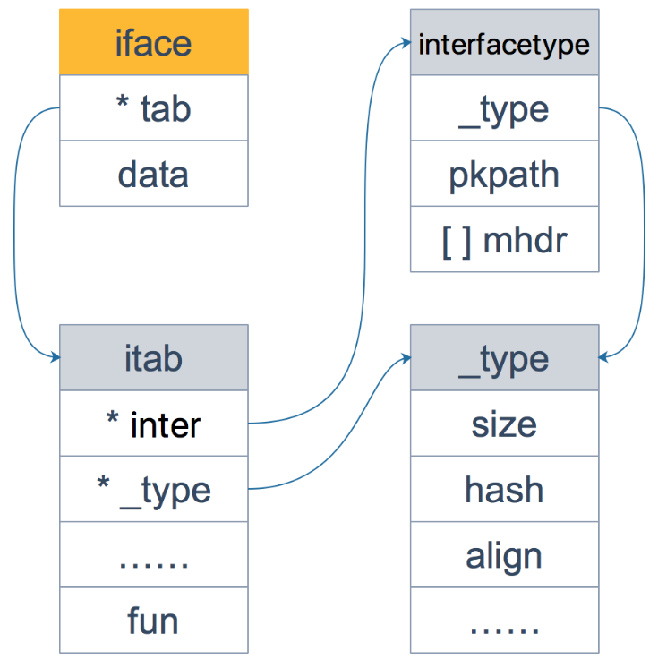
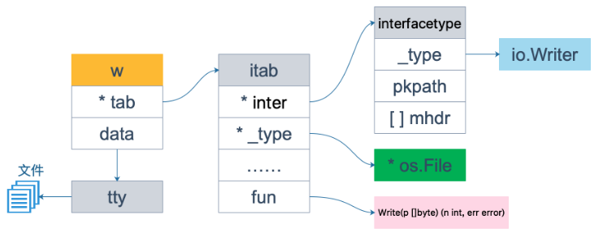
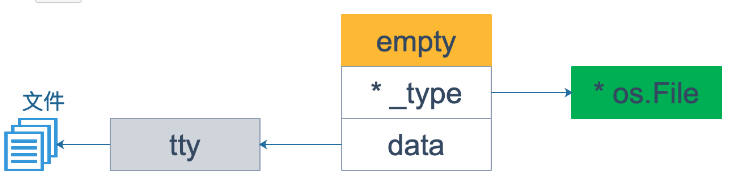
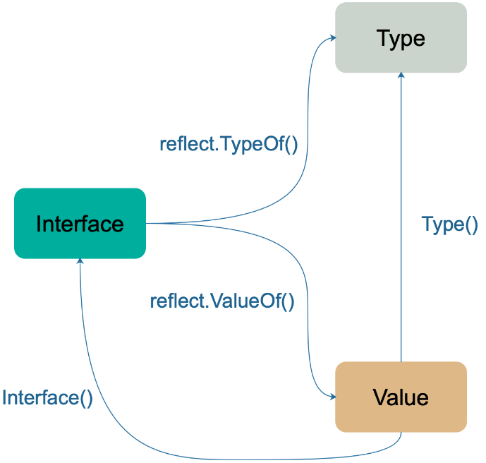
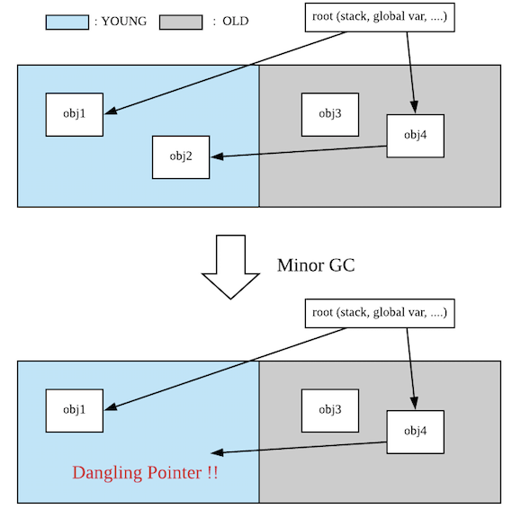

# GO BLOG

## 值接收者和指针接收者区别

### 方法

```golang
type Person struct {
    age int
}

func (p Person) howOld() int {
    return p.age
}

func (p *Person) growUp() {
    p.age += 1
}

func main() {
    // qcrao 是值类型
    qcrao := Person{age: 18}
    // 值类型 调用接收者也是值类型的方法
    fmt.Println(qcrao.howOld())
    // 值类型 调用接收者是指针类型的方法
    qcrao.growUp()
    fmt.Println(qcrao.howOld())

    // ----------------------

    // stefno 是指针类型
    stefno := &Person{age: 100}
    // 指针类型 调用接收者是值类型的方法
    fmt.Println(stefno.howOld())
    // 指针类型 调用接收者也是指针类型的方法
    stefno.growUp()
    fmt.Println(stefno.howOld())
}
```

调用了 `growUp` 函数后，不管调用者是值类型还是指针类型，它的 `Age` 值都改变了。

| | 值接收者 | 指针接收者 |
| --- | --- | --- |
| 值类型调用者| 方法会使用调用者的一个副本，类似于“传值” | 使用值的引用来调用方法，上例中，`qcrao.growUp()` 实际上是 `(&qcrao).growUp()` |
| 指针类型调用者| 指针被解引用为值，上例中，`stefno.howOld()` 实际上是 `(*stefno).howOld()` | 实际上也是“传值”，方法里的操作会影响到调用者，类似于指针传参，拷贝了一份指针 |

### 接收者

语法糖：实现了接收者是值类型的方法，相当于自动实现了接收者是指针类型的方法；而实现了接收者是指针类型的方法，不会自动生成对应接收者是值类型的方法。

理解：当实现了一个接收者是值类型的方法，就可以自动生成一个接收者是对应指针类型的方法，因为两者都不会影响接收者。但是，当实现了一个接收者是指针类型的方法，如果此时自动生成一个接收者是值类型的方法，原本期望对接收者的改变（通过指针实现），现在无法实现，因为值类型会产生一个拷贝，不会真正影响调用者。

### 两者分别在何时使用

如果方法的接收者是值类型，无论调用者是对象还是对象指针，修改的都是对象的副本，不影响调用者；如果方法的接收者是指针类型，则调用者修改的是指针指向的对象本身。

使用指针作为方法接收者的理由：

1. 方法能够修改接收者指向的值
2. 避免在每次调用方法时复制该值，在值的类型为大型结构体时这样做会更加高效

## GO 反射

### 什么是反射？

反射是指计算机程序在运行时（Run time）可以访问、检测和修改它本身状态或行为的一种能力。用比喻来说，反射就是程序在运行的时候能够“观察”并且修改自己的行为。

Go 语言提供了一种机制在运行时更新变量和检查它们的值、调用它们的方法，但是在编译时并不知道这些变量的具体类型，这称为反射机制。

### 为什么要用反射

使用反射的两个场景

1. 有时你需要编写一个函数，但是并不知道传给你的参数类型是什么，可能是没约定好；也可能是传入的类型很多，这些类型并不能统一表示。这时反射就会用的上了；
2. 有时候需要根据某些条件决定调用哪个函数，比如根据用户的输入来决定。这时就需要对**函数和函数的参数进行反射**，在运行期间动态地执行函数。

### 反射是如何实现的

`interface{}` 当向接口变量赋予一个实体类型的时候，接口会存储实体的类型信息，反射就是通过接口的类型信息实现的，反射建立在类型的基础上，Go 语言在 reflect 包里定义了各种类型，实现了反射的各种函数，通过它们可以在运行时检测类型的信息、改变类型的值。

#### types 和 interface

GO 语言中，每个变量都有一个静态类型，在编译阶段就确定了，注意，**这个类型是声明时的类型，不是底层数据类型**

接口变量可以存储任何实现了接口定义的所有方法的变量

interface{} 类型定义，其中 `itab` 由具体类型 `_type` 以及 `interfacetype` 组成，`_type` 表示具体类型，而 `interfacetype` 表示具体类型实现的接口类型



Go 语言中最常见的就是 Reader 和 Writer 接口：

```golang
type Reader interface {
    Read(p []byte) (n int, err error)
}
type Writer interface {
    Write(p []byte) (n int, err error)
}
```

```golang
var r io.Reader
tty, err := os.OpenFile("/Users/qcrao/Desktop/test", os.O_RDWR, 0)
if err != nil {    
    return nil, err
}
r = tty
```

先声明 `r` 的类型是 `io.Reader`，注意，这是 `r` 的静态类型，此时它的动态类型为 `nil`，并且它的动态值也是 `nil`。

之后，`r = tty` 这一语句，将 `r` 的动态类型变成 `*os.File`，动态值则变成非空，表示打开的文件对象。这时，`r` 可以用 `<value, type>` 对来表示为：`<tty, *os.File>`


注意看上图，此时虽然 `fun` 所指向的函数只有一个 `Read` 函数，其实 `*os.File` 还包含 `Write` 函数，也就是说 `*os.File` 其实还实现了 `io.Writer` 接口。因此下面的断言语句可以执行：

```golang
var w io.Writer
w = r.(io.Writer)
```

这样，`w` 也可以表示成 `<tty, *os.File>`，仅管它和 `r` 一样，但是 `w` 可**调用的函数取决于它的静态类型** `io.Writer`，也就是说它只能有这样的调用形式： `w.Write()` 。`w` 的内存形式如下图：



最后再来一个赋值：

```golang
var empty interface{}
empty = w
```

由于 empty 是一个空接口，因此所有的类型都实现了它，w 可以直接赋给它，不需要执行断言操作。



### 反射的基本函数

reflect 包里面包含了一个接口和一个结构体，即 `reflect.Type` 和 `reflect.Value`，它们提供很多函数来获取存储在接口里面的信息

`reflect.Type` 主要提供关于类型相关的信息，所以它和 `_type` 关联紧密，`reflect.Value` 则结合 `_type` 和 `data` 两者

reflect包提供了两个基础的关于反射的函数来获取上述的接口和结构体

```golang
func TypeOf(i interface{}) Type // 提取接口中值的类型信息
func ValueOf(i interface{}) Value // 提供实际变量的各种信息
```

总结一下：`TypeOf()` 函数返回一个接口，这个接口定义了一系列方法，利用这些方法可以获取关于类型的所有信息； `ValueOf()` 函数返回一个结构体变量，包含类型信息以及实际值。



### 反射的三大定律

1. Reflection goes from interface value to reflection object. 反射是一种检测存储在 `interface` 中的类型和值机制。这可以通过 `TypeOf` 函数和 `ValueOf` 函数得到
2. Reflection goes from reflection object to interface value. 它将 `ValueOf` 的返回值通过 `Interface()` 函数反向转变成 `interface` 变量
3. To modify a reflection object, the value must be settable. 如果想要操作原变量，反射变量 `Value` 必须要 hold 住原变量的地址才行

举个例子：

```golang
var x float64 = 3.4
v := reflect.ValueOf(x)
v.SetFloat(7.1) // Error: will panic
```

执行上面的代码会产生 panic，原因是反射变量 v 不能代表 x 本身，为什么？因为调用 `reflect.ValueOf(x)` 这一行代码的时候，传入的参数在函数内部只是一个拷贝，是值传递，所以 v 代表的只是 x 的一个拷贝，因此对 v 进行操作是被禁止的。

可设置是反射变量 `Value` 的一个性质，但不是所有的 `Value` 都是可被设置的

```golang
var x float64 = 3.4
p := reflect.ValueOf(&x)
fmt.Println("type of p:", p.Type())
fmt.Println("settability of p:", p.CanSet())

// type of p: *float64
// settability of p: false
```

p 还不是代表 x，`p.Elem()` 才真正代表 x，这样就可以真正操作 x 了

```golang
v := p.Elem()
v.SetFloat(7.1)
fmt.Println(v.Interface()) // 7.1
fmt.Println(x) // 7.1
```

## TCMalloc

### TCMalloc 是什么

TCMalloc是google推出的一种内存分配器，常见的内存分配器还有glibc的`ptmalloc`和google的`jemalloc`。相比于`ptmalloc` ，`TCMalloc` 性能更好，特别适用于高并发场景。

### TCmalloc 具体策略

与操作系统管理内存的方式类似，TCMalloc将整个虚拟内存空间划分为n个同等大小的**Page**，每个page默认8KB。又将连续的n个page称为一个**Span**。

TCMalloc定义了**PageHeap**类来处理向OS申请内存相关的操作，并提供了一层缓存。可以认为，PageHeap就是整个可供应用程序动态分配的内存的抽象。

PageHeap以span为单位向系统申请内存，申请到的span可能只有一个page，也可能包含n个page。可能会被划分为一系列的小对象，供小对象分配使用，也可能当做一整块当做中对象或大对象分配。

#### 小对象分配

小对象的分配直接从ThreadCache的FreeList中返回一个空闲对象，相应的，小对象的回收也是将其重新放回ThreadCache中对应的FreeList中。

由于每线程一个ThreadCache，因此从ThreadCache中取用或回收内存是**不需要加锁**的，速度很快。

为了方便统计数据，各线程的ThreadCache连接成一个双向链表。ThreadCache的结构示大致如下：


分配流程：

- 将要分配的内存大小映射到对应的size class。

- 查看ThreadCache中该size class对应的FreeList。

- 如果FreeList非空，则移除FreeList的第一个空闲对象并将其返回，分配结束。

- 如果FreeList是空的：

  - 从CentralCache中size class对应的CentralFreeList获取一堆空闲对象。
    - 如果CentralFreeList也是空的，则：
      - 向PageHeap申请一个span。
      - 拆分成size class对应大小的空闲对象，放入CentralFreeList中。
  - 将这堆对象放置到ThreadCache中size class对应的FreeList中（第一个对象除外）。
  - 返回从CentralCache获取的第一个对象，分配结束。


#### 中对象和大对象分配

中对象：假设要分配一块内存，其大小经过向上取整之后对应k个page，因此需要从PageHeap取一个大小为k个page的span，过程如下：

- 从k个page的span链表开始，到128个page的span链表，按顺序找到第一个非空链表。
- 取出这个非空链表中的一个span，假设有n个page，将这个span拆分成两个span：
  - 一个span大小为k个page，作为分配结果返回。
  - 另一个span大小为n - k个page，重新插入到n - k个page的span链表中。
- 如果找不到非空链表，则将这次分配看做是大对象分配


大对象：PageHeap的span set中取一个大小为k个page的span，其过程如下：

- 搜索set，找到不小于k个page的最小的span（**best-fit**），假设该span有n个page。
- 将这个span拆分为两个span：
  - 一个span大小为k个page，作为结果返回。
  - 另一个span大小为n - k个page，如果n - k > 128，则将其插入到大span的set中，否则，将其插入到对应的小span链表中。
- 如果找不到合适的span，则使用sbrk或mmap向系统申请新的内存以生成新的span，并重新执行中对象或大对象的分配算法。


## Go GC

在 Go 1.10 中，Go使用的是CMS垃圾回收器，但是没有分代，且非整理的

|                         | JAVA (JAVA 8 HotSpot VM)                    | Go             |
| ----------------------- | ------------------------------------------- | -------------- |
| 垃圾回收器（Collector） | 多种垃圾回收器（Serial，Parallel，CMS，G1） | CMS            |
| 整理（Compaction）      | 整理                                        | 非整理         |
| 分代GC                  | 分代                                        | 不分代         |
| 调试参数                | 依赖于垃圾回收器，并且有多个参数可用        | 只有`GOGC`可用 |

### 整理（Compaction）

垃圾回收可以是非移动的，也可以是移动的

#### 非移动GC（Non-moving GC）-- 标记清除算法

非移动的垃圾回收不会移动堆中的对象，Go使用的CMS垃圾回收器是非移动的，通常在非移动垃圾回收中重复进行内存的分配和释放，在堆中会产生碎片，从而降低了分配的性能，但是这也与你如何进行内存分配有关


#### 移动GC（Moving GC）-- 标记整理算法

移动GC通过将存活对象移动到堆的尾部来整理堆，一个示例就是在HotSpot VM上使用的复制算法


通过整理堆空间带来的好处有：

- 避免碎片
- 通过指针碰撞，能够实现高性能的内存分配器，因为所有对象都位于堆的末尾，所以我们可以在最后增加新对象的分配

**为什么Go不选择整理算法呢？**

- 起初Go的研发人员企图做一个 read barrier free concurrent copying GC.
- 由于时间关系，选择了CMS
- 采用了基于 TCMalloc 的内存分配器，解决了内存碎片和优化分配的问题

### 分代 （Generational GC）

分代GC的目的是为通过将堆中的对象按照其年龄进行划分来优化GC

- Minor GC：回收新生代，因为新生代对象存活时间很短，因此 Minor GC 会频繁执行，执行的速度一般也会比较快。
- Full GC：回收老年代和新生代，老年代对象其存活时间长，因此 Full GC 很少执行，执行速度会比 Minor GC 慢很多。 

#### 写屏障

分代GC的缺陷是即使垃圾回收没有执行，也仍然存在写屏障开销



**如果我们只对年轻代进行可达性分析，检查root节点指向的新对象然后进行收集，如果老年代有指向该新对象的旧对象，那么会导致该新对象意外被回收了，但是如果我们检查包含旧对象的整个堆，避免新对象被回收，那么分代GC就没有意义了**

**所以解决办法是 当替换或者重写引用时，在新对象中记录旧对象的引用（写屏障）**

**为什么Go不选择分代GC？**

由上可知，写屏障开销是Go放弃使用分代GC的原因之一，另外，在Go中，编译器的逃逸分析很出众，如果需要的话，程序员可以控制不在堆上分配的对象，因此短期对象通常分配在堆栈而不是堆上，这意味着不需要GC。

Java中的 CMS （Concurrent Mark Sweep）收集器，Mark Sweep 指的是标记-清除算法，分为以下四个阶段：

- 初始标记：仅仅只是标记一下 GC Roots 能直接关联到的对象，速度很快，需要停顿。
- 并发标记：进行 GC Roots Tracing 的过程，它在整个回收过程中耗时最长，不需要停顿。
- 重新标记：为了修正并发标记期间因用户程序继续运作而导致标记产生变动的那一部分对象的标记记录，需要停顿。
- 并发清除：不需要停顿。


在整个过程中耗时最长的并发标记和并发清除过程中，收集器线程都可以与用户线程一起工作，不需要进行停顿。存在浮动垃圾，浮动垃圾是指并发清除阶段由于用户线程继续运行而产生的垃圾，这部分垃圾只能到下一次 GC 时才能进行回收。

## Go Scheduler

### goroutine 和 thread 的区别

- 内存占用

  创建一个 goroutine 的栈内存消耗为 2 KB，实际运行过程中，如果栈空间不够用，会自动进行扩容。创建一个 thread 则需要消耗 1 MB 栈内存，而且还需要一个被称为 “a guard page” 的区域用于和其他 thread 的栈空间进行隔离

- 创建和销毁

  thread 创建和销毀都会有巨大的消耗，因为要和操作系统打交道，是内核级的，通常解决的办法就是线程池。而 goroutine 因为是由 Go runtime 负责管理的，创建和销毁的消耗非常小，是用户级。

- 切换

  thread 切换时，需要保存各种寄存器，包括 16个通用寄存器，PC、SP等等，而 goroutines 切换只需保存三个寄存器：PC, SP and BP，线程切换会消耗 1000-1500 纳秒，执行指令的条数会减少 12000-18000， Goroutine 的切换约为 200 ns，相当于 2400-3600 条指令。

### 什么是 scheduler

Go 程序的执行由两层组成：Go Program，Runtime，它们之间通过函数调用来实现内存管理、channel 通信、goroutines 创建等功能。用户程序进行的系统调用都会被 Runtime 拦截，以此来帮助它进行调度以及垃圾回收相关的工作。


## scheduler 原理：GPM模型

> scheduler 的目标：For scheduling goroutines onto kernel threads.

并发：逻辑上具有处理多个同时性任务的能力，并行：物理上同一时刻执行多个并发任务

通常说的并发编程时在单核CPU上，通过多线程共享CPU时间片串行执行（并发非并行），而并行则依赖于多核处理器等物理资源，让多个任务可以实现并行执行（并发且并行）

多线程或多进程是并行的基本条件，但单线程也可以用协程(coroutine)做到并发。简单将Goroutine归纳为协程并不合适，因为它运行时会创建多个线程来执行并发任务，且任务单元可被调度到其它线程执行。这更像是多线程和协程的结合体，能最大限度提升执行效率，发挥多核处理器能力。

```go
func main() {
    go func() {
        fmt.Println("Hello World")
    }()
}
```

支撑整个调度器的主要有4个重要结构，分别是M、G、P、Sched

- Sched结构就是调度器，它维护有存储M和G的队列以及调度器的一些状态信息等

- G 就是goroutine实现的核心结构了，G维护了goroutine需要的栈、程序计数器以及它所在的M等信息。
- M 代表内核级线程，一个M就是一个线程，goroutine就是跑在M之上的
- P 是一个抽象的概念，并不是真正的物理CPU，P全称是Processor，处理器，代表一个虚拟的 Processor，它维护一个处于 Runnable 状态的 g 队列， `m` 需要获得 `p` 才能运行 `g`

三者关系：地鼠(gopher)用小车运着一堆待加工的砖。M就可以看作图中的地鼠，P就是小车，G就是小车里装的砖


Runtime 起始时会启动一些 G：垃圾回收的 G，执行调度的 G，运行用户代码的 G；并且会创建一个 M 用来开始 G 的运行。随着时间的推移，更多的 G 会被创建出来，更多的 M 也会被创建出来。

Go scheduler 的核心思想是：

1. reuse threads；
2. 限制同时运行（不包含阻塞）的线程数为 N，N 等于 CPU 的核心数目；
3. 线程私有的 runqueues，并且可以从其他线程 stealing goroutine 来运行，线程阻塞后，可以将 runqueues 传递给其他线程。

### 启动过程

Runtime 起始时会启动一些 G：垃圾回收的 G，执行调度的 G，运行用户代码的 G；并且会创建一个 M 用来开始 G 的运行。随着时间的推移，更多的 G 会被创建出来，更多的 M 也会被创建出来。

Go 程序启动后，会给每个逻辑核心分配一个 P（Logical Processor）；同时，会给每个 P 分配一个 M（Machine，表示内核线程），这些内核线程仍然由 OS scheduler 来调度。在初始化时，Go 程序会有一个 G（initial Goroutine），执行指令的单位。G 会在 M 上得到执行

G、P、M 都说完了，还有两个比较重要的组件没有提到：全局可运行队列（GRQ）和本地可运行队列（LRQ）。LRQ 存储本地（也就是具体的 P）的可运行 goroutine，GRQ 存储全局的可运行 goroutine，这些 goroutine 还没有分配到具体的 P。


Go scheduler 运行在用户空间 和 Os scheduler 抢占式调度（preemptive）不一样，Go scheduler 采用协作式调度（cooperating）。

> Being a cooperating scheduler means the scheduler needs well-defined user space events that happen at safe points in the code to make scheduling decisions.

协作式调度一般会由用户设置调度点，例如 python 中的 yield 会告诉 Os scheduler 可以将我调度出去了。

### 调度时机

在四种情况下，goroutine 有机会发生调度

1. 使用关键字 go
2. GC
3. 系统调用
4. 内存同步访问：atomic，mutex，channel 等操作会使goroutine 阻塞，因此会被调度走

当我们翻看channel的实现代码可以发现，对channel读写操作的时候会触发调用 `runtime·park` 函数。goroutine调用park后，这个goroutine就会被设置位waiting状态，放弃cpu。被park的goroutine处于waiting状态，并且这个goroutine不在小车(P)中，如果不对其调用 `runtime·ready`，它是永远不会再被执行的

除了park可以放弃cpu外，调用 `runtime·gosched` 函数也可以让当前goroutine放弃cpu，但和park完全不同，`gosched` 是将goroutine设置为runnable状态，然后放入到调度器全局等待队列

### work stealing

Go scheduler 的职责就是将所有处于 runnable 的 goroutines 均匀分布到在 P 上运行的 M。当一个 P 发现自己的 LRQ 已经没有 G 时，会从其他 P “偷” 一些 G 来运行。

Go scheduler 使用 M:N 模型，在任一时刻，M 个 goroutines（G） 要分配到 N 个内核线程（M）。每个 M 必须依附于一个 P（ 最多为 GOMAXPROCS ），每个 P 在同一时刻只能运行一个 M。如果 P 上的 M 阻塞了，那它就需要其他的 M 来运行 P 的 LRQ 里的 goroutines


上下文切换的成本只是goroutine切换的成本

goroutine在cpu上换入换出，不断上下文切换的时候，必须要保证的事情就是`保存现场`和`恢复现场`，保存现场就是在goroutine放弃cpu的时候，将相关寄存器的值给保存到内存中；恢复现场就是在goroutine重新获得cpu的时候，需要从内存把之前的寄存器信息全部放回到相应寄存器中去。

实际上，Go scheduler 每一轮调度要做的工作就是找到处于 runnable 的 goroutines，并执行它

```c
runtime.schedule() {
    // only 1/61 of the time, check the global runnable queue for a G.
    // if not found, check the local queue.
    // if not found,
    //     try to steal from other Ps.
    //     if not, check the global runnable queue.
    //     if not found, poll network.
}
```


### scheduler 的陷阱

## 简单的生产者消费者模型

```go
func produce() {
	for i := 0; i < 10; i++ {
		stream <- i
	}
	fin <- true
}

func consume() {
	for {
		data := <- stream
		fmt.Println(data)
	}
}

func main() {
	go produce()
	go consume()
	<- fin
}
```

### 单例模式

假设在一个数据库中，我们需要一个 repository 结构作为单例对象。请注意，我们应该使用小写字母定义结构，以使其成为私有。这将禁止在包外部使用该struct

```go
import (
	"errors"
	"sync"
)

type repository struct {
	items map[string]string
	mu sync.RWMutex
}

func (r *repository) Set(key, data string) {
	r.mu.Lock()
	defer r.mu.Unlock()
	r.items[key] = data
}

func (r *repository) Get(key string) (string, error){
	r.mu.RLock()
	defer r.mu.RUnlock()
	item, ok := r.items[key]
	if !ok {
		return "", errors.New("the key is not presented")
	}
	return item, nil
}

var (
	r *repository
	once sync.Once
)

func Repository() *repository {
	once.Do(func() {
		r = &repository{items: make(map[string]string)}
	})
	return r
}
```

