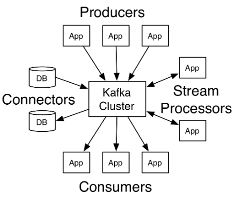
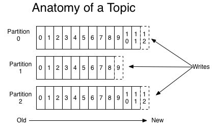
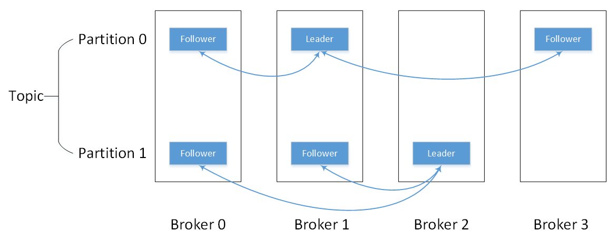

# Kafka 设计原理

[参考博客](https://blog.csdn.net/suifeng3051/article/details/48053965)

[Kafka-官方文档](https://kafka.apache.org/intro)

## Kafka 四大核心API

1. `Producer API`：允许应用程序将数据流发送到 `Kafka Cluster` 的 `topic` 上
2. `Comsumer API`：允许应用程序从Kafka集群中的 `topic` 读取数据流
3. `Streams API`：允许将输入 `topic` 的数据流转换为输出 `topic` 的数据流
4. `Connector API`：允许连接器连续从一些源系统或应用程序读取数据到 Kafka，或者从 Kafka 输出数据到某个接收系统或应用程序

## Kafka 核心组件

- Topic：每一类消息的主题，Kafka将消息按照主题分类
- Producer：发送消息者
- Consumer：消费消息者(必须订阅后才可以消费，一个消费者可以消费一个或多个主题)
- Broker：发送的消息保存在一组服务器上，称之为 `Kafka Cluster`，集群中的每一个Kafka 节点就是一个broker

每个 `Partition` 中的消息都是有序的，生产的消息被不断追加到`Partition log` 上，其中的每一个消息都被赋予了一个唯一的 `offset` 值。

Kafka集群会保存所有的消息，不管消息有没有被消费；我们可以设定消息的过期时间，只有过期的数据才会被自动清除以释放磁盘空间。比如我们设置消息过期时间为2天，那么这2天内的所有消息都会被保存到集群中，数据只有超过了两天才会被清除。

Kafka需要维持的元数据只有一个 -- 消费消息在 `Partition` 中的 `offset` 值，`Consumer` 每消费一个消息，`offset` 就会加1。其实消息的状态完全是由 `Consumer` 控制的，`Consumer` 可以跟踪和重设这个 `offset` 值，这样的话 `Consumer` 就可以读取任意位置的消息。

把消息日志以 `Partition` 的形式存放有多重考虑

- 第一，方便在集群中扩展，每个 `Partition` 可以通过调整以适应它所在的机器，而一个 `topic` 又可以有多个 `Partition` 组成，因此整个集群就可以适应任意大小的数据了
- 第二就是可以提高并发，因为可以以 `Partition` 为单位读写了。

关于如何设置 `topic` 值需要考虑的因素

- Kafka允许用户为每个 `topic` 设置副本数量，副本数量决定了有几个 `broker` 来存放写入的数据。
- `topic` 是以 `partition` 的形式存放的，每一个 `topic` 都可以设置它的 `partition` 数量，`partition` 的数量决定了组成 `topic` 的log的数量

关于如何设置 `partition` 值需要考虑的因素。一个partition只能被一个消费者消费（一个消费者可以同时消费多个partition）

- 因此，如果设置的 `partition` 的数量小于 `consumer` 的数量，就会有消费者消费不到数据。所以，推荐 `partition` 的数量一定要大于同时运行的 `consumer` 的数量。
- 另外一方面，建议 `partition` 的数量大于集群 `broker` 的数量，这样 `leader partition` 就可以均匀的分布在各个 `broker` 中，最终使得集群负载均衡。

`producers` 可以异步的并行的向 kafka 发送消息，但是通常 `producer` 在发送完消息之后会得到一个 `future` 响应，返回的是 `offset` 值或者发送过程中遇到的错误，这其中有个非常重要的参数`“acks”`,这个参数决定了 `producer` 要求 `leader partition` 收到确认的副本个数

- 如果acks设置数量为0，表示 `producer` 不会等待 `broker` 的响应，所以，`producer` 无法知道消息是否发送成功，这样有可能会导致数据丢失，但同时，acks值为0会得到最大的系统吞吐量。
- 若acks设置为1，表示 `producer` 会在 `leader partition` 收到消息时得到 `broker` 的一个确认，这样会有更好的可靠性，因为客户端会等待直到 `broker` 确认收到消息。
- 若设置为-1，`producer` 会在所有备份的 `partition` 收到消息时得到 `broker` 的确认，这个设置可以得到最高的可靠性保证。
