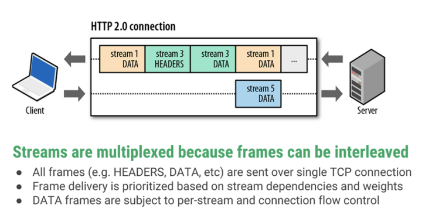

<!-- TOC -->

- [简历相关](#简历相关)
    - [项目1](#项目1)
        - [Serviceability Agent](#serviceability-agent)
    - [项目2](#项目2)
    - [项目3](#项目3)
- [数据结构](#数据结构)
    - [AVL树](#avl树)
    - [红黑树](#红黑树)
    - [B/B+树](#bb树)
    - [epool libevent](#epool-libevent)
    - [布隆过滤器](#布隆过滤器)
    - [字典树 AC自动机 KMP](#字典树-ac自动机-kmp)
- [数据库](#数据库)
    - [数据库存储过程、触发器](#数据库存储过程触发器)
    - [数据库范式](#数据库范式)
    - [ACID](#acid)
    - [并发一致性问题](#并发一致性问题)
    - [封锁](#封锁)
    - [隔离级别](#隔离级别)
    - [多版本并发控制](#多版本并发控制)
    - [数据库锁机制](#数据库锁机制)
        - [SQL语句锁实例分析](#sql语句锁实例分析)
    - [存储引擎](#存储引擎)
        - [InnoDB](#innodb)
        - [MyISAM](#myisam)
    - [数据库索引](#数据库索引)
        - [数据库索引分类](#数据库索引分类)
        - [索引失效、优缺点、优化](#索引失效优缺点优化)
        - [索引实现](#索引实现)
        - [聚簇索引和非聚簇索引](#聚簇索引和非聚簇索引)
    - [切分](#切分)
        - [水平切分](#水平切分)
        - [垂直切分](#垂直切分)
    - [视图](#视图)
    - [Redis](#redis)
        - [数据结构和对象](#数据结构和对象)
- [Linux](#linux)
    - [I/O 模式](#io-模式)
        - [阻塞I/O](#阻塞io)
        - [非阻塞I/O](#非阻塞io)
        - [I/O复用](#io复用)
        - [信号驱动I/O](#信号驱动io)
        - [异步I/O](#异步io)
        - [对比](#对比)
    - [内存管理](#内存管理)
        - [Buddy分配算法](#buddy分配算法)
        - [吞吐和响应](#吞吐和响应)
        - [硬链接和软链接](#硬链接和软链接)
    - [NetFilter & NetLink](#netfilter--netlink)
- [其他](#其他)
    - [SIP协议](#sip协议)
    - [Web请求](#web请求)
    - [HTTP协议](#http协议)
        - [GET 和 POST 区别](#get-和-post-区别)
        - [长连接 chunked 分块传输](#长连接-chunked-分块传输)
        - [HTTP Pipelining（HTTP 管线化）](#http-pipelininghttp-管线化)
        - [Cookie 和 Session](#cookie-和-session)
        - [跨站攻击](#跨站攻击)
        - [TLS](#tls)
    - [数字认证](#数字认证)
    - [网络协议](#网络协议)
        - [TCP](#tcp)
        - [UDP](#udp)
        - [NAT地址转换](#nat地址转换)
    - [路由分组转发及选择](#路由分组转发及选择)
    - [Reactor模式](#reactor模式)

<!-- /TOC -->

> 知识点总结

# 简历相关

遇到过的问题：

- 如何让 HotSpot 中已有的 Serviceability Agent 应用到 Volatility框架中
- 对JVM内存布局不了解
- 栈的生长过程，栈帧与栈帧之间的关系
- 缓冲区溢出过程中，栈的生长方向，数据的拷贝方向，溢出前后栈的信息变化

## 项目1

项目介绍：物联网服务运行时保障系统 是基于虚拟机入侵检测技术的运行时监控、恢复系统，实现了对 Linux虚拟机中正在运行的服务程序 进行运行时监控和处理反馈的功能，假设这样一个场景，当网络数据、串口数据不再安全可信时，我们还可以分析内存去判断数据的真实性，所以我在这个项目中主要负责对Linux虚拟机中 正在运行的服务程序 进行内存获取和分析，首先，由于服务程序是运行在Linux虚拟机中，在内存获取部分我使用了 Volatility 内存取证框架和LibVMI内存自省插件获取服务程序内存，其次，在内存分析部分 借助 Serviceability Agent 解析出Java进程及JVM虚拟机栈信息等，最后我还针对缓冲区溢出这种常见的攻击方式进行内存分析，实现了实时获取攻击前后函数调用关系变化，为系统检测模块后续分析提供依据

LibVMI库可以帮助我们通过 `System.map`（符号是指函数名，全局变量等，符号表记录着这些符号在内存中的虚拟地址）获取内核符号的虚拟地址，并找到对应的页表，通过页表找到数据页返回，即内存数据

`Volatility` 框架获取虚拟机中进程内存，需要两个信息，目标进程的逻辑地址 和 进程描述符的结构，前者标识了目标进程在内存中的逻辑位置，后者告诉我们进程运行的全部信息，这两个信息分别由 `System.map` 和 `module.dwarf` 提供，后一个文件是通过 `kernel-header` 生成的

这样我们就可以开始获取到虚拟机内所有进程的信息了

Java服务运行时 在Linux系统内统一的进程名为 java，Linux中进程是以链表的形式保存的，我们遍历进程链表，就可以找到进程名为 java 的进程了

对于任何一个Java程序 我们可以使用 jstack/jmap 等命令获取Java程序的堆栈信息，这些命令被封装在了 `Serviceability Agent` 中，它是 `HotSpot VM` 的调试工具，这个包中定义好了 `HotSpot VM` 中的一些Java类，比如Java线程类，栈帧类，这就方便了我们去分析Java程序中的堆栈信息

但是Volatility是用Python开发实现的，所以我们需要一个工具，让Python执行sa.jar包，即JPype工具，另外我们还需要用虚拟机中的KVM虚拟机中的JVM的信息去替换SA初始化需要的信息（这些信息包括共享库名称 - `task_struct.mm` 抽象并描述了Linux视角下管理进程地址空间的所有信息，共享库起始地址，所有的线程id - `thread_group`），这些信息正好是Volatility可以获取到的

替换掉之后，我们调用自己重新打包的 `sa-jdi.jar` 中的获取线程地址的方法 就是KVM虚拟机中的java程序的线程地址，在sa.jar包中，我们根据指定的线程名，遍历子线程列表，找到虚拟机中该线程的实例对象，可以获到获得虚拟机栈的栈顶地址，由于当前栈帧的值就是上一帧的地址，通过遍历获取栈底栈帧的FP地址，这样我们就可以自底向上分析虚拟机栈了

在Volatility中，把当前虚拟机栈的内存全部读出来，从 `fp - 48` 的位置就可以获取到方法栈帧中的参数，局部变量，局部对象引用等信息

### Serviceability Agent

ptrace系统调从名字上看是用于进程跟踪的，它提供了父进程可以观察和控制其子进程执行的能力，并允许父进程检查和替换子进程的内核镜像(包括寄存器)的值。

其基本原理是: 当使用了ptrace跟踪后，所有发送给被跟踪的子进程的信号(除了SIGKILL)，都会被转发给父进程，而子进程则会被阻塞，这时子进程的状态就会被系统标注为TASK_TRACED。而父进程收到信号后，就可以对停止下来的子进程进行检查和修改，然后让子进程继续运行。  

[Serviceability Agent](https://yq.aliyun.com/articles/20231)

在sa-jdi源码中 所有的工具类中都会启动一个 `BugSpotAgent`，在BugSpot的初始化过程中会调用 `setupDebugger` 和 `setupVM` 构造了目标VM的本机表示，通过源码分析，我们需要从这两个方法入手，替换 `setupDebugger` 初始化时的三个native方法，`attach0`，`lookupByName0` 和 `readBytesFromProcess0`  我们用Volatility获取的信息替换

- attach0：初始化VM需要，的共享库名，共享库地址，子线程ID
- lookupByName0：得到符号在内存中的地址，根据库名和符号名称在所有的共享库中遍历，找到符号偏移
- readBytesFromProcess0：得到从某地址开始指定长度的内存字节

`Serviceability Agent` 的实现原理是使用 Linux 的 `/proc` 和 `ptrace`，SA的基类是Tool，该方法会 `new BugSpotAgent()`，调用 `attach` 方法 到指定PID的VM上，在 `attach` 方法中会 调用两个方法：`setupDebugger()` 和 `setupVM()`

`setupDebugger` 会根据不同平台来设置debugger，Linux平台下，`setupDebuggerLinux` 中：

1. 设置函数库文件名 `{ "libjvm.so", "libjvm_g.so", "gamma_g" }`
2. new一个 `LinuxDebuggerLocal`
3. 调用 `LinuxDebuggerLocal` 的 `attach` 方法
4. `attach` 方法中调用了 `attach0` 方法
5. 在 `attach0` 中：
   - attach到目标进程 底层使用 linux 的 `ptrace`，**目的是为了读取目标进程的库文件信息和符号表**
   - 填充ps_prochandle
   - 读取目标进程的库文件信息和符号表 `read_lib_info`
6. 在 `read_lib_info` 方法中
   - 打开 `/proc/[pid]/maps`
   - 获取库文件信息
   - 添加库文件和符号表信息

`setupVM` 中

1. 构建HotSpotTypeDataBase
   - HotSpotTypeDataBase 存储了目标VM上的类型信息
2. 从目标VM获取原生类型大小并设置
3. 构建目标VM的本机表示，启动成功

我们要做的事情是：

- `setupDebugger()` 阶段，需要通过 `ptrace` 到目标进程上去获取目标进程的子线程、共享库文件和符号表，这样就可以获取到 HotSpotVM 中线程、变量、常量的地址，通过本地方法 `lookupByName0()` 实现，这个方法可以通过 Volatility 读共享库的方法实现替换
- `setupVM()` 阶段，通过 `/proc/[pid]/maps` 读取 elf 文件，也可以通过一些 VM 提供的元信息（`VMTypeEntry`，`VMStructEntry`，`VMIntConstantEntry`，`VMLongConstantEntry`）使用 `ptrace` 获取变量的地址，读取具体变量值的过程中，调用本地方法 `readBytesFromProcess0()` 完成，这个方法可以利用Volatility 提供的读内存的方法实现替换

libVMI 获取内核符号的流程

1. 应用程序请求查看内核符号
2. libvmi通过系统的System.map获取内核符号的虚拟地址
3. 找到虚拟地址所对应的内核页目录，并获取对应的页表
4. 通过页表找到正确的数据页
5. 数据页被返回给libvmi
6. libvmi将数据返回给vmi应用程序

`jstack` Dynamic Attach：

允许外部进程在HotSpot中启动线程，然后可以使用该线程启动代理以在该HotSpot中运行，并将有关HotSpot状态的信息发送回外部进程。这就涉及到进程间通信的问题，Linux中常用的方式为：信号机制 - 首先external process会先发送一个SIGQUIT信号给target VM process，target VM会创建一个Attach Listener线程；然后Attach Listener线程会通过Unix domain socket与external process建立连接，之后就可以基于这个socket进行通信了。

## 项目2

遇到的问题：

- libevent库如何使用
- 如何给页面编号， 对于每个HTML 页面而言，解析得到的URL中存在有效页面和无效页面，我们不能在这时对页面进行编号，因为对无效页面的编号会影响PageRank的计算，所以我们先把访问成功的页面和编号添加到 HashMap中，把URL关系写入临时文本，等待所有URL处理完，统一将临时文本中的URL替换为编号
- 而且在一个页面中存在一对连接关系出现多次的情况，在处理页面的过程中也许要去重

项目介绍：网站页面分析这个项目主要目的是爬取网站页面内容，提取URL，构建页面与页面之间的连接网络，最后根据pageRank算法计算出pk值前十的页面
在这个项目中我主要负责爬虫模块的开发，实现的主要流程是 添加定时事件查看 URL队列，提取URL，使用 BloomFilter 去重判断页面是否已经被抓取过，如果没有，DNS解析，建立网络连接，并添加写事件和读事件，在写事件中会发送HTTP请求，当连接数据到达触发读事件，使用AC自动机提取URL，添加到 URL 队列中

使用 AC 自动机而不是用 正则表达式是因为 Linux C Regex 库 只提供贪婪匹配，不支持非贪婪匹配，当匹配成功时会继续尝试向后匹配，看有没有更长的字符串，我们使用AC自动机就可以实现非贪婪匹配

Socket编程流程

- 服务器调用 `socket()` 建立用于监听和接收客户端的连接请求套接字、`bind()` 绑定监听的IP地址和端口、`listen()` 开始监听后，调用 `accept()` 阻塞等待，等待客户端的连接请求
- 客户端调用 `socket()` 初始化后，调用 `connect()` 发出SYN段并阻塞等待服务器应答，服务器应答一个SYN-ACK段，客户端收到后从 `connect()` 返回，同时应答一个ACK段，服务器收到后从 `accept()` 返回。

Socket的出现只是为了更方便的使用 TCP/IP 协议栈，其对TCP/IP进行了抽象,而不是简单的映射，形成了几个最基本的函数接口，`accept()` 函数其实抽象的是TCP的连接过程

`accept()` 接收一个客户端的连接请求并返回一个新的套接字，这个套接字与 `socket()` 返回的用于监听和接收客户端的连接请求的套接字不是同一个

假设一共有三个客户端连接到服务器，那么在服务器端以一共有四个套接字，第一个是 `socket()` 返回的用于监听的套接字，其余3个是分别调用三次 `accept()` 返回的不同的套接字

`accept()` 函数返回的新socket其实指代的是本次创建的连接，而一个连接是包含两部分信息的，一个是 源IP/源端口，另一个是 目的IP/目的端口，所以 `accept()` 可以生成多个不同的socket，而这些socket里面包含的目的IP/目的端口是不变的，变化的只是 源IP/源端口，这样的话，这些socket目的端口就可以都是80端口，而socket还是能根据源/目的对来分辨出IP包和socket的归属关系，从而完成对 TCP/IP 协议的操作封装

connect (套接字默认阻塞) 出错返回的情况：

- 调用connect时内核发送一个SYN，若无响应则等待6s后再次发送一个，仍无响应则等待24s再发送一个，若总共等了75s后仍未收到响应则返回**ETIMEDOUT错误**；
- 若对客户的SYN的响应是RST，则表示该服务器主机在我们指定的端口上面没有进程在等待与之连接，例如服务器进程没运行，客户收到RST就马上返回**ECONNREFUSED错误**；
- 若客户发出的SYN在中间的某个路由上引发了一个“destination unreachable”（目的不可达）ICMP错误，客户主机内核保存该消息，并按1中所述的时间间隔发送SYN，在某个规定的时间（4.4BSD规定75s）仍未收到响应，则把保存的ICMP错误作为**EHOSTUNREACH 或 ENETUNREACH错误**返回给进程。

若 connect 失败，则该套接字不可用，必须关闭，我们不能对这样的套接字再次调用connect函数，在每次connect失败后，都必须close当前套接字并重新调用socket

不同的进程可以监听在同一个 <IP地址：端口> 上么？

服务器监听一个端口会经历：

- 根据套接字类型创建套接字
- 将套接字bind 绑定到具体的网络端口和端口号上
- 调用listen开始在这个套接字上进行监听

`SO_REUSEADDR` 用于对 TCP 套接字 处于 TIME_WAIT 状态下的socket，才可以重复绑定使用，sever端重视在调用bind之前设置 `SO_REUSEADDR` 套接字选项

## 项目3

项目介绍：智慧酒店云住平台 - 通过IoT、AI能力以及云的基础能力，结合腾讯的内容资源，为旅客提供客房控制、娱乐、客房需求等功能，帮助酒店提升服务、降本增效、沉淀数据。

该项目的应用场景包含了入住的全过程，当客户入住中时，可以通过交互设备控制客房内的所有家具、影视娱乐等，我实习期间主要参与了客房控制相关功能的开发以及组内Git仓库拆分、本地开发环境优化的工作。在实际的场景中，客户对房间内的音箱说“打开窗帘、我要看直播”这样的语句，房间内的窗帘会自动打开，电视会打开开始播放

这些控制功能的调用链路是：当客户对音箱说完话，音箱将语音解析为对应的请求消息，发送到云住平台，云住平台通过音箱序列号查找该音箱是哪个集团的哪个分店的哪个房间，构造包含requestId、设备Id、属性值的gRPC请求消息发送到该房间的网关设备，网关设备解析请求消息对窗帘或者电视下发指令，实现对应的控制意图

web页面主要是给酒店管理人员使用，酒店管理人员可以在web页面上添加房间内的设备，比如音箱、窗帘、电视等等；管理房间模式，比如查房模式、睡眠模式；设置该分店的问答知识库等

举例自己从前端到后端开发的完整功能问答知识库：需求背景：客户可以通过与音箱对话，询问如：酒店早餐时间、附近的地铁站、景点等，这些问题的答案是与分店本身相关的，所以下放到云住平台实现，酒店管理人员可以在web上对问题的答案进行修改，客户可以向音箱提问，音箱回复对应的答案

实现过程：数据库中两张表：一张问题表、一张问题酒店关联表；问题表主要包括问题Id、问题内容、创建修改时间等，所有分店的问题均相同，不同的是问题答案；问题酒店关联表主要包括问题Id，分店Id以及答案

使用 分店Id 查询一次分店表获取当前分店信息，查询一次问题表获取分页所有问题，利用 分店Id 查询问题关联表获取当前分店所有答案，在 service  层拼接消息返回

### 相关知识点

#### gRPC

RPC 的主要目标是让构建分布式应用更容易，在提供强大的远程调用能力时不损失本地调用的语义简洁性。为实现该目标，RPC 框架需提供一种透明调用机制让使用者不必显式的区分本地调用和远程调用。

RPC要达到的目标：远程调用时，要能够像本地调用一样方便，让调用者感觉不到远程调用的逻辑，需要解决以下三个问题：

- **Call ID映射**。我们怎么告诉远程机器我们要**调用哪个函数呢**？在本地调用中，函数体是直接通过函数指针来指定的，但是在远程调用中，是无法调用函数指针的，因为两个进程的地址空间是完全不一样。所以，在RPC中，**所有的函数都必须有自己的一个ID** 。当客户端需要进行远程调用时，它就查一下 <Call ID, 函数> 映射表，找出相应的Call ID，然后把它传给服务端，服务端也通过查表，来确定客户端需要调用的函数，然后执行相应函数的代码。
- **序列化和反序列化**。客户端怎么把参数值传给远程的函数呢？需要客户端把参数先转成一个字节流，传给服务端后，再把字节流转成自己能读取的格式。这个过程叫序列化和反序列化。同理，从服务端返回的值也需要序列化反序列化的过程。
- **网络传输** 。尽管大部分RPC框架都使用TCP协议，但其实UDP也可以，而gRPC干脆就用了HTTP2。Java的Netty也属于这层的东西。

rpc框架一般基于tcp或者http协议实现。基于http的rpc框架的优缺点

- 优点：HTTP/1.x协议简单明了，是目前最流行的应用层协议，有着非常成熟且完善的各种基础设施，如负载均衡、监控、代理等，适用性广泛，各个设备系统均有实现
- 缺点：就是HTTP/1.x采用的是文本协议，解析速度慢，带宽占用高。而且request/response的通信方法导致整体效率不高。

gRPC基于HTTP2协议，HTTP2 使得 gRPC 能够更好的适用于移动客户端和服务端通信的使用场景，并且连接多路复用也保证了RPC 的效率。grpc 的协议设计上很好的使用了HTTP2 现有的语义，请求和响应的数据使用HTTP Body 发送，其他的控制信息则用 Header 表示。

流：是服务器和客户端在 HTTP/2 连接内用于交换帧数据的独立双向序列，逻辑上可看作一个较为完整的交互处理单元，HTTP/2 连接上传输的每个帧都关联到一个流，一个连接上可以同时有多个流，同一个流的帧按序传输，不同流的帧交错混乱传输

帧：HTTP/2 抛弃 HTTP/1 的文本协议改为二进制协议，HTTP/2 的基本传输单元为帧，每个帧都从属于某个流



gRPC over HTTP/2

gRPC 在HTTP2 的基础上定义了 request 和 response 规范，使用 header 帧描述 meta 信息如超时时间、payload的压缩算法等

客户端的每次 gRPC 调用都发起了一个流，然后在这个流中发送 header 帧和数据帧，而服务端的返回结过结果也是使用同一个流进行传输。

#### docker-compose

compose 是一个用于定义和运行多容器Docker应用程序的工具，可以使用yaml 文件来配置应用程序的服务

# 数据结构

## AVL树

AVL树是加了额外平衡条件的二叉搜索树，要求任何节点的左右子树高度相差最多为1

AVL不平衡的情况有四种：

1. 插入点位于X的左子节点的左子树 - 左左 - 单旋转，以X右旋
2. 插入点位于X的左子节点的右子树 - 左右 - 双旋转，以左子节点左旋，再以X节点右旋
3. 插入点位于X的右子节点的左子树 - 右左 - 双旋转，以右子节点右旋，再以X节点左旋
4. 插入点位于X的右子节点的右子树 - 右右 - 单旋转，以X左旋

## 红黑树

首先红黑树是不符合AVL树的平衡条件的，即每个节点的左子树和右子树的高度最多差1的二叉查找树。但是提出了为节点增加颜色，红黑是用非严格的平衡来换取增删节点时候旋转次数的降低，任何不平衡都会在三次旋转之内解决，而AVL是严格平衡树，因此在增加或者删除节点的时候，根据不同情况，旋转的次数比红黑树要多。所以红黑树的插入效率更高

红黑树5个约束

- 每个节点或是红色的，或是黑色的。
- 根节点是黑色的。
- 每个叶节点（NULL）是黑色的。
- 如果一个节点是红色的，则它的两个孩子节点都是黑色的。（不能有两个父子节点都为红）
- 对每个节点，从该节点到其所有后代叶节点的简单路径上，均包含相同数目的黑色节点。

插入的几种情况，插入节点必为红节点

- 父黑 直接插入
- 父红 叔红
  - 变父节点为黑，叔节点为黑，祖父节点为红，当前节点指向祖父节点
- 父红 叔黑 插入节点是父的右节点
  - 父节点为新的当前结点，新当前结点为支点左旋
- 父红 叔黑 插入节点是父的左节点
  - 父节点为黑 祖父节点为红 以祖父节点为支点右旋

删除的几种情况 [参考](https://github.com/julycoding/The-Art-Of-Programming-By-July/blob/master/ebook/zh/03.01.md)

只针对删除黑色节点才有修复，思路是：

- 把父亲节点另一边（即删除节点的兄弟树）其中一个节点弄成红色，也少一个黑色
- 或者把另一边多的黑色节点转过来一个

- 当前结点是红+黑色，直接把当前结点染成黑色，结束此时红黑树性质全部恢复。
- 当前结点是黑+黑且是根结点， 解法：什么都不做，结束。

**情况1**：兄弟节点为红，那么父节点和兄弟节点的子节点为黑 - 父变红，兄变黑，左旋转父节点，重新进入算法

**情况2**：兄弟节点为黑，兄弟节点的两个子节点也为黑 - 兄弟节点变为红色，父节点到下面的所有路径都少了一个黑节点，父节点作为当前节点，重新进入算法

**情况3**：兄弟节点为黑，兄弟的左为红，右为黑 - 把兄弟结点染红，兄弟左子结点染黑，之后再在兄弟结点为支点解右旋，之后重新进入算法，此是把当前的情况转化为情况4

**情况4**：兄弟节点为黑，兄弟的右为红，左为任意 - 把兄弟结点染成当前结点父结点的颜色，把当前结点父结点染成黑色，兄弟结点右子染成黑色，之后以当前结点的父结点为支点进行左旋，此时算法结束

## B/B+树

B Tree 指的是 Balance Tree，也就是平衡多路查找树，一颗m阶的B_TREE或是一颗空树，或者是满足下列条件的m叉树：

- 树中每个结点最多有m个孩子结点；
- 若根结点不是叶子节点，则根结点至少有2个孩子结点；
- 除根结点外，其它结点至少有(m/2的上界)个孩子结点；
- 所有的叶结点都在同一层上，并且不带信息（可以看作是外部结点或查找失败的结点，实际上这些结点不存在，指向这些结点的指针为空）。

B+ Tree 是基于 B Tree 和叶子节点顺序访问指针进行实现，它具有 B Tree 的平衡性，并且通过顺序访问指针来提高区间查询的性能。

B+Tree是应文件系统所需而产生的一种B_TREE树的变形树。一棵m阶的B+树和m阶的B_TREE的差异在于以下三点：

- n 棵子树的结点中含有n个关键码；
- 所有的叶子结点中包含了全部关键码的信息，及指向含有这些关键码记录的指针，且叶子结点本身依关键码的大小自小而大的顺序链接；
- 非终端结点可以看成是索引部分，结点中仅含有其子树根结点中最大（或最小）关键码。

**数据库索引采用B+树而不是B树的主要原因**：B+树只要遍历叶子节点就可以实现整棵树的遍历，而且在数据库中基于范围的查询是非常频繁的，而B树只能中序遍历所有节点才可以做到遍历整棵树，效率太低。

比较：

红黑树等平衡树也可以用来实现索引，但是文件系统及数据库系统普遍采用 B+ Tree 作为索引结构，主要有以下两个原因：

1. 更少的查找次数

平衡树查找操作的时间复杂度和树高 h 相关，O(h)=O(logdN)，其中 d 为每个节点的出度。

红黑树的出度为 2，而 B+ Tree 的出度一般都非常大，所以红黑树的树高 h 很明显比 B+ Tree 大非常多，查找的次数也就更多。

2. 利用磁盘预读特性

为了减少磁盘 I/O 操作，磁盘往往不是严格按需读取，而是每次都会预读。预读过程中，磁盘进行顺序读取，顺序读取不需要进行磁盘寻道，并且只需要很短的旋转时间，速度会非常快。

操作系统一般将内存和磁盘分割成固定大小的块，每一块称为一页，内存与磁盘以页为单位交换数据。数据库系统将索引的一个节点的大小设置为页的大小，使得一次 I/O 就能完全载入一个节点。并且可以利用预读特性，相邻的节点也能够被预先载入。

**IO次数 取决于B+树的高度h，`h = log(m+1)N`，每个磁盘块的数据项的数量是m，当数据量N一定时，m越大，h越小，m = 磁盘块的大小 / 数据项的大小，磁盘块的大小是固定的，所以如果数据项占的空间越小，数据项的数量越多，树的高度也就越低，这就是为什么每个数据项即索引字段要尽量小，这也是为什么B+树要求把真正的数据放到叶子节点上而不是中间节点，一旦放到中间节点，磁盘块的数据项会大幅下降，导致树增高**

## epool libevent

[libevent](https://www.cnblogs.com/nearmeng/p/4043548.html)

epoll是一种当文件描述符的内核缓冲区非空的时候，发出可读信号进行通知，当写缓冲区不满的时候，发出可写信号通知的机制

执行epoll_create时，创建了红黑树和就绪链表，执行epoll_ctl时，如果增加socket描述符，则检查在红黑树中是否存在，存在立即返回，不存在则添加到树中，然后向内核注册回调函数，用于描述符对应的中断事件来临时向准备就绪链表中插入描述符。执行epoll_wait时立刻返回准备就绪链表里的描述符即可。

epoll的两种模式，水平触发模式下，只要一个描述符上的事件一次没有处理完，会在以后调用epoll_wait时次次返回这个描述符，而边缘触发模式仅在第一次返回。

- 区别与 select I/O 复用的方式，调用epoll_create()方法 内核就已经在内核态开始准备要监控的描述符，epoll_ctl只是往内核的红黑树中塞入新的描述符，然后注册回调函数用于中断事件向就绪链表中插入数据，做到了一次拷贝，返回时仅仅观察就绪链表中是否有数据即可
- select 和 poll 每次调用都需要将全部描述符从应用进程缓冲区复制到内核缓冲区。
- select 和 poll 的返回结果中没有声明哪些描述符已经准备好，所以如果返回值大于 0 时，应用进程都需要使用轮询的方式来找到 I/O 完成的描述符。epoll_wait将准备就绪的描述符直接返回即可
- 另外，当我们调用epoll_ctl往里塞入百万个描述符时，epoll_wait仍然可以飞快的返回，并有效的将发生事件的描述符给我们用户

应用场景：

1. select： select 的 timeout 参数精度为 1ns，而 poll 和 epoll 为 1ms，因此 select 更加适用于实时性要求比较高的场景，比如核反应堆的控制。select 可移植性更好，几乎被所有主流平台所支持。
2. poll： poll 没有最大描述符数量的限制，如果平台支持并且对实时性要求不高，应该使用 poll 而不是 select。
3. epoll： 只需要运行在 Linux 平台上，有大量的描述符需要同时轮询，并且这些连接最好是长连接。

需要同时监控小于 1000 个描述符，就没有必要使用 epoll，因为这个应用场景下并不能体现 epoll 的优势。

需要监控的描述符状态变化多，而且都是非常短暂的，也没有必要使用 epoll。因为 epoll 中的所有描述符都存储在内核中，造成每次需要对描述符的状态改变都需要通过 epoll_ctl() 进行系统调用，频繁系统调用降低效率。并且 epoll 的描述符存储在内核，不容易调试

libevent是一个轻量级的基于事件驱动的高性能的开源网络库，并且支持多个平台，对多个平台的I/O复用技术进行了封装，屏蔽平台不同导致的差异

Libevent 开发流程：

- 初始化 event_base
- 向 Libevent 添加事件，首先需要设置event对象
- 设置事件ev绑定的文件描述符或者信号，对于定时事件设为-1
- 设置事件类型 `EV_READ | EVPERSIST`
- 设置事件回调函数以及参数arg
- 调用event_base_dispatch(base)开启事件循环

## 布隆过滤器

[bloomFilter](https://blog.csdn.net/xinzhongtianxia/article/details/81294922)

误判率随 Hash 函数个数和存储空间增加成指数级降低 `k = (m/n)ln2`，k为Hash函数个数，n为数据量，m为存储空间大小

参考网上的统计数据：17个Hash函数，2.4亿个Bit位，28MB的存储空间，1000W个元素数据量，误差在千万分之一，我们用了11个Hash函数，28M存储空间，10W数据量，误差在十万分之一到百万分之一之间

- hash表中的槽位越多，越浪费空间，槽位越少，效率越低
- 当样本分布极度不均匀的时候，BitSet会造成很大空间上的浪费，当元素不是整型的时候，BitSet就不适用了

```java
public void set(int value) {
    int byteIndex = value / 8;
    int bitIndex = value % 8;
    byte[byteIndex] = byte[byteIndex] | 1 << (7 - bitIndex)
}
```

- 多个hash，增大随机性，减少hash碰撞的概率
- 扩大数组范围，使hash值均匀分布，进一步减少hash碰撞的概率。
- 要想保持错误率低，最好让位数组有一半还空着。

如果对应的bit位值都为1，那么也不能肯定这个url一定存在，也就是说，BloomFilter其实是存在一定的误判的，这个误判的概率显然和数组的大小以及hash函数的个数以及每个hash函数本身的好坏有关

相比于传统的 List、Set、Map 等数据结构，它更高效、占用空间更少，但是缺点是其返回的结果是概率性的，而不是确切的。

应用场景：黑名单，网络爬虫，K-V系统快速判断某个key是否存在 HBase Redis

```java
private static final int SIZE = 1<<24;
BitSet bitSet = new BitSet(SIZE);
Hash[] hashs = new Hash[8];
private static final int seeds[]=new int[]{3,5,7,9,11,13,17,19};
public static void main(String[] args) {
    String email = "zhenlingcn@126.com";
    BloomDemo bloomDemo = new BloomDemo();
    System.out.println(email+"是否在列表中： "+bloomDemo.contains(email));
    bloomDemo.add(email);
    System.out.println(email+"是否在列表中： "+bloomDemo.contains(email));
    email="zhenlingcn@163.com";
    System.out.println(email+"是否在列表中： "+bloomDemo.contains(email));
}
public BloomDemo() {
    for (int i = 0; i < seeds.length; i++) {
        hashs[i] = new Hash(seeds[i]);
    }
}
public void add(String string) {
    for(Hash hash : hashs) {
        bitSet.set(hash.getHash(string), true);
    }
}
public boolean contains(String string) {
    boolean have = true;
    for(Hash hash : hashs) {
        have &= bitSet.get(hash.getHash(string));
    }
    return have;
}
class Hash {
    private int seed = 0;
    public Hash(int seed) {
        this.seed = seed;
    }
    public int getHash(String string) {
        int val = 0;
        int len = string.length();
        for (int i = 0; i < len; i++) {
            val = val * seed + string.charAt(i);
        }
        return val & (SIZE - 1);
    }
}
```

## 字典树 AC自动机 KMP

字典树的典型应用是用于文本词频统计，是一颗多叉树，读入文本的同时建立树，每个节点保存了所有的孩子节点，有标记该节点是否为结束节点，利用字符串的公共前缀来降低查询时间的开销以达到提高效率的目的。空间的花费不会超过单词数×单词长度。

AC自动机是多模匹配算法，就是在Trie的基础上构造失效节点 [参考](https://blog.csdn.net/bestsort/article/details/82947639)

[AC自动机算法详解](https://www.cnblogs.com/cmmdc/p/7337611.html)

- 根据模式串建立Trie
- 给Trie添加失效节点 bfs实现
  - fail指针指向他父亲节点 的 fail指针指向的那个节点 的 具有相同字母的子节点
- 输入待处理文本

```java
private int SIZE = 26;
private TrieNode root;//字典树的根

private Trie() {
    root = new TrieNode();
}

private class TrieNode {
    private int num; //有多少单词通过这个节点,即由根至该节点组成的字符串模式出现的次数
    private TrieNode[]  son;
    private boolean isEnd;
    private char val;

    TrieNode() {
        num = 1;
        son = new TrieNode[SIZE];
        isEnd = false;
    }
}

//建立字典树
public void insert(String str) {
    if(str == null || str.length() == 0) {
        return;
    }
    TrieNode node = root;
    char[] letters = str.toCharArray();
    for(int i = 0, len = str.length(); i < len; i++) {
        int pos = letters[i] - 'a';
        if(node.son[pos] == null) {
            node.son[pos] = new TrieNode();
            node.son[pos].val = letters[i];
        } else {
            node.son[pos].num++;
        }
        node = node.son[pos];
    }
    node.isEnd=true;
}

//在字典树中查找一个完全匹配的单词.
public boolean has(String str) {
    if (str == null || str.length() == 0) {
        return false;
    }
    TrieNode node = root;
    char[] letters = str.toCharArray();
    for (int i = 0,len = str.length(); i<len; i++) {
        int pos = letters[i] - 'a';
        if (node.son[pos] != null) {
            node = node.son[pos];
        } else {
            return false;
        }
    }
    return node.isEnd;
}
```

KMP：KMP算法的思想是，对匹配串本身先做一个处理，得到一个next数组。next 数组各值的含义：代表当前字符之前的字符串中，有多大长度的相同前缀后缀。例如如果 `next[j] = k`，代表 j 之前的字符串中有最大长度为 k 的相同前缀后缀。next 数组相当于“最大长度值” 整体向右移动一位，然后初始值赋为-1

```java
void makeNext(const char P[],int next[]) {
    int q, k;//q:模版字符串下标；k:最大前后缀长度
    int m = strlen(P);//模版字符串长度
    next[0] = 0;//模版字符串的第一个字符的最大前后缀长度为0
    for (q = 1, k = 0; q < m; ++q)//for循环，从第二个字符开始，依次计算每一个字符对应的next值
    {
        while(k > 0 && P[q] != P[k])//递归的求出P[0]···P[q]的最大的相同的前后缀长度k
            k = next[k - 1];          //看下面的分析，这个while循环是整段代码的精髓所在 
        if (P[q] == P[k])//如果相等，那么最大相同前后缀长度加1
        {
            k++;
        }
        next[q] = k;
    }
}
```

原因在于 `P[k]` 已经和 `P[q]` 失配了，而且 `P[q-k]...P[q-1]` 又与 `P[0]...P[k-1]` 相同，看来 `P[0]...P[k-1]` 这么长的子串是用不了了，那么要找个同样也是 `P[0]` 打头、`P[k-1]` 结尾的子串即 `P[0]...P[j-1](j == next[k-1])`，看看它的下一项 `P[j]` 是否能和 `P[q]` 匹配

```java
int kmp(const char T[],const char P[],int next[])
{
    int n, m;
    int i, j;
    n = strlen(T);
    m = strlen(P);
    makeNext(P,next);
    for (i = 0, j = 0; i < n; ++i)
    {
        while(j > 0 && P[j] != T[i])
            j = next[j - 1];
        if (P[j] == T[i])
        {
            j++;
        }
        if (j == m)
        {
            printf("Pattern occurs with shift:%d\n",(i - m + 1));
        }
    }
}
```

函数式编程中的函数这个术语不是指计算机中的函数（实际上是Subroutine），而是指数学中的函数，即自变量的映射。

函数式编程关心数据的映射，命令式编程关心解决问题的步骤

Hadoop 在一次 MapReduce 运算之后，会将数据的运算结果从内存写到磁盘中，第二次MapReduce运算时从磁盘中读取数据，所以瓶颈在2次运算间的多余IO消耗，Spark则是将数据一致缓存在内存中，直到得到最后的结果

Spark Streaming 是核心Spark API 的扩展，可实现对实时数据流的可扩展、高吞吐量、容错流处理

Spark Streaming 接收实时输入数据流并将数据分成批处理，然后由Spark引擎处理以批量生成最终结果流。

```scala
def doTopK1(lines:RDD[String]):Unit = {
    //计算每一个单词的词频
    val wordCountRDD = lines.flatMap(_.split("\\s+")).map((_, 1)).reduceByKey(_+_)
    //排序
    val sorted = wordCountRDD.map{case(key,value) => (value,key)}.sortByKey(true, 3)
    //得到词频最高的4个单词
    val topk = sorted.top(4)
    //print
    topk.foreach(println)
}
```

# 数据库

## 数据库存储过程、触发器

数据库存储过程

SQL语句需要先编译然后执行，而存储过程是在大型数据库系统中，一组为了完成特定功能的SQL 语句集，存储在数据库中，经过第一次编译后调用不需要再次编译，用户通过指定存储过程的名字并给出参数（如果该存储过程带有参数）来执行它。存储过程是数据库中的一个重要对象。

存储过程分为两类：系统提供的存储过程和用户自定义存储过程

优点：

- 重复使用：存储过程可以重复使用，从而可以减少数据库开发人员的工作量
- 提高性能：存储过程在创建的时候就进行了编译，将来使用的时候不用再重新编译。一般的SQL语句每执行一次就需要编译一次，所以使用存储过程提高了效率。
- 减少网络流量：存储过程位于服务器上，调用的时候只需要传递存储过程的名称以及参数就可以了，因此降低了网络传输的数据量。
- 安全性：参数化的存储过程可以防止SQL注入式的攻击，而且可以将Grant、Deny以及Revoke权限应用于存储过程。

```sql
模板：
CREATE  PROCEDURE  存储过程名
        @参数1  数据类型 = 默认值,
        ...,
        @参数n  数据类型 OUTPUT
        AS
        SQL语句
GO

示例：
CREATE PROCEDURE UserLogin
    @name varchar(20),
    @password varchar(20)

AS

-- 定义一个临时用来保存密码的变量
BEGIN
    select * from userinfo where userName=@name and userPass=@password
END
GO

执行：
EXEC 过程名 [参数]
```

触发器

触发器是与表事件相关的特殊的存储过程，它的执行由事件触发，和存储过程的一个区别是触发器不能执行 EXECUTE 语句调用，而是在用户执行 Transact-SQL语句时自动触发执行，经常用于加强数据的完整性约束和业务规则等

- DML 触发器：DML触发器的主要作用在于强制执行业务规则，以及扩展Sql Server约束，默认值等
- DDL 触发器：主要用于审核与规范对数据库中表，触发器，视图等结构上的操作
- 登录触发器

## 数据库范式

- 第一范式：列不可分，eg:【联系人】（姓名，性别，电话），一个联系人有家庭电话和公司电话，那么这种表结构设计就没有达到 1NF；

- 第二范式：有主键，保证完全依赖。eg:订单明细表【OrderDetail】（OrderID，ProductID，UnitPrice，Discount，Quantity，ProductName），Discount（折扣），Quantity（数量）完全依赖（取决）于主键（OderID，ProductID），而 UnitPrice，ProductName 只依赖于 ProductID，不符合2NF；

- 第三范式：无传递依赖(非主键列 A 依赖于非主键列 B，非主键列 B 依赖于主键的情况)，eg:订单表【Order】（OrderID，OrderDate，CustomerID，CustomerName，CustomerAddr，CustomerCity）主键是（OrderID），CustomerName，CustomerAddr，CustomerCity 直接依赖的是 CustomerID（非主键列），而不是直接依赖于主键，它是通过传递才依赖于主键，所以不符合 3NF。

- BC范式：在3NF基础上，主属性不依赖于主属性

五大约束

- primary KEY:设置主键约束
- UNIQUE：设置唯一性约束，不能有重复值
- DEFAULT：默认值约束
- NOT NULL：设置非空约束，该字段不能为空
- FOREIGN key：设置外键约束

事务指的是满足 ACID 特性的一组操作，可以通过 Commit 提交一个事务，也可以使用 Rollback 进行回滚。

## ACID

- 原子性（Atomicity）
  - 事务被视为不可分割的最小单元，事务的所有操作要么全部提交成功，要么全部失败回滚。
- 一致性（Consistency）
  - **数据库**在事务执行前后都保持一致性状态。在一致性状态下，所有事务对一个数据的读取结果都是相同的，应用系统从一个正确的状态到另一个正确的状态，始终满足约束条件。
- 隔离性（Isolation）
  - **一个事务**所做的修改在最终提交以前，对其它事务是不可见的。
- 持久性（Durability）
  - 一旦事务提交，则其所做的修改将会永远保存到数据库中。即使系统发生崩溃，事务执行的结果也不能丢失。使用重做日志来保证持久性。

ACID之间的关系

- 只有满足一致性，事务的执行结果才是正确的。
- 在无并发的情况下，事务串行执行，隔离性一定能够满足。此时只要能满足原子性，就一定能满足一致性。
- 在并发的情况下，多个事务并行执行，事务不仅要满足原子性，还需要满足隔离性，才能满足一致性。
- 事务满足持久化是为了能应对数据库崩溃的情况。

## 并发一致性问题

- 丢失修改：T1 和 T2 两个事务都对一个数据进行修改，T1 先修改，T2 随后修改，T2 的修改覆盖了 T1 的修改。
- 脏读: 事务T1更新了一行记录内容，但并没有提交修改。事务T2读取更新后的行，然后T1执行回滚操作。读取了刚才所做的修改。现在T2读取的行就无效了。（一个事务读取了另一个事务未提交的数据）
- 不可重复读：事务T1读取了一行记录，紧接着T2修改了T1刚才读取的那一行记录，然后T1又再次读取这行记录，发现与刚才读取的结果不同。
- 幻读：事务T1读取一个结果集，然后T2事务在T1结果集范围内插入一行记录。然后T1再次对表进行检索，发现多了T2插入的数据。在连续两次当前读中，第二次的当前读比第一次的当前读返回了更多的记录

产生并发不一致性问题主要原因是破坏了事务的隔离性，解决方法是通过并发控制来保证隔离性，数据库管理系统提供了事务的隔离级别，让用户以一种更轻松的方式处理并发一致性问题。

## 封锁

MySQL 中提供了两种封锁粒度：行级锁以及表级锁

应该尽量只锁定需要修改的那部分数据，而不是所有的资源。锁定的数据量越少，发生锁争用的可能就越小，系统的并发程度就越高。

但是加锁需要消耗资源，锁的各种操作（包括获取锁、释放锁、以及检查锁状态）都会增加系统开销。因此封锁粒度越小，系统开销就越大。

- 读写锁
  - 排他锁：简写为 X 锁，又称写锁。
  - 共享锁：简写为 S 锁，又称读锁。
- 意向锁：可以更容易地支持多粒度封锁。在存在行级锁和表级锁的情况下，事务 T 想要对表 A 加 X 锁，就需要先检测是否有其它事务对表 A 或者表 A 中的任意一行加了锁，那么就需要对表 A 的每一行都检测一次，这是非常耗时的。引入了IS和IX，都是表锁
  - 一个事务在获得**某个数据行对象**的 S 锁之前，必须先获得表的 IS 锁或者更强的锁
  - 一个事务在获得**某个数据行对象**的 X 锁之前，必须先获得表的 IX 锁

封锁协议

两段锁协议(2PL)：MySQL 的 InnoDB 存储引擎采用两段锁协议，会根据隔离级别在需要的时候自动加锁，并且所有的锁都是在同一时刻被释放，这被称为隐式锁定。即锁操作分为两个阶段：加锁阶段与解锁阶段，并且保证加锁阶段与解锁阶段不相交

## 隔离级别

不同的隔离级别对锁的使用是不同的，**锁的应用最终导致不同事务的隔离级别**。

- 读未提交：事务中的修改，即使没有提交，对其它事务也是可见的。会导致脏读
- 读提交：一个事务只能读取已经提交的事务所做的修改。换句话说，一个事务所做的修改在提交之前对其它事务是不可见的。会导致不可重复读、幻读
- 可重复读：保证在同一个事务中多次读取同样数据的结果是一样的。会导致幻读
- 可串行化：强制事务串行执行，会导致加锁读

| | 脏读 | 不可重复读 | 幻读 | 加锁读
| --- | --- | --- | --- | --- |
| 未提交读 | YES | YES | YES | NO |
| 提交读 | NO | YES | YES | NO |
| 可重复读 | NO | NO | YES | NO |
| 可串行化 | NO | NO | NO | YES |

## 多版本并发控制

多版本并发控制是 MySQL 的 InnoDB 存储引擎实现隔离级别的一种具体方式，用于实现提交读和可重复读这两种隔离级别。

版本号：

- 系统版本号：是一个递增的数字，每开始一个新的事务，系统版本号就会自动递增。
- 事务版本号：事务开始时的系统版本号。

MVCC 在每行记录后面都保存了两个隐藏的列，用来存储两个版本号

- 创建版本号：指示创建一个数据行的快照时的系统版本号
- 删除版本号：如果该快照的删除版本号大于当前事务版本号表示该快照有效，否则表示该快照已经被删除了

MVCC 使用到的快照存储在 Undo 日志中，该日志通过回滚指针把一个数据行（Record）的所有快照连接起来。

实现过程：以下实现过程针对可重复读隔离级别。当开始新一个事务时，该事务的版本号肯定会大于当前所有数据行快照的创建版本号，理解这一点很关键。

- SELECT：T 所要读取的数据行快照的创建版本号必须小于 T 的版本号，除此之外，T 所要读取的数据行快照的删除版本号必须大于 T 的版本号
- INSERT：将当前系统版本号作为数据行快照的创建版本号。
- DELETE：将当前系统版本号作为数据行快照的删除版本号。
- UPDATE：将当前系统版本号作为更新前的数据行快照的删除版本号，并将当前系统版本号作为更新后的数据行快照的创建版本号。可以理解为先执行 DELETE 后执行 INSERT。

快照读和当前读

- 快照读：读取的是记录的可见版本（可能是历史版本），简单的select操作属于快照读，不加锁 `select * from table where ?`
- 当前读：读取的是记录的最新版本，当前读返回的记录都会加上锁，保证其他事务不会并发修改这条记录，当前读包括 特殊的读操作/插入/更新/删除操作
  - `select * from table where ? lock in share mode`，加共享锁
  - `select * from table where ? for update`，加排他锁
  - `insert into table values (…)`，加排他锁
  - `update table set ? where ?`，加排他锁
  - `delete from table where ?`，加排他锁

Next-Key Locks 是 MySQL 的 InnoDB 存储引擎的一种锁实现。

MVCC 不能解决幻读的问题，Next-Key Locks 就是为了解决这个问题而存在的。在可重复读（REPEATABLE READ）隔离级别下，使用 MVCC + Next-Key Locks 可以解决幻读问题。

## 数据库锁机制

数据库锁定机制简单来说就是数据库为了保证数据的一致性而使各种共享资源在被并发访问，访问变得有序所设计的一种规则，MySQL各存储引擎使用了三种类型（级别）的锁定机制，行级锁定(容易发生死锁)，页级锁定和表级锁定

- InnoDB的行级锁同样分为两种，共享锁和排他锁，同样InnoDB也引入了意向锁（表级锁）的概念，所以也就有了意向共享锁和意向排他锁，所以InnoDB实际上有四种锁，即共享锁（S）、排他锁（X）、意向共享锁（IS）、意向排他锁（IX）
- 在MySQL数据库中，使用表级锁定的主要是MyISAM

- 悲观锁：假定会发生并发冲突，屏蔽一切可能违反数据完整性的操作。加锁的时间可能会很长，这样可能会长时间的限制其他用户的访问，也就是说悲观锁的并发访问性不好
- 乐观锁：假设不会发生并发冲突，只在提交操作时检查是否违反数据完整性。乐观锁不能解决脏读的问题。

### SQL语句锁实例分析

对于 SQL1: `select * from t1 where id = 10` 这条语句而言，在 提交读 和 可重复读 两种隔离级别下，select 操作不加锁，采用快照读

对于 SQL2: `delete from t1 where id = 10` 这条语句而言，加什么锁需要看隔离级别以及id列上存在什么样的索引

#### 提交读 RC 隔离级别下

- **组合一：id列是主键**
  - id是主键时，此SQL只需要在id=10这条记录上加X锁即可
- **组合二：id列是二级唯一索引**
  - 若id列是unique列，其上有unique索引。那么SQL需要加两个X锁，一个对应于id unique索引上的id = 10的记录，另一把锁对应于聚簇索引上的 `[name=’d’(primary key),id=10]` 的记录。
- **组合三：id列是二级非唯一索引**
  - 若id列上有非唯一索引，那么对应的所有满足SQL查询条件的记录，都会被加锁。同时，这些记录在聚簇索引上的记录，也会被加锁。
- **组合四：id列上没有索引**
  - 若id列上没有索引，SQL会走聚簇索引的全扫描进行过滤，由于过滤是由MySQL Server层面进行的。因此每条记录，无论是否满足条件，都会被加上X锁。但是，为了效率考量，MySQL做了优化，对于不满足条件的记录，会在判断后放锁，最终持有的，是满足条件的记录上的锁，但是不满足条件的记录上的加锁/放锁动作不会省略。同时，优化也违背了2PL的约束。

#### 可重复读 RR 隔离级别下

- **组合五：id列是主键**
  - 与组合一相同
- **组合六：id列是二级唯一索引**
  - 与组合二相同
- **组合七：id列是二级非唯一索引**
  - Repeatable Read隔离级别下，id列上有一个非唯一索引，对应SQL：`delete from t1 where id = 10` 首先，通过id索引定位到第一条满足查询条件的记录，加记录上的X锁，加GAP上的GAP锁（前加），然后加主键聚簇索引上的记录X锁，然后返回；然后读取下一条，重复进行。直至进行到第一条不满足条件的记录 `[11,f]`，此时，不需要加记录X锁，但是仍旧需要加GAP锁，最后返回结束。
- **组合八：id列上没有索引**
  - 在Repeatable Read隔离级别下，如果进行全表扫描的当前读，那么会锁上表中的所有记录，同时会锁上聚簇索引内的所有GAP，杜绝所有的并发 更新/删除/插入 操作。当然，也可以通过触发semi-consistent read，来缓解加锁开销与并发影响，但是semi-consistent read本身也会带来其他问题，不建议使用。

#### 串行化 Serializable 隔离级别下

在这种隔离级别下，SQL1 会加读锁，SQL2 和RR隔离级别完全一致

在MySQL/InnoDB中，所谓的读不加锁，并不适用于所有的情况，而是隔离级别相关的。Serializable隔离级别，读不加锁就不再成立，所有的读操作，都是当前读。

复杂的SQL分析：

对于复杂的SQL语句而言，首先要将where条件进行切分，切分为：Index key(索引上的查找范围)，Index Filter(索引上进行过滤)，Table Filter(辅助索引上无法过滤，只能在聚簇索引上过滤)

在Repeatable Read隔离级别下，针对一个复杂的SQL，首先需要提取其where条件。Index Key确定的范围，需要加上GAP锁；Index Filter过滤条件，视MySQL版本是否支持ICP，若支持ICP，则不满足Index Filter的记录，不加X锁，否则需要X锁；Table Filter过滤条件，无论是否满足，都需要加X锁。

死锁分析：

死锁的发生与否，并不在于事务中有多少条SQL语句，死锁的关键在于：两个(或以上)的Session加锁的顺序不一致。而使用本文上面提到的，分析MySQL每条SQL语句的加锁规则，分析出每条语句的加锁顺序，然后检查多个并发SQL间是否存在以相反的顺序加锁的情况，就可以分析出各种潜在的死锁情况，也可以分析出线上死锁发生的原因。

## 存储引擎

不同的存储引擎决定了MySQL数据库中的表可以用不同的方式来存储

### InnoDB

是 MySQL 默认的事务型存储引擎，只有在需要它不支持的特性时，才考虑使用其它存储引擎。

实现了四个标准的隔离级别，默认级别是可重复读（REPEATABLE READ）。在可重复读隔离级别下，通过多版本并发控制（MVCC）+ 间隙锁（Next-Key Locking）防止幻影读。

主索引是聚簇索引，在索引中保存了数据，从而避免直接读取磁盘，因此对查询性能有很大的提升。

内部做了很多优化，包括从磁盘读取数据时采用的可预测性读、能够加快读操作并且自动创建的自适应哈希索引、能够加速插入操作的插入缓冲区等。

支持真正的在线热备份。其它存储引擎不支持在线热备份，要获取一致性视图需要停止对所有表的写入，而在读写混合场景中，停止写入可能也意味着停止读取。

### MyISAM

设计简单，数据以紧密格式存储。对于只读数据，或者表比较小、可以容忍修复操作，则依然可以使用它。

提供了大量的特性，包括压缩表、空间数据索引等。

不支持事务。

不支持行级锁，只能对整张表加锁，读取时会对需要读到的所有表加共享锁，写入时则对表加排它锁。但在表有读取操作的同时，也可以往表中插入新的记录，这被称为并发插入（CONCURRENT INSERT）。

可以手工或者自动执行检查和修复操作，但是和事务恢复以及崩溃恢复不同，可能导致一些数据丢失，而且修复操作是非常慢的。

如果指定了 DELAY_KEY_WRITE 选项，在每次修改执行完成时，不会立即将修改的索引数据写入磁盘，而是会写到内存中的键缓冲区，只有在清理键缓冲区或者关闭表的时候才会将对应的索引块写入磁盘。这种方式可以极大的提升写入性能，但是在数据库或者主机崩溃时会造成索引损坏，需要执行修复操作。

- Memory: 将表中的数据存放在内存中，如果数据库重启或发生崩溃，表中的数据库都将消失，它非常适合存储临时数据的临时表．默认采用哈希索引

比较：

- 事务：InnoDB 是事务型的，可以使用 Commit 和 Rollback 语句。
- 并发：MyISAM 只支持表级锁，而 InnoDB 还支持行级锁。
- 外键：InnoDB 支持外键。
- 备份：InnoDB 支持在线热备份。
- 崩溃恢复：MyISAM 崩溃后发生损坏的概率比 InnoDB 高很多，而且恢复的速度也更慢。
- 其它特性：MyISAM 支持压缩表和空间数据索引（空间数据索引会从所有维度来索引数据，可以有效地使用任意维度来进行组合查询）。

SQL注入：把SQL命令插入到表单提交或输入域名或页面请求的查询字符串，最终达到欺骗服务器执行恶意的SQL命令

- 检验用户输入
- 不使用动态拼装的SQL 参数化SQL
- 每个应用使用单独的权限有限的数据库连接
- hash敏感信息
- 应用异常，模糊提示

## 数据库索引

索引是在存储引擎层实现的，而不是在服务器层实现的，所以不同存储引擎具有不同的索引类型和实现。

### 数据库索引分类

#### B+ Tree 索引

- 因为不再需要进行全表扫描，只需要对树进行搜索即可，所以查找速度快很多。
- 除了用于查找，还可以用于排序和分组。
- 可以指定多个列作为索引列，多个索引列共同组成键。
- 适用于全键值、键值范围或键前缀查找

InnoDB 的 B+Tree 索引分为主索引和辅助索引。主索引的叶子节点 data 域记录着完整的数据记录，这种索引方式被称为聚簇索引。因为无法把数据行存放在两个不同的地方，所以一个表只能有一个聚簇索引。

辅助索引的叶子节点的 data 域记录着主键的值，因此在使用辅助索引进行查找时，需要先查找到主键值，然后再到主索引中进行查找。

#### 哈希索引

哈希索引能以 O(1) 时间进行查找，但是失去了有序性：

- 哈希索引只包含**哈希值和行指针**，不存储字段值，所以不能使用索引来避免读取行
- 无法用于排序与分组
- 只支持精确匹配索引所有列的查询才是有效的，无法用于部分查找和范围查找。

InnoDB 存储引擎有一个特殊的功能叫“自适应哈希索引”，当某个索引值被使用的非常频繁时，会在 B+Tree 索引之上再创建一个哈希索引，这样就让 B+Tree 索引具有哈希索引的一些优点，比如快速的哈希查找。

#### 全文索引

- MyISAM 存储引擎支持全文索引，用于查找文本中的关键词，而不是直接比较是否相等。
- 查找条件使用 MATCH AGAINST，而不是普通的 WHERE。
- 全文索引使用倒排索引实现，它记录着关键词到其所在文档的映射。
- InnoDB 存储引擎在 MySQL 5.6.4 版本中也开始支持全文索引。

### 索引失效、优缺点、优化

建立索引的几大原则：

- 1.最左前缀匹配原则，非常重要的原则，mysql会一直向右匹配直到遇到范围查询(>、<、between、like)就停止匹配
- 2.`=` 和 `in` 可以乱序
- 3.尽量选择区分度高的列作为索引
- 4.索引列不能参与计算
- 5.尽量的扩展索引，不要新建索引

索引优缺点：

- 大大减少了服务器需要扫描的数据行数。
- 帮助服务器避免进行排序和分组，以及避免创建临时表（B+Tree 索引是有序的，可以用于 ORDER BY 和 GROUP BY 操作。临时表主要是在排序和分组过程中创建，因为不需要排序和分组，也就不需要创建临时表）。
- 将随机 I/O 变为顺序 I/O
- 时间方面：创建索引和维护索引要耗费时间，具体地，当对表中的数据进行增加、删除和修改的时候，索引也要动态的维护，这样就降低了数据的维护速度；
- 空间方面：索引需要占物理空间。

怎么发现有问题的SQL语句：

MySQL的慢查询日志是MySQL提供的一种日志记录，它用来记录在MySQL中响应时间超过阀值的语句，具体指运行时间超过long_query_time值的SQL，则会被记录到慢查询日志中。long_query_time的默认值为10，意思是运行10s以上的语句。

EXPLAIN 命令可以对 SELECT 语句进行分析，并输出SELECT 执行的详细信息，以供开发人员针对性优化

SQL语句优化：

- 优化insert语句：一次插入多值
- 应尽量避免在 where 子句中使用!=或<>操作符，否则将引擎放弃使用索引而进行全表扫描；
- 应尽量避免在 where 子句中对字段进行null值判断，否则将导致引擎放弃使用索引而进行全表扫描；

索引优化：

- 独立的列：在进行查询时，索引列不能是表达式的一部分，也不能是函数的参数，否则无法使用索引
- 多列索引：在需要使用多个列作为条件进行查询时，使用多列索引比使用多个单列索引性能更好
- 索引列的顺序：让选择性最强的索引列放在前面
- 前缀索引：对于 BLOB、TEXT 和 VARCHAR 类型的列，必须使用前缀索引，只索引开始的部分字符
- 覆盖索引：索引包含所有需要查询的字段的值。

多列（复合）索引：

对复合索引，按照字段在查询条件中出现的频率建立索引，在复合索引中，记录首先按照第一个字段排序，对第一个字段上取值相同的记录再按照第二个字段的取值排序，依此类推，因此只有复合索引的第一个字段出现在查询条件中，该索引才可能被使用，因此将应用频率高的字段放在复合索引的前面，会使系统最大可能地使用此索引，发挥索引的作用

在mysql建立复合索引时会遵循最左前缀匹配的原则，即最左优先，在检索数据时从联合索引的最左边开始匹配，示例：对列 col1，col2 和 col3 建一个联合索引 `test_col1_col2_col3`

```txt
KEY test_col1_col2_col3 on test(col1, col2, col3)
```

联合索引 test_col1_col2_col3 实际建立了(col1)、(col1,col2)、(col,col2,col3)三个索引。

适合的场景有：

- 全字段匹配
- 匹配部分最左前缀
- 匹配第一列
- 匹配第一列范围查询，可用 like a%，但不能用 like %b
- 精确匹配某一列和范围匹配另外一列

### 索引实现

MyISAM索引实现

- MyISAM索引使用了B+Tree作为索引结构，叶子结点的data域存放的是数据记录的地址。
- MyISAM中索引检索的算法为首先按照B+Tree搜索算法搜索索引，如果指定的Key存在，则取出其data域的值，然后以data域的值为地址，读取相应数据记录。
- 主索引和辅助索引的存储结构没有任何区别。

InnoDB索引实现

- InnoDB 的 B+Tree 索引分为主索引和辅助索引。主索引的叶子节点 data 域记录着完整的数据记录，这种索引方式被称为聚簇索引。因为无法把数据行存放在两个不同的地方，所以一个表只能有一个聚簇索引。
- 辅助索引的叶子节点的 data 域记录着主键的值，因此在使用辅助索引进行查找时，需要先查找到主键值，然后再到主索引中进行查找。
- 适用于全键值、键值范围和键前缀查找，其中键前缀查找只适用于最左前缀查找。如果不是按照索引列的顺序进行查找，则无法使用索引。

### 聚簇索引和非聚簇索引

- 聚簇索引。表数据按照索引的顺序来存储的，也就是说索引项的顺序与表中记录的物理顺序一致。对于聚集索引，叶子结点即存储了真实的数据行，不再有另外单独的数据页。 在一张表上最多只能创建一个聚集索引，因为真实数据的物理顺序只能有一种。
- 非聚簇索引。表数据存储顺序与索引顺序无关。对于非聚集索引，叶结点包含索引字段值及指向数据页数据行的逻辑指针，其行数量与数据表行数据量一致。

- 如果给表中多个字段加上索引， 那么就会出现多个独立的索引结构，每个索引（非聚集索引）互相之间不存在关联
- 每次给字段建一个新索引， 字段中的数据就会被复制一份出来， 用于生成索引。 因此给表添加索索引会增加表的体积，占用磁盘存储空间。

非聚集索引和聚集索引的区别在于，通过聚集索引可以查到需要查找的数据，而通过非聚集索引可以查到记录对应的主键值，再使用主键的值通过聚集索引查找到需要的数据，不管以任何方式查询表，最终都会利用主键通过聚集索引来定位到数据， 聚集索引（主键）是通往真实数据所在的唯一路径。

有一种例外可以不使用聚集索引就能查询出所需要的数据，这种非主流的方法 称之为「覆盖索引」查询，也就是平时所说的复合索引或者多字段索引查询，当为字段建立索引以后，字段中的内容会被同步到索引之中，如果为一个索引指定两个字段，那么这个两个字段的内容都会被同步至索引之中。

## 切分

### 水平切分

水平切分又称为 Sharding，它是将同一个表中的记录拆分到多个结构相同的表中。

当一个表的数据不断增多时，Sharding 是必然的选择，它可以将数据分布到集群的不同节点上，从而缓存单个数据库的压力。

### 垂直切分

垂直切分是将一张表按列切分成多个表，通常是按照列的关系密集程度进行切分，也可以利用垂直切分将经常被使用的列和不经常被使用的列切分到不同的表中。

在数据库的层面使用垂直切分将按数据库中表的密集程度部署到不同的库中，例如将原来的电商数据库垂直切分成商品数据库、用户数据库等。

## 视图

视图是从一个表或是多个表导出的表，视图与表不同，视图是一个虚表，即视图所对应的数据不进行实际存储，数据库中指存储视图的定义，在对视图的数据进行操作时，系统根据视图的定义去操作与视图相关联的基本表。

视图中的数据会随着原表的变化自动更新，因为视图归根结底就是SELECT语句，每次查看视图其实就是执行SELECT语句，因此可以保证数据的最新状态。

使用视图的好处：

- 减少数据冗余，方便对数据的操作
- 数据的安全性和保密

[视图的简单理解](https://blog.csdn.net/zpznba/article/details/86549116)

## Redis

Redis是一款基于内存的且支持持久化、高性能的Key-Value NoSQL 数据库，其支持丰富数据类型(string，list，set，sorted set，hash)，常被用作缓存的解决方案。Redis具有以下显著特点：

- 速度快，因为数据存在内存中，类似于HashMap，HashMap的优势就是查找和操作的时间复杂度都是O(1)；
- 支持丰富数据类型，支持string，list，set，sorted set，hash；
- 支持事务，操作都是原子性，所谓的原子性就是对数据的更改要么全部执行，要么全部不执行；
- 丰富的特性：可用于缓存，消息，按key设置过期时间，过期后将会自动删除。

### 数据结构和对象

#### 简单动态字符串

Redis 只会使用 C 字符串作为字面量， 在大多数情况下， Redis 使用 SDS （Simple Dynamic String，简单动态字符串）作为字符串表示。比起C字符串，SDS字符串由以下优点：

- 尝试复杂度获取字符串长度（len 属性实现）
- 杜绝缓存区溢出（API会先检查SDS的空间是否满足修改所需的要求）
- 减少修改字符串长度时所需的内存重分配次数（空间预分配，惰性空间释放）
- 二进制安全（二进制方式处理SDS存放在buf数组中的数据）
- 兼容部分C字符串函数（遵循C字符串以空字符结尾的惯例）

#### 链表

- 链表被广泛用于实现 Redis 的各种功能， 比如列表键， 发布与订阅， 慢查询， 监视器， 等等。
- 每个链表节点由一个 listNode 结构来表示， 每个节点都有一个指向前置节点和后置节点的指针， 所以 Redis 的链表实现是双端链表。
- 每个链表使用一个 list 结构来表示， 这个结构带有表头节点指针、表尾节点指针、以及链表长度等信息。
- 因为链表表头节点的前置节点和表尾节点的后置节点都指向 NULL ， 所以 Redis 的链表实现是无环链表。
- 通过为链表设置不同的类型特定函数， Redis 的链表可以用于保存各种不同类型的值。

#### 字典

Redis 字典使用哈希表作为底层实现，一个哈希表里面可以有多个哈希表节点， 而每个哈希表节点就保存了字典中的一个键值对。

Redis 中字典 `dict` 包含 `dictht ht[2]`，一般情况下只使用 `ht[0]` 哈希表，`ht[1]` 哈希表只会在对 `ht[0]` 进行rehash时使用

`dict` 包含两个字段 `dictType *type` 和 `void *privdata`

- type 属性是一个指向 dictType 结构的指针， 每个 dictType 结构保存了一簇用于操作特定类型键值对的函数， Redis 会为用途不同的字典设置不同的类型特定函数。如计算哈希值 `hash = dict->type->hashFunction(key)`
- 而 privdata 属性则保存了需要传给那些类型特定函数的可选参数。

Redis 使用 MurmurHash 算法，即使输入的键是有规律的， 算法仍能给出一个很好的随机分布性， 并且算法的计算速度也非常快。

发生Hash碰撞时使用链地址法解决键冲突，为了加快插入速度使用头插

rehash：负载因子 `load_factor = ht[0].used / ht[0].size (已保存节点数量/哈希表大小)`，调整过程为：

1. 为字典的 `ht[1]` 哈希表分配空间， 这个哈希表的空间大小取决于要执行的操作， 以及 `ht[0]` 当前包含的键值对数量 （也即是 ht[0].used 属性的值）：
    - 如果执行的是扩展操作， 那么 `ht[1]` 的大小为第一个大于等于 `ht[0]`.used * 2 的 2^n （2 的 n 次方幂）；
    - 如果执行的是收缩操作， 那么 `ht[1]` 的大小为第一个大于等于 `ht[0]`.used 的 2^n 。
2. 将保存在 `ht[0]` 中的所有键值对 rehash 到 `ht[1]` 上面： rehash 指的是重新计算键的哈希值和索引值， 然后将键值对放置到 `ht[1]` 哈希表的指定位置上。
3. 当 `ht[0]` 包含的所有键值对都迁移到了 `ht[1]` 之后 （`ht[0]` 变为空表）， 释放 `ht[0]` ， 将 `ht[1]` 设置为 `ht[0]` ， 并在 `ht[1]` 新创建一个空白哈希表， 为下一次 rehash 做准备。

这个rehash过程不是一次性、集中式地完成的，而是分多次，渐进式地完成的，通过 `rehashidx` 索引计数器，设置为0 表示rehash工作开始了，-1表示rehash操作完成了，在rehash进行期间，每次对字典的操作程序除了执行指定的操作以外， 还会顺带将 `ht[0]` 哈希表在 rehashidx 索引上的所有键值对 rehash 到 `ht[1]` ， 当 rehash 工作完成之后， 程序将 rehashidx 属性的值增一。

因为在进行渐进式 rehash 的过程中， 字典会同时使用 `ht[0]` 和 `ht[1]` 两个哈希表， 所以在渐进式 rehash 进行期间， 字典的删除（delete）、查找（find）、更新（update）等操作会在两个哈希表上进行，新添加到字典的键值对一律会被保存到 `ht[1]` 中，而 `ht[0]` 不再进行任何添加操作，这一措施保证了 `ht[0]` 包含的键值对数量会只减不增， 并随着 rehash 操作的执行而最终变成空表。

#### 跳跃表

跳跃表（skiplist）是一种有序数据结构， 它通过在每个节点中维持多个指向其他节点的指针， 从而达到快速访问节点的目的。Redis 只在两个地方用到了跳跃表， 一个是实现有序集合键， 另一个是在集群节点中用作内部数据结构

跳跃表节点：

- **层**：跳跃表节点的 level 数组可以包含多个元素， 每个元素都包含一个指向其他节点的指针， 程序可以通过这些层来加快访问其他节点的速度， 一般来说， 层的数量越多， 访问其他节点的速度就越快
- **前进指针**：每个层都有一个指向表尾方向的前进指针（level[i].forward 属性）， 用于从表头向表尾方向访问节点。
- **跨度**：跨度（level[i].span 属性）用于记录两个节点之间的距离，跨度实际上是用来计算排位的，在查找某个节点的过程中， 将沿途访问过的所有层的跨度累计起来， 得到的结果就是目标节点在跳跃表中的排位。
- **后退指针**：节点的后退指针（backward 属性）用于从表尾向表头方向访问节点：跟可以一次跳过多个节点的前进指针不同， 因为每个节点只有一个后退指针， 所以每次只能后退至前一个节点。
- **分值和成员**：分值（score 属性）是一个 double 类型的浮点数， 跳跃表中的所有节点都按分值从小到大来排序。节点的成员对象（obj 属性）是一个指针， 它指向一个字符串对象， 而字符串对象则保存着一个 SDS 值。

#### 整数集合

- 整数集合是集合键的底层实现之一。
- 整数集合的底层实现为数组， 这个数组以有序、无重复的方式保存集合元素， 在有需要时， 程序会根据新添加元素的类型， 改变这个数组的类型。
- 升级操作为整数集合带来了操作上的灵活性， 并且尽可能地节约了内存。
- 整数集合只支持升级操作， 不支持降级操作。

#### 压缩列表

压缩列表是一种为节约内存而开发的顺序型数据结构。压缩列表被用作列表键和哈希键的底层实现之一。

一个压缩列表可以包含任意多个节点（entry）， 每个节点可以保存一个字节数组或者一个整数值。每个压缩列表节点都由 `previous_entry_length`（前一个节点的长度）、`encoding`（节点的content属性保存数据的类型和长度）、`content`（节点的值） 三个部分组成

| previous_entry_length | encoding | content | 解释 |
| --- | --- | --- | --- |
| 1字节表示前一个节点的长度小于254字节 | 00001011 | "hello world" | 00表示节点保存的是一个字节数组，001011 记录了字节数组的长度 11
| 5字节表示前一个节点的长度大于254字节 | 11000000 | 10086 | 11000000 表示节点保存的是一个 int16_t 类型的整型值，content属性保存着节点的值 10086

#### 对象

Redis 并没有直接使用这些数据结构来实现键值对数据库， 而是基于这些数据结构创建了一个对象系统，这个系统包含字符串对象、列表对象、哈希对象、集合对象和有序集合对象这五种类型的对象， 每种对象都用到了至少一种我们前面所介绍的数据结构。

Redis 使用对象来表示数据库中的键和值， 每次当我们在 Redis 的数据库中新创建一个键值对时， 我们至少会创建两个对象， 一个对象用作键值对的键（键对象）， 另一个对象用作键值对的值（值对象）。

```c++
typedef struct redisObject {

    unsigned type:4;    // 类型
    unsigned encoding:4;  // 编码
    void *ptr; // 指向底层实现数据结构的指针

    // ...
} robj;
```

对于 Redis 数据库保存的键值对来说， 键总是一个字符串对象， 而值则可以是字符串对象、列表对象、哈希对象、集合对象或者有序集合对象的其中一种

| 对象 | 对象 type 属性的值 | TYPE 命令的输出 |
| --- | --- | --- |
| 字符串对象 | REDIS_STRING | "string" |
| 列表对象 | REDIS_LIST | "list" |
| 哈希对象 | REDIS_HASH | "hash" |
| 集合对象 | REDIS_SET | "set"
| 有序集合对象 | REDIS_ZSET | "zset" |

encoding 属性记录了对象所使用的编码， 也即是说这个对象使用了什么数据结构作为对象的底层实现

| 对象所使用的底层数据结构 | 编码常量 | OBJECT ENCODING 命令输出 |
| --- | --- | --- |
| 整数 | EDIS_ENCODING_INT | "int" |
| 编码的简单动态字符串 | REDIS_ENCODING_EMBSTR | "embstr" |
| 简单动态字符串 | REDIS_ENCODING_RAW | "raw" |
| 字典 | EDIS_ENCODING_HT | "hashtable" |
| 双端链表 | REDIS_ENCODING_LINKEDLIST | "linkedlist" |
| 压缩列表 | REDIS_ENCODING_ZIPLIST | "ziplist" |
| 整数集合 | REDIS_ENCODING_INTSET | "intset" |
| 跳跃表和字典 | REDIS_ENCODING_SKIPLIST | "skiplist" |

# Linux

## I/O 模式

两个阶段：

- 等待数据准备好
- 从内核缓存区向进程缓存区复制数据


对于一个套接字上的输入操作，第一步通常涉及等待数据从网络中到达。当所等待数据到达时，它被复制到内核中的某个缓冲区。第二步就是把数据从内核缓冲区复制到应用进程缓冲区。

[IO - 同步，异步，阻塞，非阻塞 （亡羊补牢篇）](https://blog.csdn.net/historyasamirror/article/details/5778378)

[也谈IO模型](http://www.rowkey.me/blog/2016/01/18/io-model/)

### 阻塞I/O

应用进程被阻塞，直到数据从内核缓冲区复制到应用进程缓冲区中才返回。

应该注意到，在阻塞的过程中，其它应用进程还可以执行，因此阻塞不意味着整个操作系统都被阻塞。因为其它应用进程还可以执行，所以不消耗 CPU 时间，这种模型的 CPU 利用率效率会比较高。

### 非阻塞I/O

应用进程执行系统调用之后，内核返回一个错误码。应用进程可以继续执行，但是需要不断的执行系统调用来获知 I/O 是否完成，这种方式称为轮询（polling）。

由于 CPU 要处理更多的系统调用，因此这种模型的 CPU 利用率比较低。

### I/O复用

I/O 复用是同步阻塞的

使用 select 或者 poll 等待数据，并且可以等待多个套接字中的任何一个变为可读。这一过程会被阻塞，当某一个套接字可读时返回，之后再使用 recvfrom 把数据从内核复制到进程中。

它可以让单个进程具有处理多个 I/O 事件的能力。又被称为 Event Driven I/O，即事件驱动 I/O。

如果一个 Web 服务器没有 I/O 复用，那么每一个 Socket 连接都需要创建一个线程去处理。如果同时有几万个连接，那么就需要创建相同数量的线程。相比于多进程和多线程技术，I/O 复用不需要进程线程创建和切换的开销，系统开销更小。

### 信号驱动I/O

应用进程使用 sigaction 系统调用，内核立即返回，应用进程可以继续执行，也就是说等待数据阶段应用进程是非阻塞的。内核在数据到达时向应用进程发送 SIGIO 信号，应用进程收到之后在信号处理程序中调用 recvfrom 将数据从内核复制到应用进程中。

相比于非阻塞式 I/O 的轮询方式，信号驱动 I/O 的 CPU 利用率更高。

### 异步I/O

应用进程执行 aio_read 系统调用会立即返回，应用进程可以继续执行，不会被阻塞，内核会在所有操作完成之后向应用进程发送信号。

异步 I/O 与信号驱动 I/O 的区别在于，异步 I/O 的信号是通知应用进程 I/O 完成，而信号驱动 I/O 的信号是通知应用进程可以开始 I/O。

### 对比

- 同步IO和异步IO 的区别反映在数据拷贝阶段是由用户线程完成还是内核完成。所以说异步IO必须要有操作系统的底层支持。
- 阻塞IO和非阻塞IO 的区别反映在IO操作的第一个阶段，即查看数据是否就绪时，是如何处理的。

多路复用IO为何比非阻塞IO模型的效率高是因为在非阻塞IO中，不断地询问socket状态时通过用户线程去进行的，而在多路复用IO中，轮询每个socket状态是内核在进行的，这个效率要比用户线程要高的多。

在异步IO模型中，IO操作的两个阶段都不会阻塞用户线程，这两个阶段都是由内核自动完成，然后发送一个信号告知用户线程操作已完成。用户线程中不需要再次调用IO函数进行具体的读写。这点是和信号驱动模型有所不同的，在信号驱动模型中，当用户线程接收到信号表示数据已经就绪，然后需要用户线程调用IO函数进行实际的读写操作；而在异步IO模型中，收到信号表示IO操作已经完成，不需要再在用户线程中调用iO函数进行实际的读写操作。

两种高性能IO设计模式：Reactor和Proactor

- 在Reactor模式中，会先对每个client注册感兴趣的事件，然后有一个线程专门去轮询每个client是否有事件发生，当有事件发生时，便顺序处理每个事件，当所有事件处理完之后，便再转去继续轮询
- 在Proactor模式中，当检测到有事件发生时，会新起一个异步操作，然后交由内核线程去处理，当内核线程完成IO操作之后，发送一个通知告知操作已完成

**synchronous IO和asynchronous IO**:

- A synchronous I/O operation causes the requesting process to be blocked until that **I/O operation** completes
  - blocking IO
  - non-blocking IO
  - IO multiplexing
- An asynchronous I/O operation does not cause the requesting process to be blocked;

## 内存管理

进程内存空间5个不同的数据区

- 代码段：代码段是用来存放可执行文件的操作指令，也就是说是它是可执行程序在内存中的镜像
- 数据段：数据段用来存放可执行文件中已初始化全局变量
- BSS段：BSS段包含了程序中未初始化的全局变量，在内存中 bss段全部置零
- 堆：堆是用于存放进程运行中被动态分配的内存段，它的大小并不固定，可动态扩张或缩减
- 栈：栈是用户存放程序临时创建的局部变量

Linux操作系统采用虚拟内存管理技术，使得每个进程都有各自互不干涉的进程地址空间，该空间是块大小为4G的线性虚拟空间，用户所看到和接触到的都是该虚拟地址，无法看到实际的物理内存地址，用户空间从0到3G（0xC0000000），内核空间占据3G到4G，每个进程的用户空间是完全独立、互不相干的

进程内存管理的对象是进程线性地址空间上的内存镜像，这些内存镜像其实就是进程使用的虚拟内存区域，虚拟空间被划分为许多大小可变的内存区域 - 4096的倍数

在Linux内核中对应进程内存区域的数据结构是: `vm_area_struct`, **内核将每个内存区域作为一个单独的内存对象管理**，相应的操作也都一致，`vm_area_struct` 是描述进程地址空间的基本管理单元，对于一个进程来说往往需要多个内存区域来描述它的虚拟空间，这些内存区域可以使用红黑树或者链表关联

由虚变实：

从上面已经看到进程所能直接操作的地址都为虚拟地址。当进程需要内存时，从内核获得的仅仅是虚拟的内存区域，而不是实际的物理地址，进程并没有获得物理内存，获得的仅仅是对一个新的线性地址区间的使用权。实际的物理内存只有当进程真的去访问新获取的虚拟地址时，才会由“请求页机制”产生“缺页”异常，从而进入分配实际页面的例程。

该异常是虚拟内存机制赖以存在的基本保证——它会告诉内核去真正为进程分配物理页，并建立对应的页表，这之后虚拟地址才实实在在地映射到了系统的物理内存上。

Linux内核管理物理内存是通过分页机制实现的，它将整个内存划分成无数个4k（在i386体系结构中）大小的页，从而分配和回收内存的基本单位便是内存页了

### Buddy分配算法

伙伴的定义：两个块大小相同，两个块地址连续，两个块必须是同一个大块中分离出来的

缺点：一个很小的块往往会阻碍一个大块的合并，一个系统中，对内存块的分配，大小是随机的，一片内存中仅一个小的内存块没有释放，旁边两个大的就不能合并。

分配原理：

假如系统需要 4 个页面大小的内存块，该算法就到 `free_area[2]` 中查找，如果链表中有空闲块，就直接从中摘下并分配出去。如果没有，算法将顺着数组向上查找 `free_area[3]`,如果 `free_area[3]` 中有空闲块，则将其从链表中摘下，分成等大小的两部分，前四个页面作为一个块插入`free_area[2]`，后4个页面分配出去，`free_area[3]`中也没有，就再向上查找，如果`free_area[4]`中有，就将这16个页面等分成两份，前一半挂到 `free_area[3]` 的链表头部，后一半的8个页等分成两等分，前一半挂 `free_area[2]` 的链表中，后一半分配出去。假如 `free_area[4]` 也没有，则重复上面的过程，知道到达 `free_area` 数组的最后，如果还没有则放弃分配。

释放原理：

内存的释放是分配的逆过程，也可以看作是伙伴的合并过程。当释放一个块时，先在其对应的链表中考查是否有伙伴存在，如果没有伙伴块，就直接把要释放的块挂入链表头；如果有，则从链表中摘下伙伴，合并成一个大块，然后继续考察合并后的块在更大一级链表中是否有伙伴存在，直到不能合并或者已经合并到了最大的块

整个过程中，位图扮演了重要的角色，位图的某一位对应两个互为伙伴的块，为1表示其中一块已经分配出去了，为0表示两块都空闲。伙伴中无论是分配还是释放都只是相对的位图进行异或操作。分配内存时对位图的运算是为释放过程服务，释放过程根据位图判断伙伴是否存在，如果对相应位的异或操作得1，则没有伙伴可以合并，如果异或操作得0，就进行合并，并且继续按这种方式合并伙伴，直到不能合并为止。

### 吞吐和响应

首先我们在思考调度器的时候，我们要理解任何操作系统的调度器设计只追求2个目标：**吞吐率大和延迟低**

- 因为吞吐率要大，势必要把更多的时间放在做真实的有用功，而不是把时间浪费在频繁的进程上下文切换
- 而延迟要低，势必要求优先级高的进程可以随时抢占进来，打断别人，强行插队。但是，抢占会引起上下文切换，上下文切换的时间本身对吞吐率来讲，是一个消耗

在Linux运行的进程，分为2类，一类是CPU消耗型（狂算），一类是I/O消耗型（狂睡，等I/O），前者CPU利用率高，后者CPU利用率低。一般而言，I/O消耗型任务对延迟比较敏感，应该被优先调度

系统调用是操作系统的最小功能单位，内核向上层应用提供访问的接口

内核从本质上看是一种软件——控制计算机的硬件资源，并提供上层应用程序运行的环境，用户态即上层应用程序的活动空间，应用程序的执行必须依托于内核提供的资源

库函数实现对系统调用的封装，将简单的业务逻辑结构呈现给用户，方便用户调用

用户态到内核态切换

- 系统调用 (软中断)
- 异常事件
- 外围设备的中断 (硬中断)

孤儿进程：一个父进程退出，而它的一个或多个子进程还在运行，那么那些子进程将成为孤儿进程。孤儿进程将被init进程(进程号为1)所收养，并由init进程对它们完成状态收集工作。

僵尸进程：一个进程使用fork创建子进程，如果子进程退出，而父进程并没有调用 `wait` 或 `waitpid` 获取子进程的状态信息，那么子进程的进程描述符仍然保存在系统中。这种进程称之为僵死进程。

进程死锁四个必要条件：

- 互斥条件: 一个资源每次只能被一个进程使用。
- 请求与保持条件: 一个进程因请求资源而阻塞时，对已获得的资源保持不放。
- 不剥夺条件: 进程已获得的资源，在末使用完之前，不能强行剥夺。
- 循环等待条件: 若干进程之间形成一种头尾相接的循环等待资源关系。

银行家算法通过先 试探 分配给该进程资源，然后通过安全性算法判断分配后的系统是否处于安全状态，若不安全则试探分配作废，让该进程继续等待。

进程和线程的区别：

1. 进程是资源分配的最小单位，线程是CPU调度的最小单位，这句话的意思是 进程仍然可以被CPU调度，而资源分配必须在进程上分配
2. 一个进程可以有多个线程
3. 进程的创建和销毁的开销要大于线程
4. 进程间共享资源依赖于共享文件或者共享内存，同一进程的不同线程间可以共享进程的资源
5. 进程的个体间是完全独立的，而线程间是彼此依存的。多进程环境中，任何一个进程的终止，不会影响到其他进程。而多线程环境中，父线程终止，全部子线程被迫终止(没有了资源)。而任何一个子线程终止一般不会影响其他线程
6. fork()是将父进程的全部资源复制给了子进程。而线程的clone只是复制了一小部分必要的资源
7. Linux中 进程和线程上下文切换的开销没有太大差别

进程调度算法：

批处理系统：批处理系统没有太多的用户操作，在该系统中，调度算法目标是保证吞吐量和周转时间（从提交到终止的时间）

- 先来先服务
- 短作业优先
- 最短剩余时间优先

交互式系统：交互式系统有大量的用户交互操作，在该系统中调度算法的目标是快速地进行响应。

- 时间片轮转
- 优先级调度
- 多机反馈队列

实时系统：实时系统要求一个请求在一个确定时间内得到响应。分为硬实时和软实时，前者必须满足绝对的截止时间，后者可以容忍一定的超时。

### 硬链接和软链接

链接简单说实际上是一种文件共享的方式

- 软链接： `ln -s source target`，在硬盘上创建新的 inode 以及 区块，区块内容为目标文件的绝对路径，访问时用绝对路径替换即可。当源文件被删除了，区块中的绝对路径失效，软链接就打不开了。可以为目录建立链接。
- 硬链接： `ln source target`，inode 指向目标文件在硬盘中的区块，删除目标文件仍可以访问，不能跨越文件系统、不能对目录进行链接，因为会破坏文件系统的有向无环的结构

读取文件数据时需要经过目录的 `inode` 和 `block`，然后才能够找到文件的 inode 号，最终才会读到正确的 文件block 内的数据

目录inode（满足权限？） => 目录block => 文件inode（满足权限？） => 文件block

## NetFilter & NetLink

在Linux用户空间中，进程之间通信的IPC机制主要有：管道及命名管道，信号，消息队列，共享内存，信号量，套接字。为了完成内核空间和用户空间的通信，Linux提供了基于socket的NetLink 通信机制，可以实现内核与用户空间数据的及时交换

NetFilter 是Linux 2.4.x 引入的一个子系统，它作用为一个通用的、抽象的框架，提供了一整套的hook函数的管理机制，使得数据包过滤、网络地址转换和基于协议类型的连接跟踪成为了可能，NetFilter 在内核中的位置如下：


# 其他

## SIP协议

SIP是一个应用层的信令控制协议。用于创建、修改和释放一个或多个参与者的会话

- **用户代理：** UA 如用于创建和管理 SIP 会话的移动电话、多媒体手持设备、PC、PDA 等。用户代理客户机发出消息。用户代理服务器对消息进行响应。
- **注册服务器：** SIP 注册服务器是包含域中所有用户代理的位置的数据库。在 SIP 通信中，这些服务器会检索出对方的 IP 地址和其他相关信息，并将其发送到 SIP 代理服务器。
- **代理服务器：** SIP 代理服务器接受 SIP UA 的会话请求并查询 SIP 注册服务器，获取收件方 UA 的地址信息。然后，它将会话邀请信息直接转发给收件方 UA（如果它位于同一域中）或代理服务器（如果 UA 位于另一域中）。
- **重定向服务器：** SIP 重定向服务器允许 SIP 代理服务器将 SIP 会话邀请信息定向到外部域。SIP 重定向服务器可以与 SIP 注册服务器和 SIP 代理服务器同在一个硬件上。

注册阶段：

- 用户首次试呼时，终端代理A 向代理服务器发送REGISTER 注册请求；
- 代理服务器通过后端认证中心获知用户信息不在数据库中，便向终端代理回送401Unauthorized 质询信息，其中包含安全认证所需的令牌；
- 终端代理提示用户输入其标识和密码后，根据安全认证令牌将其加密后，再次用REGISTER 消息报告给代理服务器；
- 代理服务器将REGISTER 消息中的用户信息解密，通过认证/计费中心验证其合法后，将该用户信息登记到数据库中，并向终端代理A 返回成功响应消息200 OK。

呼叫建立阶段：

- 发送到代理服务器的INVITE请求负责启动会话。
- 代理服务器发送100 尝试立即响应呼叫者（Alice）以停止INVITE请求的重新发送。
- 代理服务器在位置服务器中搜索Bob的地址。获取地址后，进一步转发INVITE请求。
- 此后，Bob手机生成的180 振铃（临时响应）返回给爱丽丝。
- 鲍勃拿起手机后一个200 OK响应很快产生。
- 一旦200 OK到达Alice，Bob 从Alice 收到一个ACK。
- 同时，会话建立，RTP数据包（会话）从两端开始流动。
- 会话结束后，任何参与者（Alice或Bob）都可以发送一个BYE请求来终止会话。
- BYE直接从Alice到Bob绕过代理服务器。
- 最后，Bob发送200 OK响应来确认BYE，会话终止。

## Web请求

- DHCP配置主机信息：假设主机最开始没有 IP 地址以及其它信息，那么就需要先使用 DHCP 来获取。
- 在发送 HTTP 请求之前首先需要与网站建立 TCP 连接，那么主机需要知道网站的域名对应的 IP 地址。
- DNS解析域名：DNS客户机端向DNS服务器端发送一份查询报文，报文中包含着要访问的主机名字段，该DNS客户机最终会收到一份回答报文，其中包含有该主机名对应的IP地址，一旦该浏览器收到来自DNS的IP地址，就可以向该IP地址定位的HTTP服务器发起TCP连接
- HTTP请求页面：主机就能够生成 TCP 套接字，经历三次握手建立 TCP 连接，TCP连接建立以后，向 Web 服务器发送 HTTP GET 报文。

DNS 解析过程：

- 首先查询本地DNS缓存，查看是否由 指定域名对应的IP
- 向服务提供商的DNS服务器发起查询
- 如果没有 `ISP-DNS` 向根域名服务器发出请求 根域名服务器返回 `com` 域的NS记录
- `ISP-DNS` 向 `com` 域的服务器发送请求 返回 `baidu.com` 这个域的NS记录
- `ISP-DNS` 向 `baidu.com` 域的权威服务器发起请求，查了下有 `www` 这台主机，把这个IP返回
- `ISP-DNS` 拿到IP返回给客户端，并保存在缓存中

## HTTP协议

- 请求报文包含状态行（请求方法，URL，版本），请求头，消息主体
- 响应报文包含状态行（版本，状态代码和描述），响应头，响应主体

### GET 和 POST 区别

- GET 用于获取资源，而 POST 用于传输实体主体，可以用来提交或取回消息。
- GET 和 POST 的请求都能使用额外的参数，但是 GET 的参数是以查询字符串出现在 URL 中，而 POST 的参数存储在实体主体中。不能因为 POST 参数存储在实体主体中就认为它的安全性更高，因为照样可以通过一些抓包工具（Fiddler）查看。GET方法提交的URL参数数据大小没有限制是指http协议没有对URL长度进行限制，这个限制是特定的浏览器及服务器对它的限制
- 请求报文的 HTTP 方法本身是可缓存的，包括 GET 和 HEAD，但是 PUT 和 DELETE 不可缓存，POST 在多数情况下不可缓存的。
- 在使用 XMLHttpRequest 的 POST 方法时，浏览器会先发送 Header 再发送 Data。但并不是所有浏览器会这么做，例如火狐就不会。而 GET 方法 Header 和 Data 会一起发送。

条件GET 相关字段 `If-Modified-Since`，`Last-Modified`，`Expires`

1. 客户端之前已经访问过该网站，并再次访问该网站
2. 客户端发送一个包询问是否在上一次访问网站的时间后是否更改了页面，如果服务器没有更新，显然不需要把整个网页传给客户端，客户端只要使用本地缓存即可，如果服务器对照客户端给出的时间已经更新了客户端请求的网页，则发送这个更新了的网页给用户

```txt
GET / HTTP/1.1  
Host: www.sina.com.cn:80  
If-Modified-Since:Thu, 4 Feb 2010 20:39:13 GMT  
Connection: Close

HTTP/1.0 304 Not Modified  
Date: Thu, 04 Feb 2010 12:38:41 GMT  
Content-Type: text/html  
Expires: Thu, 04 Feb 2010 12:39:41 GMT  
Last-Modified: Thu, 04 Feb 2010 12:29:04 GMT  
Age: 28  
X-Cache: HIT from sy32-21.sina.com.cn  
Connection: close
```

### 长连接 chunked 分块传输

使用长连接之后，客户端、服务器如何知道本次传输结束？

1. 判断传输数据是否达到了Content-Length 指示的大小
2. 动态生成的文件没有 Content-Length，它是分块传输（chunked），这时候就要根据 chunked 编码来判断，chunked 编码的数据在最后有一个空 chunked 块，表明本次传输数据结束

Transfer-Encoding 是一个用来标示 HTTP 报文传输格式的头部值，如果一个HTTP消息（请求消息或应答消息）的Transfer-Encoding 消息头的值为chunked，那么，消息体由数量未定的块组成，并以最后一个大小为0的块为结束。

chunked 和 multipart 两个名词在意义上有类似的地方，不过在 HTTP 协议当中这两个概念则不是一个类别的。

- multipart 是一种 Content-Type，标示 HTTP 报文内容的类型
- 而 chunked 是一种传输格式，标示报头将以何种方式进行传输

chunked 传输不能事先知道内容长度，只能靠最后的空 chunked 来判断，因此对于下载请求来说无法实现进度，**chunked的优势在于，服务器端可以边生成内容边发送，无需事先生成全部的内容。**HTTP/2.0 不支持 Transfer-Encoding: chunked，因为 HTTP/2.0 有自己的 streaming 传输方式

### HTTP Pipelining（HTTP 管线化）

默认情况下 HTTP 协议中每个传输层连接只能承载一个 HTTP 请求和响应，浏览器会在收到上一个请求的响应之后，再发送下一个请求

HTTP Pipelining（管线化）是将多个 HTTP 请求整批提交的技术，在传送过程中不需等待服务端的回应

- 管线化通过长连接实现，仅 HTTP/1.1 支持此技术
- 只有 GET 和 HEAD 请求可以进行管线化，而 POST 则有所限制
- 初次创建连接时不应启动管线机制，因为对方（服务器）不一定支持 HTTP/1.1 版本的协议
- 管线化不会影响响应到来的顺序
- HTTP/1.1 要求服务器端支持管线化，但并不要求服务器端也对响应进行管线化处理，只是要求对于管线化的请求不失败即可，开启管线化很可能并不会带来性能提升

### Cookie 和 Session

什么是会话：客户端打开与服务器的连接发出请求到服务器响应客户端请求的全过程称之为会话。

什么是会话跟踪：会话跟踪指的是对同一个用户对服务器的连续的请求和接受响应的监视。

HTTP 协议是无状态的，主要是为了让 HTTP 协议尽可能简单，使得它能够处理大量事务。它不能保存客户的信息，HTTP/1.1 引入 Cookie 来保存状态信息。

Cookie 是服务器发送到用户浏览器并保存在本地的一小块数据，它会在浏览器之后向同一服务器再次发起请求时被携带上，用于告知服务端两个请求是否来自同一浏览器。

除了可以将用户信息通过 Cookie 存储在用户浏览器中，也可以利用 Session 存储在服务器端，存储在服务器端的信息更加安全。

Session是在服务端保存的一个数据结构，用来跟踪用户的状态，这个数据可以保存在集群、数据库、文件中；Cookie是客户端保存用户信息的一种机制，用来记录用户的一些信息，也是实现Session的一种方式。

使用 Session 维护用户登录状态的过程如下：

- 用户进行登录时，用户提交包含用户名和密码的表单，放入 HTTP 请求报文中；
- 服务器验证该用户名和密码，如果正确则把用户信息存储到 Redis 中，它在 Redis 中的 Key 称为 Session ID；
- 服务器返回的响应报文的 Set-Cookie 首部字段包含了这个 Session ID，客户端收到响应报文之后将该 Cookie 值存入浏览器中；
- 客户端之后对同一个服务器进行请求时会包含该 Cookie 值，服务器收到之后提取出 Session ID，从 Redis 中取出用户信息，继续之前的业务操作。

应该注意 Session ID 的安全性问题，不能让它被恶意攻击者轻易获取，那么就不能产生一个容易被猜到的 Session ID 值。此外，还需要经常重新生成 Session ID，在对安全性要求极高的场景下，例如转账等操作，除了使用 Session 管理用户状态之外，还需要对用户进行重新验证，比如重新输入密码，或者使用短信验证码等方式。

Cookie 和 Session 选择：

- Cookie 只能存储 ASCII 码字符串，而 Session 则可以存取任何类型的数据，因此在考虑数据复杂性时首选 Session；
- Cookie 存储在浏览器中，容易被恶意查看。如果非要将一些隐私数据存在 Cookie 中，可以将 Cookie 值进行加密，然后在服务器进行解密；
- 对于大型网站，如果用户所有的信息都存储在 Session 中，那么开销是非常大的，因此不建议将所有的用户信息都存储到 Session 中。

### 跨站攻击

CSRF 跨站请求伪造，是伪造请求，冒充用户在站内的正常操作。

防范：验证码，Token

Token不存放在cookie中，那么攻击者就无法得到这个随机生成的 Token，就无法执行CSRF攻击

Token：客户端传送用户名和密码到服务器请求登陆，服务器在验证通过后签发一个有时效性的 Token，将 Token 返回给客户端

- Token **要足够随机**，只有这样才算不可预测
- Token **是一次性的**，即每次请求成功后要更新Token，这样可以增加攻击难度，增加预测难度
- Token **要注意保密性**，敏感操作使用 post，防止 Token 出现在 URL 中

和Session的区别：当客户端不只是浏览器，还有APP等其他客户端时，cookie是不起作用的，但是Token没有这个问题，Token 可以被APP存放在内存当中，Token具有更广的适用性

**过滤用户输入的内容不能阻挡 csrf，我们需要做的是过滤请求的来源。**

XSS 跨站脚本攻击，注入攻击的一种，其特点是不对服务器端造成任何伤害，而是通过一些正常的站内交互途径，例如发布评论，提交含有 JavaScript 的内容文本

防范：过滤用户输入，将用户的输入使用 HTML 解析库进行解析，获取其中的数据。然后根据用户原有的标签属性，重新构建 HTML 元素树。构建的过程中，所有的标签、属性都只从白名单中拿取。

### TLS

TLS握手发生在TCP建立连接之后，握手就是协商，协商加解密协议所需要的一些参数信息等内容

TLS分为单向验证和双向验证

- 单向验证：server端将证书发送给客户端，客户端验证server端证书的合法性等，例如常用的HTTPS网站的访问
- 双向验证：不仅客户端会验证server端的合法性，同时server端也会验证客户端的合法性，例如银行网银登陆，支付宝登陆交易

握手过程：

> [TLS Handshake Protocol](https://docs.microsoft.com/zh-cn/windows/desktop/SecAuthN/tls-handshake-protocol)

1. 客户端发送 `Client hello` 消息到服务器端，以及 客户端的随机值和支持的加密套件
2. 服务器端响应 `Server hello` 消息到客户端，并携带服务器端的随机值
3. 服务器将其证书发送到客户端进行身份验证，并可以从客户端请求证书，然后发送 `Server hello done` 消息
4. 如果服务器端从客户端请求了证书，那么客户端将发送证书
5. 客户端创建一个 `Pre-Master Secret`，并用服务器端证书中的公钥对其进行加密，将加密后的 `Pre-Master Secret` 发送服务器端
6. 服务器接收 `Pre-Master Secret`，服务器和客户机各自根据 `Pre-Master Secret` 生成主密钥和会话密钥。
7. 客户机向服务器发送 `Change cipher spec` 通知，指示客户机将开始使用新的会话密钥来散列和加密消息。客户端还发送 `Client finished` 消息
8. 服务器接收 `Change cipher spec`，并使用会话密钥将其记录层安全状态切换为对称加密，服务器端向客户端发送 `Server Finished` 消息
9. 客户机和服务器现在可以通过它们建立的安全通道交换应用程序数据。所有从客户机发送到服务器和从服务器发送到客户机的消息都使用会话密钥加密。

> 计算机网络

1. **协商加密算法**，浏览器A向服务器B发送浏览器的SSL版本号和一些可选的加密算法，B从中选定自己所支持的算法并告知A
2. **服务器鉴别**，服务器B向浏览器A发送一个包含其RSA公钥的数字证书，A使用该证书的认证机构CA的公开发布的RSA公钥对该证书进行验证
3. **会话密钥计算**，由浏览器A随机产生一个秘密数，用服务器B的RSA公钥进行加密后发送给B，双方根据协商的算法产生一个共享的对称会话密钥
4. **安全数据传输**，双方用会话密钥加密和解密它们之间传送的数据并验证其完整性

## 数字认证

服务器的运营人员向 CA 提出公开密钥的申请，CA 在判明提出申请者的身份之后，会对已申请的公开密钥做数字签名，然后分配这个已签名的公开密钥，并将该公开密钥放入公开密钥证书后绑定在一起。

进行 HTTPS 通信时，服务器会把证书发送给客户端。客户端取得其中的公开密钥之后，先使用数字签名进行验证，如果验证通过，就可以开始通信了。

- Bob 将 自己的公钥 和 Bob的信息 发送给CA，CA使用CA的密钥签名形成证书
- Bob 计算 自己的信息 的Hash值，将Hash值用 Bob的私钥 加密，得到摘要，将**摘要，Bob的证书**一同发送给 Alice
- Alice 收到 Bob 发来的摘要，证书之后，先从获取 CA的公钥 对证书解密，从中拿到 Bob 的公钥和信息，然后用 Bob的公钥解密摘要，得到一个Hash1，然后对 Bob的信息 进行Hash，得到Hash2，比较Hash值1和2，如果相同则证明证书有效，双方开始通信

Alice不用维护公钥库

- 客户端随机生成对称密钥key，用服务器端的公钥加密key，发送给服务器端，服务器端用私钥解密得到key，双方便可以用key加密要传输的数据了

HTTPS的攻击方式：中间人攻击，首先中间人可以获取到客户端与服务器之间所有的通信内容，对客户端而言中间人是一个服务器，对服务器而言中间人是一个客户端，解决办法，客户端预埋证书，只有证书验证通过以后才可以通信

## 网络协议

### TCP

TCP 协议设计的目的是为了对网络数据包进行流量控制，拥塞控制，超时重传

- TCP 提供一种面向连接的、可靠的字节流服务
- 在一个 TCP 连接中，仅有两方进行彼此通信。广播和多播不能用于 TCP
- TCP 使用校验和，确认和重传机制来保证可靠传输
- TCP 给数据分节进行排序，并使用累积确认保证数据的顺序不变和非重复
- TCP 使用滑动窗口机制来实现流量控制，通过动态改变拥塞窗口的大小进行拥塞控制
- TCP 所能提供的是数据的可靠递送或故障的可靠通知

**RTO (Retransmission TimeOut) 重传超时时间**，TCP 超时与重传中一个很重要的部分是对一个给定连接的往返时间(RTT)的测量，由于网络流量的变化，这个时间会相应的发生变化，TCP需要跟踪这些变化并动态调整超时时间RTO

**RTT (Round Trip Time) 往返时间** 由三部分组成：链路的传播时间，末端系统的处理时间 和 路由器缓存中的排队和处理时间，其中前两部分的值对于一个TCP连接相对固定，路由器缓存中的排队和处理时间会随着整个网络的拥塞程度的变化而变化，所以RTT的变化在一定程度上反映了网络的拥塞程度

RTT 两种测量方式

1. TCP Timestamp选项，TCP 时间戳可以用来精确的测量RTT，RTT = 当前时间 - 数据包中 Timestamp 选项的回显时间，这个回显时间是该数据包发出去的时间
2. 重传队列中数据包的TCP控制块，在TCP重传队列中保存着发送而未被去确定的数据包，数据包skb 中的TCP 控制块包含着一个变量 tcp_skb_cb->when，记录着该数据包的第一次传输时间 RTT = 当前时间 - when

方法1 比 方法2 的功能更加强大，它们是有区别的，对于重传的数据包的响应，方法1可以用它来采集一个新的RTT测试样例，而方法2不能，因为TCP 时间戳选项可以区分这个响应是原始数据包还是重传数据包触发的，从而计算出准确的RTT值

#### 三次握手


三次握手的原因：第三次握手是为了防止失效的连接请求到达服务器，让服务器错误打开连接。

客户端发送的连接请求如果在网络中滞留，那么就会隔很长一段时间才能收到服务器端发回的连接确认。客户端等待一个超时重传时间之后，就会重新请求连接。但是这个滞留的连接请求最后还是会到达服务器，如果不进行三次握手，那么服务器就会打开两个连接。如果有第三次握手，客户端会忽略服务器之后发送的对滞留连接请求的连接确认，不进行第三次握手，因此就不会再次打开连接。

TCP 三次握手过程中可以携带数据包么？

TCP 协议三次握手的前两次是不可以携带数据的，第三次握手允许携带数据，在内核中，客户端处于 SYN-SENT 状态时，if 判断条件不满足直接回复单独的ACK包，如果任何条件满足则设置定时器等待短暂的时间，这段时间如果有数据便随着数据发送ACK，没有数据只发ACK

SYN 泛洪攻击的解决办法：

一般情况下，当服务器收到一个TCP SYN报文后，马上为该连接请求分配缓冲区，然后返回一个SYN＋ACK报文，这时形成一个半连接。SYN Flood正是利用了这一点，发送大量的伪造源地址的SYN连接请求，而不完成连接。这样就大量的消耗的服务器的资源。

SYN Cookie 技术针对标准TCP连接建立过程资源分配上的这一缺陷，改变了资源分配的策略。它的原理是，在TCP服务器接收到TCP SYN包并返回TCP SYN+ACK包时，不分配一个专门的数据区，而是根据这个SYN包计算出一个cookie值。这个cookie作为将要返回的SYN+ACK包的初始序列号。当客户端返回一个ACK包时，根据包头信息计算cookie，与返回的确认序列号(初始序列号 + 1)进行对比，如果相同，则是一个正常连接，然后，分配资源，建立连接。

但是该方法也存在一些弱点。由于cookie的计算只涉及了包头的部分信息，在连接建立过程中不在服务器端保存任何信息，所以失去了协议的许多功能，比如，超时重传。此外，由于计算cookie有一定的运算量，增加了连接建立的延迟时间，因此，SYN-cookie技术不能作为高性能服务器的防御手段。通常采用动态资源分配机制，当分配了一定的资源后再采用cookie技术，Linux就是这样实现的。还有一个问题是，当我们避免了SYN Flood攻击的同时，同时也提供了另一种拒绝服务攻击方式，攻击者发送大量的ACK报文，使服务器忙于计算验证。尽管如此，在预防 SYN Flood攻击方面，SYN-cookie技术仍然是一种有效的技术

#### 四次挥手


四次挥手的原因：客户端发送了 FIN 连接释放报文之后，服务器收到了这个报文，就进入了 CLOSE-WAIT 状态。这个状态是为了让服务器端发送还未传送完毕的数据，传送完毕之后，服务器会发送 FIN 连接释放报文。

TIME_WAIT

客户端接收到服务器端的 FIN 报文后进入此状态，此时并不是直接进入 CLOSED 状态，还需要等待一个时间计时器设置的时间 2MSL。这么做有两个理由：

- 确保最后一个确认报文能够到达。如果 B 没收到 A 发送来的确认报文，那么就会重新发送连接释放请求报文，A 等待一段时间就是为了处理这种情况的发生。
- 等待一段时间是为了让本连接持续时间内所产生的所有报文都从网络中消失，使得下一个新的连接不会出现旧的连接请求报文。

发起socket主动关闭的一方 socket将进入 TIME_WAIT 状态，TIME_WAIT 状态将持续 2MSL，在Windows 下默认是4分钟，TIME_WAIT 状态下的socket不能被回收使用，具体现象是对一个处理大量短连接的服务器（爬虫服务器），如果是由服务器主动关闭客户端的连接，将导致服务器端存在大量的 TIME_WAIT 状态的socket，甚至比处于 ESTABLISHED 状态下的 socket 多的多，严重影响服务器的处理性能，甚至耗尽可用的socket停止服务

解决办法：优化服务器参数，缩短 TIME_WAIT 时间，缩短从 FIN_WAIT_2 到 TIME_WAIT 的时间，迅速回收资源，重用 TIME_WAIT 状态的socket

CLOSE_WAIT

根据 四次挥手 的示意图，如果服务器端一直保持在CLOSE_WAIT 状态只有一种可能就是客户端关闭连接之后，服务器端忘记关闭连接，解决办法：查代码

#### 拥塞控制

TCP通过四个算法来进行拥塞控制：慢启动、拥塞避免、快重传、快恢复

发送方需要维护一个叫做拥塞窗口（cwnd）的状态变量，注意拥塞窗口与发送方窗口的区别：拥塞窗口只是一个状态变量，实际决定发送方能发送多少数据的是发送方窗口。


**慢启动和拥塞避免**：

发送的最初执行慢启动，令 cwnd = 1，发送方只能发送 1 个报文段；当收到确认后，将 cwnd 加倍，因此之后发送方能够发送的报文段数量为：1、2、4、8 ...

注意到慢启动每个轮次都将 cwnd 加倍，这样会让 cwnd 增长速度非常快，从而使得发送方发送的速度增长速度过快，网络拥塞的可能性也就更高。设置一个慢启动门限 `ssthresh`，当 `cwnd >= ssthresh` 时，进入拥塞避免，每个轮次只将 cwnd 加 1。

如果出现了超时，则令 `ssthresh = cwnd / 2`，然后重新执行慢启动。

慢启动阶段指数增长一方面是为了加快发包速率，另外一方面是尽快探查网络带宽的边界，当进入拥塞避免阶段之后，转为线性探查一方面是了为探查网络带宽边界，另一方面是为了避免网络带宽的抖动带来的拥塞状况

**快重传和快恢复**：

在接收方，要求每次接收到报文段都应该对最后一个已收到的有序报文段进行确认。例如已经接收到 M1 和 M2，此时收到 M4，应当发送对 M2 的确认。

在发送方，如果收到三个重复确认，那么可以知道下一个报文段丢失，此时执行快重传，立即重传下一个报文段。例如收到三个 M2，则 M3 丢失，立即重传 M3(这里是概念上的描述，而不是对具体的 ack 字段的描述)。

在这种情况下，只是丢失个别报文段，而不是网络拥塞。因此执行快恢复，令 `ssthresh = cwnd / 2，cwnd = ssthresh`，注意到此时直接进入拥塞避免。

慢启动和快恢复的快慢指的是 `cwnd` 的设定值，而不是 `cwnd` 的增长速率。慢启动 `cwnd` 设定为 1，而快恢复 `cwnd` 设定为 `ssthresh`。

**TCP KeepAlive**：

TCP KeepAlive 的基本原理是，隔一段时间给连接对端发送一个探测包，如果收到对方回应的 ACK，则认为连接还是存活的，在超过一定重试次数之后还是没有收到对方的回应，则丢弃该 TCP 连接。

TCP是面向流的，无保护消息边界，如果发送端连续发送数据，接收端有可能在一次接收动作中会接收两个或者更多的数据包

解决方法：

- 发送固定长度的消息
- 把消息的尺寸和消息一块发送过去
- 使用特殊的标记来区分消息间隔

### UDP

- UDP 缺乏可靠性。UDP 本身不提供确认，序列号，超时重传等机制。UDP 数据报可能在网络中被复制，被重新排序。即 UDP 不保证数据报会到达其最终目的地，也不保证各个数据报的先后顺序，也不保证每个数据报只到达一次
- UDP 数据报是有长度的。每个 UDP 数据报都有长度，如果一个数据报正确地到达目的地，那么该数据报的长度将随数据一起传递给接收方。而 TCP 是一个字节流协议，没有任何（协议上的）记录边界。
- UDP 是无连接的。UDP 客户和服务器之前不必存在长期的关系。UDP 发送数据报之前也不需要经过握手创建连接的过程。
- UDP 支持多播和广播。

#### 广播和多播

广播一共有四种：

- 受限的广播：广播地址为 `255.255.255.255`，仅出现在本地网络，路由器不转发该数据报
- 指向网络的广播：广播地址是主机号全为1的地址，路由器必须转发网络的广播
- 指向子网的广播：广播地址为主机号为全1且有特定子网号的地址
- 指向所有子网的广播：广播地址的子网号和主机号为全1

应用：

- ARP协议通过链路层广播定位具有指定IP地址的主机的MAC地址(ip-->mac)
- 主机通过广播向DHCP服务器申请IP地址(电脑每次开机运行DHCP，请求路由器发送ip)

多播又叫组播，使用D类地址，D类地址分配的28bit均用作多播组号而不再表示其他，多播数据报仅由对该数据报感兴趣的接口接收

- 允许一个或多个发送者（组播源）发送单一的数据包到多个接收者（一次的，同时的）的网络技术
- 可以大大的节省网络带宽，因为无论有多少个目标地址，在整个网络的任何一条链路上只传送单一的数据包
- 多播技术的核心就是针对如何节约网络资源的前提下保证服务质量。

广播多用于局域网，多播还可用于广域网

广播和多播的区别：

- 广播数据报的接收是被动的，多播数据包的接收是主动的，主机加入指定的多播组才会接收该组的多播数据报
- 连接到子网上的所有主机都要接收广播数据报，这会增加子网上的主机负担，而采用多播方式可以只把数据报发送给对数据报感兴趣的主机
- 广播要将目的地址设置为网络的广播地址，并设置套接字选项SO_BROADCAST，多播数据报使用D类地址进行发送，在发送端不用设置套接字选项，但在接收端需要指出主机加入哪一个多播组

### NAT地址转换

NAT 网络地址转换，就是替换IP报文头部的地址信息。NAT通常部署在一个组织的网络出口位置，通过将内部网络IP地址替换为出口的IP地址提供公网可达性和上层协议的连接能力

比如：客户端 172.18.250.6 和 服务器 202.108.22.5 通信，172.18.250.6 发送数据时，先转换为 219.155.6.240:1723（任意>1024的随机端口），利用这个身份发送数据给服务器，然后服务器回应数据并发送给219.155.6.240:1723，NAT网关检查自己的关联表，意识到这是自己内网中 172.18.250.6 的数据包，然后把这个数据发送给客户端

| 协议 | 内网的私有IP | 公网源IP + 端口 | 目的地址IP + 端口 |
| --- | --- | --- | --- |
| TCP | 172.18.250.6 | 219.155.6.240:1723 | 202.108.22.5:80 |
| TCP | 172.18.250.7 | 219.155.6.240:1026 | 202.108.22.5:80 |
| TCP | 172.18.250.8 | 219.155.6.240:1492 | 202.108.22.5:80 |

总而言之，我们利用端口号的唯一性实现了公网ip转换为内网ip

## 路由分组转发及选择

- 从数据报的首部提取目的主机的 IP 地址 D，得到目的网络地址 N。
- 若 N 就是与此路由器直接相连的某个网络地址，则进行直接交付；
- 若路由表中有目的地址为 D 的特定主机路由，则把数据报传送给表中所指明的下一跳路由器；
- 若路由表中有到达网络 N 的路由，则把数据报传送给路由表中所指明的下一跳路由器；
- 若路由表中有一个默认路由，则把数据报传送给路由表中所指明的默认路由器；
- 报告转发分组出错。

路由选择协议

RIP：路由信息协议，是基于距离向量的路由选择协议

OSPF：开放最短路径优先协议，是基于链路状态的路由选择协议

| 名称 | 工作核心 | 向谁发 | 发什么 | 什么时候发 |
| --- | --- | --- | --- | --- |
| RIP | 跳数，1-15，大于15表示不可达 | 相邻路由器 | 当前本路由器所知道的全部信息，即自己的路由表 | 固定的时间间隔 |
| OSPF | 计算链路度量（距离，时延，带宽等） | 所有路由器 | 与本路由器相邻的所有路由器的链路状态 | 链路状态变化时 |

| 名称 | 收敛状态 | 传输协议 | 路由选择 | 网络规模 | 子网划分 |
| --- | --- | --- | --- | --- | --- |
| RIP | 所有路由器最终会知道到达本自治系统中任何一个网络的最短距离和下一跳路由器地址 | UDP | 不能在两个网络之间使用多条路由，选择一条最短路由 | 限制了网络规模，最大距离为15，16不可达 | 1号版本不支持子网划分，2号版本支持 |
| OSPF | 最终所有路由器都具有全网的拓扑结构图，并且是一致的，相比于 RIP，OSPF 的更新过程收敛的很快 | OSPF位于网路层，直接用IP数据包传输，报文短不存在分片 | 如果到同一个网路有多条相同代价的路径，可以将通信量负载平衡 | 链路的度量可以是 1-65535的任何一个数 | 在路由分组中包含子网掩码，支持可变地址的子网划分和无分类编址CIDR |

为什么说 RIP 有坏消息传得慢的问题？

RIP协议的每个路由器虽然知道所有网络距离以及下一跳路由，但是不知道全网的网络拓扑结构，只有到了下一跳路由器才能知道下一跳应该怎么走，如果目的主机已经不可达了，仍会尝试向下一跳转发数据包

## Reactor模式

Reactor 模式是一种处理一个或多个客户端并发交付服务请求的事件设计模式，ServiceHandler 复用传入的请求，并将它们同步分派给关联的请求处理程序

Reactor 四个角色：

- 初始化分配器(Initiation Dispatcher)：EventHandler的容器，用来注册、移除EventHandler等，另外它作为Reactor模式的入口调用同步事件分离器等待事件发生，当事件发生时，将事件发生的Handle分发到相应的EventHandler上
- Handle：句柄或文件描述符，对资源的一种抽象
- 同步事件分离器(Synchronous Event Demultiplexer)：系统调用，用于等待事件的发生，在Linux下为 select，poll，epoll，Java NIO中为 Selector
- 事件处理器(Event Handler)：本身由多个回调方法构成，定义了事件处理的方法

Reactor 流程：

1. 主程序初始化 InitationDispatcher，注册 EventHandler 到 InitationDispatcher中，每个 EventHandler 包含对相应 Handle 的引用，从而建立 Handle 到 EventHandler 的映射。
2. 主程序调用 InitiationDispatcher 的 handle_events() 方法以启动 Event Loop，在 Event Loop 中，调用同步事件分离器的方法等待事件发生。
3. 当某个或某些事件发生后，同步事件分离器的方法返回对应的 Handle，InitiationDispatcher 根据返回的 Handle 找到注册的 EventHandler，并回调该 EventHandler 的 handle_events(event_type) 方法。
4. 在 EventHandler 的 handle_events(event_type) 方法中还可以向 InitiationDispatcher 中注册新的 Eventhandler，比如对 AcceptorEventHandler 来说，当有新的 client 连接时，它会产生新的 EventHandler 以处理新的连接，并注册到 InitiationDispatcher 中。
